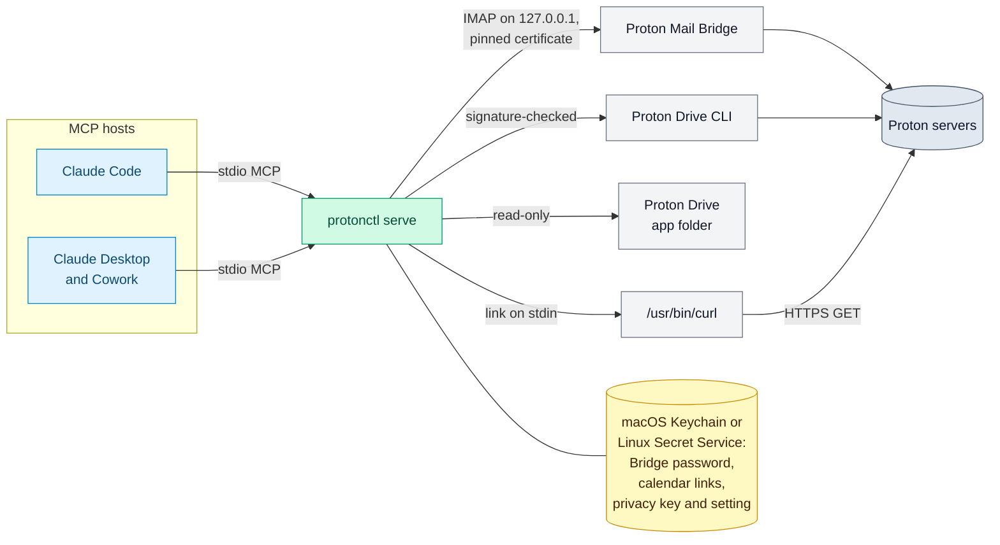

# protonctl: a local, read-only MCP server for Proton Mail, Proton Drive and Proton Calendar

protonctl lets an AI assistant answer questions about your own mail,
calendar and files in Proton Mail, Proton Calendar and Proton Drive. It is
a local MCP server (Model Context Protocol, the open standard that AI apps
use to call tools) and a command-line tool, written in Rust, for macOS and
Linux. It runs on your computer and reads through the Proton apps you
already use. It is read-only: it can search and read, and it cannot send,
share, draft, label, move or delete. The AI apps that call it are its
hosts; the first supported hosts are Claude Code, Claude Desktop and
Cowork. A privacy setting, aliases mode, replaces people's names and
addresses in results with aliases before a host sees them.

**protonctl is unofficial. It is not affiliated with, endorsed or
sponsored by Proton AG.** The names Proton Mail, Proton Drive and Proton
Calendar appear here only to say which services it reads.

## What it does for you

Ask the host a question in your own words. It calls protonctl's tools and
answers from what they return. Three prompts to try, each with the tools
that answer it:

- "Which threads this week mention the invoice, and who sent them?"
  Tools: `search_threads`, then `get_thread`.
- "What is on my calendar next Tuesday, and does anything overlap?"
  Tool: `list_events`.
- "Find the lease PDF in my Drive and summarize its renewal terms."
  Tools: `search_files`, then `read_file_content`. `search_files` needs the
  Proton Drive app (see [Add Drive](#add-drive)).

Everything runs on your computer. protonctl sends nothing to its
developer, and the developer runs no server for it. Mail comes through
Proton Mail Bridge, files through the Proton Drive app and the official
Proton Drive CLI, and the calendar through a share link that you make for
it. protonctl never holds your Proton password or keys. Its secrets go to
the macOS Keychain, or on Linux to the Secret Service, never to a file.

## What it cannot do

- Send, reply, forward, draft, share, label, move, flag or delete. These
  capabilities do not exist in protonctl, so no prompt, and no text inside
  an email, can make it do them. Other tools in the same session can still
  send; what a result holds is what could leave.
- Write anything to your Proton account, uploads to Drive included.
- Read Proton Pass, Contacts, the content of Docs and Sheets, Photos, VPN
  or Wallet.
- Run on Windows.
- Recall a result once a host has it. What the host does with a result,
  and what its model provider keeps, follows that host's terms
  ([PRIVACY.md](PRIVACY.md)).

## The privacy setting

protonctl answers no call until you choose one of two modes
([Choose the privacy setting](#choose-the-privacy-setting) has the
commands):

- **Off mode**: results as the Proton apps show them, names included.
- **Aliases mode**: names, email addresses, phone and account numbers,
  codes and passwords in results become aliases such as
  `amber-falcon-river`, and one person gets one alias in every chat. The
  host still answers; protonctl's instructions ask it to call people by
  their role. protonctl writes nothing to disk in this mode.

Aliases mode does not find every name. Names in no header, in a message
body, a subject or a file name, are found by a name model that runs on
your Mac (Phase 5 in the [RFC](docs/rfc-0001/09-rollout.md)): on a
synthetic corpus in 28 languages it found 93% of the people,
organizations, projects, products and places, so about one name in
fourteen can still reach the host as written, and a word it takes for a
product's name becomes an alias too. Aliases mode refuses to run until
the model is installed ([Install the name model](#install-the-name-model)).


*Illustration with synthetic data, not a recording, about two minutes long.
Chapter 1 (what it does) shows what is built. Chapter 2 explains where your
data goes once a host reads it. Chapter 3 shows aliases mode and
`setup privacy`, built in Phase 2, and `reveal_message`, which is planned
for Phase 3 ([RFC-0001](docs/rfc-0001.md)).
[Full-resolution video (MP4)](https://github.com/matt-w-horn/protonctl/blob/f0414ddc9515df3b0941e76fb6351864e4b80e6d/docs/demo/protonctl-demo.mp4), rendered from
[`docs/demo/storyboard.html`](docs/demo/storyboard.html) by
[`docs/demo/render.mjs`](docs/demo/render.mjs).*

## How it fits together



## What can it read?

| Service | Through | Tools |
|---|---|---|
| Calendar (read-only) | a Full-view share link, fetched by `/usr/bin/curl` | `list_calendars`, `list_events`, `search_events`, `get_event` |
| Drive (read-only) | the Proton Drive app's local folder, and the official Proton Drive CLI for content; without the app, listing goes through the CLI and search is off | `search_files`, `list_folder`, `get_file_metadata` (with `digests: true`, Proton's node IDs, the SHA-1 Proton stored at upload, and local digests), `read_file_content` (the text of text files, PDFs and Word, RTF and OpenDocument documents, a page at a time, and images), `download_file` (any file, with its SHA-256 and SHA-1, saved or returned inline), `list_drive_tree` (everything under a folder, a page at a time), `export_drive_manifest` (the same inventory written to the export folder) |
| Mail (read-only) | Proton Mail Bridge, over local IMAP with its certificate pinned | `search_threads` (Gmail-style queries, one row per thread, optional snippets), `count_messages` (totals, or groups by sender, domain or recipient, in one call), `get_thread` (quoted replies removed), `get_message`, `list_labels`, `get_attachment` (text, PDF and document text, or images, with its SHA-256 and SHA-1) |

`get_status` lists what protonctl can reach, every secret it holds, and the
privacy mode.

In aliases mode (see [Choose the privacy setting](#choose-the-privacy-setting))
the same tools answer with aliases in place of names, except
`download_file` and `export_drive_manifest`, which it does not offer. Drive
tools take a `fileId` or `folderId` from a result instead of a path, and
`get_attachment` returns text only.

Content comes back in the tool result wherever it can, so no folder is
needed to read it. Text pages by `offset` and `maxChars` (20,000 characters
unless asked otherwise), and each result says where the next page starts.
PDF text comes from macOS's PDFKit and Word, RTF and OpenDocument text from
`textutil`, both part of macOS, so there is nothing more to install (on
Linux, see [On Linux](#on-linux)). Each runs in a sandbox (`sandbox-exec`,
deprecated and still enforcing) that lets it read only the system's own
files, write nothing, and reach no network, no other program and no
Keychain item; `protonctl doctor` reads a sample through each. A
scanned PDF, which has no text, comes back as images of its pages, a few
per call, and any PDF's pages can be asked for that way. Images come back
as image content. A file saved by `download_file`, or an
attachment that is neither text nor an image, goes to a private folder and
is removed after an hour, or when the server stops. With `export: true` it
goes to the export folder instead (see Configuration). With `inline: true`
its bytes come back in the result, base64, which not every host accepts yet.

## Which hosts run it?

protonctl is built for three hosts: Claude Code, Claude Desktop and
Cowork. Each starts `protonctl serve` as a local MCP server over stdio and
calls its tools. Claude Code ran it on 2026-10-06, in off mode; the same
check in Claude Desktop and Cowork has not run yet
([RFC section 9, M1.1](docs/rfc-0001/09-rollout.md#milestones),
[#18](https://github.com/matt-w-horn/protonctl/issues/18)). Any other host
that starts a local MCP server over stdio can start `protonctl serve` the
same way; none has been tried.

protonctl runs on a Mac with Apple silicon, and on Linux with the
differences that [On Linux](#on-linux) lists.

## Install as a Claude Code plugin

The plugin adds protonctl's server, `proton`, to Claude Code and Cowork.
The plugin contains no protonctl binary. Its launcher, `scripts/serve`, runs
`~/.cargo/bin/protonctl serve`, so you install protonctl itself as well.
If `~/.cargo/bin/protonctl` is missing, the server does not start, and the
launcher's error message names `scripts/install.sh`.

1. If you added the `proton` server by hand before (see
   [Connect a host](#connect-a-host)), remove it first, so that its tools do
   not appear twice:

   ```sh
   claude mcp remove proton
   ```

2. Add the plugin. In Claude Code 2.1.287 or later, run
   `/plugin directory` and choose protonctl, once Anthropic's plugin
   directory lists it. Or add it from the `protonctl` marketplace in this
   repository:

   ```text
   /plugin marketplace add matt-w-horn/protonctl
   /plugin install protonctl@protonctl
   ```

   For Cowork, add it in Claude Desktop, under
   **Customize > Plugins**: from **Discover** once the directory lists it,
   or from the marketplace `matt-w-horn/protonctl`.
3. Install protonctl from a clone at a release tag. Replace `TAG` with the
   newest tag on the repository's
   [tags page](https://github.com/matt-w-horn/protonctl/tags):

   ```sh
   git clone --branch TAG https://github.com/matt-w-horn/protonctl.git
   cd protonctl
   scripts/install.sh
   ```

   This needs Rust 1.99 or later and the Xcode command line tools.
   [Install](#install) explains the prompts that `install.sh` shows.
4. Choose the privacy setting (see
   [Choose the privacy setting](#choose-the-privacy-setting)). Then add each
   service you want: [a calendar](#add-a-calendar), [mail](#add-mail) and
   [Drive](#add-drive).
5. Restart Claude Code and Claude Desktop.

The plugin takes the place of the `claude mcp add` command in
[Connect a host](#connect-a-host). The permission rules there have a form
for the plugin.

protonctl runs on a Mac with Apple silicon. There, the plugin runs in:

- Claude Code.
- Cowork, in sessions that run on your Mac. A Cowork session that runs
  elsewhere does not start protonctl.

Chat does not start a plugin's local server, on claude.ai or in the Claude
apps. For Claude Desktop's chat, use the manual configuration in
[Connect a host](#connect-a-host).

Updating the plugin changes only the launcher, not protonctl. To update
protonctl itself, run `scripts/install.sh` again from a clone at the new
tag, then restart Claude Code and Claude Desktop. In the clone, with the
new tag as `TAG`:

```sh
git fetch --tags
git checkout TAG
scripts/install.sh
```

## Install

```sh
scripts/install.sh
```

It builds protonctl, signs it, and puts it in `~/.cargo/bin`. The first run
also makes the signing identity: a self-signed certificate named
`protonctl` in the login keychain, whose key cannot be exported. Every run
then asks to let `codesign` use that key. Choose **Allow**, never Always
Allow: any program can run `codesign`, so Always Allow would let one sign
a replaced protonctl without a prompt. If an install signs without asking,
undo it: open
`/System/Library/CoreServices/Applications/Keychain Access.app`, choose
the login keychain and My Certificates, open the `protonctl` certificate's
disclosure triangle, double-click its key, and in Access Control remove
every application from the list of those always allowed, then Save Changes.

The first time the signed protonctl reads each Keychain item (the calendar
link, the Bridge password, the privacy key), macOS asks once; choose Always
Allow. A later install signed with the same identity reads them with no
prompt, so a Keychain prompt for protonctl after that means the binary was
replaced by something else. On Linux, install with
`cargo install --path . --locked`.

The commands below use the full path, in case `~/.cargo/bin` is not on your
PATH.

`scripts/install.sh` does not download the name model. Its last line says
whether the model is installed; if it is not, see
[Install the name model](#install-the-name-model).

## Choose the privacy setting

protonctl answers no call until you choose how its results reach the
model. Choose one:

```sh
~/.cargo/bin/protonctl setup privacy
~/.cargo/bin/protonctl setup privacy --off
```

- **Aliases mode** (`setup privacy`): names, addresses, phone and account
  numbers, codes and passwords appear as aliases such as
  `amber-falcon-river`, and links as "link 1" with their domain's alias.
  Message, thread, event and file IDs, Drive paths and page tokens become
  opaque handles, and digests are keyed. Each result has an `entities`
  table that gives each alias's type, hints such as `external`, and a
  `ref`, which a query can use in place of the name (`from:ref:REF`).
  Nothing is saved to disk: a Drive file that is only in the cloud is
  fetched into a RAM disk that protonctl makes for itself and removes when
  it stops (on Linux, a private folder under `$XDG_RUNTIME_DIR`), and
  images come back as a type and a reason. Names in free text, such as a
  body, a subject or a file name, are found by the name model, which
  misses some: about one name in fourteen on a synthetic corpus, more in
  Hebrew, Czech, Finnish and Ukrainian, where the corpus is smallest
  ([RFC section 7](docs/rfc-0001/07-testing.md)). Aliases mode needs the
  model installed ([Install the name model](#install-the-name-model)) and
  refuses every call without it.
- **Off mode** (`setup privacy --off`): results as they are, names included.
  It asks first, on a terminal.

The setting is one Keychain item, `protonctl/privacy-mode`, for every host
on the Mac. `setup privacy` also makes the privacy key,
`protonctl/privacy-key`, if there is none; `protonctl rotate-key` replaces
it, which changes every alias and stops old refs and handles from working.
After a change, restart Claude Code and Claude Desktop: a server that is
running refuses every call once the setting changes.

## Install the name model

Aliases mode finds names in free text with
[Otter](https://huggingface.co/whoisjones/otter-cross-mmbert) (Apache-2.0),
run on your Mac by a Rust ONNX runtime inside protonctl; nothing is
fetched while it runs. The model is two files in
`~/Library/Application Support/protonctl/model` (on Linux
`$XDG_DATA_HOME/protonctl/model`, by default
`~/.local/share/protonctl/model`): `otter.onnx`, 1.2 GB, and
`tokenizer.json`. protonctl checks both against the SHA-256 values pinned
in `src/privacy/detect/model.rs` when it loads them, then finds the names
of a fixed sentence before it serves anything; if either check fails,
every aliases-mode call is refused and `protonctl doctor` says why.

The files are not in this repository. Install them from the hosted copy with
`scripts/install-model.sh`, which checks each file's SHA-256 before it moves
the file into place, so a wrong download is refused and the folder is left
as it was. Replace `MODEL_URL` with the folder the maintainer publishes both
files in:

```sh
scripts/install-model.sh --url MODEL_URL
```

`--url` fetches `MODEL_URL/otter.onnx` and `MODEL_URL/tokenizer.json`. To
install from a folder you already have instead, pass `--from FOLDER`, the
folder holding both files. The script creates the model folder readable only
by you (mode 0700), and its files 0600. A second run skips the files already
in place, and `scripts/install-model.sh --check` says whether both are there.

Or make the ONNX file yourself from the checkpoint, with Python, `torch`,
`transformers` and `onnx` installed:

```sh
python3 scripts/otter-export.py CHECKPOINT_DIR ~/Library/Application\ Support/protonctl/model/otter.onnx
cp CHECKPOINT_DIR/tokenizer.json ~/Library/Application\ Support/protonctl/model/
~/.cargo/bin/protonctl doctor
```

`CHECKPOINT_DIR` is a local copy of the checkpoint at commit `8729188`;
the script loads only that folder and runs the model's own code from it.
The server loads the model once, in about four seconds on an M2 Pro, and
holds about 1.4 GB of memory while it runs; a 20,000-character page takes
about 7 s there.

## Add a calendar

In the Proton web app, open the calendar's sharing settings and create a
Full-view link used only by protonctl. Copy it, then:

```sh
pbpaste | ~/.cargo/bin/protonctl setup calendar --id personal
```

The link goes to the Keychain (service `protonctl`, account
`calendar/personal`) and the calendar's id and name go to
`~/.config/protonctl/config.toml`. Proton's server decrypts the calendar
whenever the link is fetched, and changes can take up to 8 hours to appear.

## Add mail

Proton Mail Bridge (a separate app from the Proton Mail desktop app) must be
installed and signed in, with **Show All Mail** on and **Connection mode** set
to **SSL**, both under Advanced settings. It need not stay open: when it isn't
running, protonctl opens it in the background and waits about 10 seconds. Select your account in Bridge and copy
its password: the Bridge password, not your Proton password. Then run this
with the username Bridge shows:

```sh
pbpaste | ~/.cargo/bin/protonctl setup mail --address you@proton.me
```

The first connection pins Bridge's TLS certificate, and later connections
refuse any other. If you reinstall Bridge, its certificate changes: delete
`[mail]` from the config and run setup again.

## Add Drive

Install the official Proton Drive CLI at `~/bin/proton-drive` (or pass
`--cli` with its path) and sign it in; signing in is the CLI's own step, so
protonctl never sees your Proton password:

```sh
~/bin/proton-drive auth login
~/.cargo/bin/protonctl setup drive
```

`setup drive` checks that the CLI is Proton's and signed in, finds the
Proton Drive app's folder if the app is installed (or takes `--folder`),
and writes `[drive]` to the config. Drive is off until it runs. Without the
app, listing goes through the CLI and search is off. protonctl checks the
CLI again before every run, on a private copy that is then the one that
runs: on macOS, that Proton's Apple team signed it. On Linux, where Proton
publishes no signature or checksum, `setup drive` shows the CLI's SHA-256,
asks you on a terminal to confirm it, and pins it in the Secret Service;
every run must match it. After you update the CLI, run `setup drive`
again to pin the new one; `setup drive --cli <path>` pins a CLI at
another path. Each asks first.

## Connect a host

Claude Code:

```sh
claude mcp add --scope user proton -- "$HOME/.cargo/bin/protonctl" serve
```

Claude Desktop and Cowork: quit the app, then add a `proton` entry under
`mcpServers` in `~/Library/Application Support/Claude/claude_desktop_config.json`.
That file already holds the app's own settings, so merge into it rather than
replace it. This does the merge and leaves the old file beside it as `.bak`:

```sh
python3 -c 'import json, os, shutil; p = os.path.expanduser("~/Library/Application Support/Claude/claude_desktop_config.json"); c = json.load(open(p)); shutil.copy(p, p + ".bak"); c.setdefault("mcpServers", {})["proton"] = {"command": os.path.expanduser("~/.cargo/bin/protonctl"), "args": ["serve"]}; json.dump(c, open(p, "w"), indent=2, ensure_ascii=False)'
```

Then open the app again.

Another host that starts a local MCP server over stdio takes the same
command, `~/.cargo/bin/protonctl serve`, in its own configuration; see
[Which hosts run it?](#which-hosts-run-it) for what has been checked.

In Claude Code, these rules allow the tools that only read without a
prompt, and leave the three that can save files in off mode
(`get_attachment`, `download_file` and `export_drive_manifest`) on ask:
`mcp__proton__get_status`, `mcp__proton__get_event`,
`mcp__proton__get_file_metadata`, `mcp__proton__get_message`,
`mcp__proton__get_thread`, `mcp__proton__list_*`, `mcp__proton__search_*`,
`mcp__proton__count_*`, `mcp__proton__read_*`.

With the plugin, the tools' names start with
`mcp__plugin_protonctl_proton__` in place of `mcp__proton__`, so the same
rules are: `mcp__plugin_protonctl_proton__get_status`,
`mcp__plugin_protonctl_proton__get_event`,
`mcp__plugin_protonctl_proton__get_file_metadata`,
`mcp__plugin_protonctl_proton__get_message`,
`mcp__plugin_protonctl_proton__get_thread`,
`mcp__plugin_protonctl_proton__list_*`,
`mcp__plugin_protonctl_proton__search_*`,
`mcp__plugin_protonctl_proton__count_*`,
`mcp__plugin_protonctl_proton__read_*`.

## Claude Code sandbox

In Claude Code the model has a shell. Without a fence, a command it runs can
list the Drive app's folder, run `proton-drive`, connect to Bridge's IMAP
port, edit protonctl's config and search the Keychain, around protonctl's
tools and its privacy setting. These settings in `~/.claude/settings.json`
close those routes for the commands Claude runs. They were checked on
Claude Code 2.1.293 on macOS: each probe below failed with them and passed
without them (RFC Q17).

```json
{
  "sandbox": {
    "enabled": true,
    "failIfUnavailable": true,
    "allowUnsandboxedCommands": false,
    "filesystem": {
      "denyRead": ["~/Library/CloudStorage/ProtonDrive-*", "~/bin/proton-drive"],
      "denyWrite": ["~/.config/protonctl"]
    },
    "network": {
      "allowedDomains": [],
      "deniedDomains": ["proton.me", "*.proton.me"],
      "strictAllowlist": true,
      "allowLocalBinding": false
    }
  },
  "permissions": {
    "deny": [
      "Read(~/Library/CloudStorage/ProtonDrive-*/**)",
      "Edit(~/.config/protonctl/**)"
    ]
  }
}
```

If `[drive] cli` in your config points elsewhere than `~/bin/proton-drive`,
put that path in `denyRead`. Add the hosts your own work needs to
`allowedDomains`; with the list empty, every host is refused.

| Setting | What it closes | Seen |
|---|---|---|
| `denyRead` of the Drive folder | reading or listing the folder from any command, `ls` or a script alike | `Operation not permitted`. The folder's name and that it exists stay visible: `stat` succeeds |
| `Read(...)` deny rule | the Read, Grep and Glob tools, which run outside the sandbox | `File is in a directory that is denied by your permission settings` |
| `denyRead` of `proton-drive` | copying the binary | `cp: Operation not permitted`. It does not stop running it: `proton-drive --version` exits 0. No setting denies execution |
| `deniedDomains` | the CLI's, and any command's, connections to Proton, even with `*.proton.me` in `allowedDomains` | `deny network-outbound proton.me:443 (host is on the deny list)` |
| `allowLocalBinding: false`, the default | connections to 127.0.0.1:1143 | `nc` exits 1 and `curl` 7, where without the sandbox `nc` connects. Keep `localhost` and `127.0.0.1` out of `allowedDomains`: an entry there opens every local port to a command that goes through the proxy |
| `denyWrite` of `~/.config/protonctl` | writes from any command; reads stay allowed | a Python `open(..., "w")` gets `Operation not permitted` |
| `Edit(...)` deny rule | the Edit and Write tools, and the file commands Claude Code recognizes in Bash, such as `touch`, `sed -i`, `tee` and `>` | `touch` is refused before it runs |
| `strictAllowlist` with `allowedDomains` | every other host, refused instead of prompted | `deny network-outbound example.com:443 (host is not on the allow list)`, `curl` exit 56; with `--noproxy '*'` no route at all, exit 6 |
| `allowUnsandboxedCommands: false` | the retry outside the sandbox that Claude can otherwise ask for | |
| `failIfUnavailable` | running without the sandbox when it cannot start | |

The Keychain needs no setting, and none covers it: inside the sandbox
`security find-generic-password -s protonctl` answers `The specified item
could not be found in the keychain` (exit 44), and outside it finds the
items. That is the sandbox's own default on macOS, not a line in this
list, so check it again after a Claude Code upgrade with that command. An
`excludedCommands` entry for `security`, `network.allowMachLookup: ["*"]`
or `filesystem.disabled` would each reopen it.

What the sandbox does not cover: commands you type at the `!` prompt,
`excludedCommands`, hooks and MCP servers all run outside it, protonctl
itself included, which is how it reaches the Keychain, Bridge and the
CLI. Permission rules match the text of a command, not the program, so
the `Read` and `Edit` rules above cover Claude's file tools and the
file commands Claude Code recognizes, and the sandbox is what stops a
script. The proxy decides by hostname without inspecting TLS, so keep
`allowedDomains` short. `strictAllowlist` and `allowUnsandboxedCommands`
count only from user settings, managed settings or `--settings`, not from
a project's `.claude/settings.json`. On Linux the sandbox needs
`bubblewrap` and `socat`, there is no Drive app folder, and a sandboxed
command's loopback is private by design; the settings were not checked
there.

## Check, and revoke

```sh
~/.cargo/bin/protonctl doctor
```

```sh
~/.cargo/bin/protonctl logout
```

`logout` asks first, then deletes protonctl's Keychain items, the privacy
key and setting among them. A calendar link keeps working for
anyone who has it until you delete it in the calendar's sharing settings in
the Proton web app. The Proton Drive CLI has its own session, which this ends:

```sh
proton-drive auth logout
```

## On Linux

protonctl runs on Linux too ([RFC section 11](docs/rfc-0001/11-platforms.md)).
The steps above apply, with these differences:

- **Secrets** go to the Secret Service over D-Bus: GNOME Keyring or KWallet,
  which Bridge and the Drive CLI also need. Items carry the attributes
  `service` `protonctl` and `account`, as the Keychain items do. With no
  Secret Service running, setup refuses; protonctl never writes a secret to
  a file. A locked keyring shows the desktop's unlock prompt.
- **Pasting**: use `wl-paste` (Wayland) or `xclip -selection clipboard -o`
  (X11) where the steps above use `pbpaste`.
- **Bridge**: protonctl never starts it on Linux. Set Bridge up once in its
  window (sign in, **Show All Mail** on, **Connection mode** SSL), quit it,
  then keep it running with no window as a systemd user unit. Save this as
  `~/.config/systemd/user/protonmail-bridge.service`, with the path that
  `command -v protonmail-bridge` prints:

  ```ini
  [Unit]
  Description=Proton Mail Bridge

  [Service]
  ExecStart=/usr/bin/protonmail-bridge --noninteractive
  Restart=on-failure

  [Install]
  WantedBy=default.target
  ```

  Then run `systemctl --user enable --now protonmail-bridge`.
- **Drive** goes through the CLI only, since there is no Proton Drive app
  for Linux, so search is off. `setup drive` pins the CLI's SHA-256 in
  the Secret Service, after asking on a terminal; after you update the
  CLI, run `setup drive` again to pin the new one. A pin from an older
  protonctl, in the config, is ignored: run `setup drive` once. In
  aliases mode the CLI downloads a file it reads into `$XDG_RUNTIME_DIR`,
  which must be in memory (tmpfs) and yours alone, and any swap must be
  encrypted or zram, so the file never reaches a disk in clear; `doctor`
  checks this.
- **Documents** are read by poppler (`pdftotext`, `pdftoppm`)
  and pandoc, and in aliases mode the text in images and scans by
  Tesseract: install `poppler-utils`, `pandoc` and `tesseract-ocr`, with a
  `tesseract-ocr-LANG` package for each language besides English that
  Tesseract should read (it reads English only as built). Each runs in a sandbox
  (Landlock and seccomp) that lets it read only the system's programs and
  libraries, write nothing, and reach no network; the kernel must enforce
  Landlock, and `doctor` checks that it does. pandoc cannot read the old
  binary Word format (`.doc`); a copy saved as `.docx` can be read.

## Configuration

`~/.config/protonctl/config.toml` holds no secrets. The format is documented
at the top of `src/config.rs`; for example, `[drive] exclude = ["/Private"]`
hides a folder from every result.

### Export folder

An agent whose shell runs elsewhere (Cowork's VM) cannot read protonctl's
private download folder. Text, documents and images reach it in the tool
result; for whole files, name an export folder, and `download_file` and
`get_attachment` with `export: true`, and `export_drive_manifest`, write
there instead:

```toml
[export]
folder = "/Users/you/protonctl-export"
```

Files land at `drive/<Drive path>`, `mail/<messageId>/<index>-<name>` and
`manifests/drive-<time>.jsonl`, and stay until you delete them. The folder
must be an absolute path outside the Proton Drive app's folder (writing there
would upload to Proton) and outside `~/Library/Caches/protonctl`. Pick one no
sync service mirrors, unless you want that, and connect it to Cowork to give
agents there the files.

## Privacy

protonctl sends nothing to its developer, and the developer runs no server
for it. [PRIVACY.md](PRIVACY.md) says what protonctl reads, where its
results go, what it keeps on your Mac, and how to remove all of it.

## FAQ

**Is protonctl made by Proton?** No. protonctl is an independent
open-source project under the Apache License 2.0. It is not affiliated
with, endorsed or sponsored by Proton AG. It holds no Proton password or
keys, and it reads through Proton's own apps and a calendar share link.

**Does protonctl send my data anywhere?** Not to its developer: it has no
telemetry, no crash reports and no update check, and the developer runs no
server for it. Each result goes to the host that asked for it. The host
sends it to its model provider under your account's terms, and keeps
transcripts on your computer. [PRIVACY.md](PRIVACY.md) follows the data
step by step.

**Can it send, delete or move mail?** No. protonctl cannot send, reply,
forward, draft, share, label, move, flag or delete, in mail, Drive or the
calendar. These capabilities do not exist in it.

**Does it need my Proton password?** No. Mail uses the password that
Proton Mail Bridge shows for your account, which is not your Proton
password. The calendar uses a share link. Drive uses the Proton Drive
CLI's own sign-in, which protonctl never sees. Secrets go to the macOS
Keychain, or on Linux to the Secret Service, never to a file.

**Which AI apps can use it?** Claude Code, Claude Desktop and Cowork are
the first supported hosts ([Which hosts run it?](#which-hosts-run-it)).
Any host that starts a local MCP server over stdio can start it; no other
host has been tried.

**What does aliases mode hide, and what does it not?** It replaces names,
email addresses, phone and account numbers, codes and passwords with
aliases, turns IDs and Drive paths into opaque handles, and writes nothing
to disk. It does not hide context that points to a person (a job, an
event, a writing style), and the name model that finds names in free
text misses about one in fourteen
([The privacy setting](#the-privacy-setting)).

**Does it run on Linux?** Yes, with poppler, pandoc and Tesseract for
documents and
the Secret Service for secrets ([On Linux](#on-linux)). Windows is not
planned.

## Support

Ask for help, or report a bug, in
[GitHub issues](https://github.com/matt-w-horn/protonctl/issues). Report a
vulnerability privately, as [SECURITY.md](SECURITY.md) describes.

## Development

Design and requirements: [docs/rfc-0001.md](docs/rfc-0001.md).

```sh
scripts/check.sh
```

That runs every gate the pre-commit hook runs: fmt, clippy with `-D warnings`,
the tests, `cargo deny check`, and a line-coverage floor through
`cargo-llvm-cov` and Homebrew's `llvm` (`brew install cargo-llvm-cov llvm`),
which prints coverage per file. Unused dependencies are checked by hand, now
and then, with `cargo machete` (`cargo install cargo-machete --locked`).

The gates also run on Linux, as in a cloud container
([RFC section 11](docs/rfc-0001/11-platforms.md)). Install the tools with
`cargo install cargo-deny cargo-llvm-cov --locked` and
`rustup component add llvm-tools-preview`. The tests of macOS's PDF and Word
readers run only on a Mac. With `clang` installed and
`rustup target add aarch64-apple-darwin`, `check.sh` on Linux also lints the
macOS build, so changes to macOS-only code are checked there too. With
`dbus-run-session` and `gnome-keyring-daemon` installed (Debian and Ubuntu:
`dbus` and `gnome-keyring`), it also tests the Secret Service store against
a throwaway keyring in a private D-Bus session. The tests of the Linux
document readers need `poppler-utils`, `pandoc` and `tesseract-ocr`, and
fail without them.
The tests of the name model run only where it is installed
([Install the name model](#install-the-name-model)); elsewhere, in CI
among others, they print a notice and check nothing.
Inside Claude Code's Bash sandbox `~/.cargo` is not writable, so point Cargo
elsewhere first:

```sh
export CARGO_HOME="$TMPDIR/cargo-home"
```

After an install, this runs every tool once against your real calendar,
mail and Drive, as a host does, and prints only outcomes and counts.
Run it from a normal terminal; it uses the installed binary, so a Keychain
approval given while a host ran it covers it too:

```sh
python3 scripts/live-check.py
```

Also expect `codesign` to report a valid Proton binary as "modified" there;
judge the Drive CLI's signature with the `doctor` command above, run from a
normal terminal. The mail tests start a fake Bridge on a local port, which the
sandbox refuses unless `sandbox.network.allowLocalBinding` is true.

## Credits

The words in aliases come from the
[EFF large word list](https://www.eff.org/deeplinks/2016/07/new-wordlists-random-passphrases)
by Joseph Bonneau for the Electronic Frontier Foundation, used under
[CC BY 4.0](https://creativecommons.org/licenses/by/4.0/). protonctl drops
644 of its 7,776 words; `src/privacy/words-dropped.txt` lists them with the
reason for each.

## License

protonctl is under the Apache License 2.0; see [LICENSE](LICENSE). The word
list stays under CC BY 4.0, as [Credits](#credits) says.
