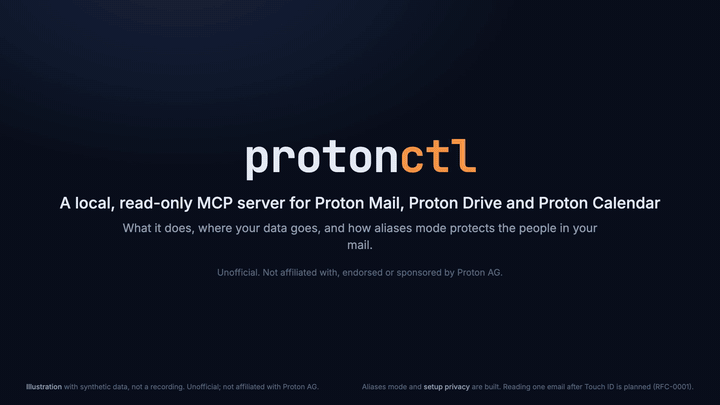
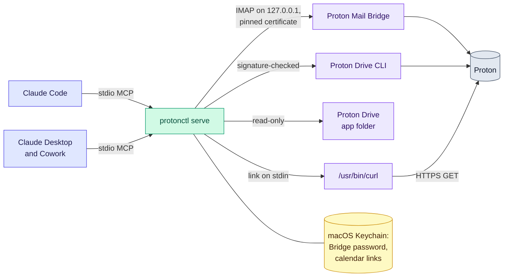

# protonctl

A local MCP server and CLI that lets Claude (Claude Code, Claude Desktop and
Cowork) read Proton Mail, Calendar and Drive through Proton's own apps. It is
read-only: it cannot send, share, draft, label, move or delete. It holds no
Proton password or keys, and keeps its secrets in the macOS Keychain. Design
and requirements: [docs/rfc-0001.md](docs/rfc-0001.md).



*Illustration with synthetic data, not a recording, about two minutes long.
Chapter 1 (what it does) shows what is built. Chapter 2 explains where your
data goes once Claude reads it. Chapter 3 shows aliases mode and
`setup privacy`, built in Phase 2, and `reveal_message`, which is planned
for Phase 3 ([RFC-0001](docs/rfc-0001.md)).
[Full-resolution video (MP4)](https://github.com/matt-w-horn/protonctl/blob/f0414ddc9515df3b0941e76fb6351864e4b80e6d/docs/demo/protonctl-demo.mp4), rendered from
[`docs/demo/storyboard.html`](docs/demo/storyboard.html) by
[`docs/demo/render.mjs`](docs/demo/render.mjs).*

protonctl is unofficial and not affiliated with Proton AG.

## How it fits together



## What works now

| Service | Through | Tools |
|---|---|---|
| Calendar (read-only) | a Full-view share link, fetched by `/usr/bin/curl` | `list_calendars`, `list_events`, `search_events`, `get_event` |
| Drive (read-only) | the Proton Drive app's local folder, and the official Proton Drive CLI for content; without the app, listing goes through the CLI and search is off | `search_files`, `list_folder`, `get_file_metadata` (with `digests: true`, Proton's node IDs, the SHA-1 Proton stored at upload, and local digests), `read_file_content` (the text of text files, PDFs and Word, RTF and OpenDocument documents, a page at a time, and images), `download_file` (any file, with its SHA-256 and SHA-1, saved or returned inline), `list_drive_tree` (everything under a folder, a page at a time), `export_drive_manifest` (the same inventory written to the export folder) |
| Mail (read-only) | Proton Mail Bridge, over local IMAP with its certificate pinned | `search_threads` (Gmail-style queries, one row per thread, optional snippets), `count_messages` (totals, or groups by sender, domain or recipient, in one call), `get_thread` (quoted replies removed), `get_message`, `list_labels`, `get_attachment` (text, PDF and document text, or images, with its SHA-256 and SHA-1) |

`get_status` lists what protonctl can reach, every secret it holds, and the
privacy mode.

In aliases mode (see [Choose the privacy setting](#choose-the-privacy-setting))
the same tools answer with aliases in place of names, except
`download_file` and `export_drive_manifest`, which it does not offer. Drive
tools take a `fileId` or `folderId` from a result instead of a path, and
`get_attachment` returns text only.

Content comes back in the tool result wherever it can, so no folder is
needed to read it. Text pages by `offset` and `maxChars` (20,000 characters
unless asked otherwise), and each result says where the next page starts.
PDF text comes from macOS's PDFKit and Word, RTF and OpenDocument text from
`textutil`, both part of macOS, so there is nothing more to install. A
scanned PDF, which has no text, comes back as images of its pages, a few
per call, and any PDF's pages can be asked for that way. Images come back
as image content. A file saved by `download_file`, or an
attachment that is neither text nor an image, goes to a private folder and
is removed after an hour, or when the server stops. With `export: true` it
goes to the export folder instead (see Configuration). With `inline: true`
its bytes come back in the result, base64, which not every host accepts yet.

## Example prompts

Three prompts to try, each with the tools that answer it:

- "Which threads this week mention the invoice, and who sent them?"
  Tools: `search_threads`, then `get_thread`.
- "What is on my calendar next Tuesday, and does anything overlap?"
  Tool: `list_events`.
- "Find the lease PDF in my Drive and summarize its renewal terms."
  Tools: `search_files`, then `read_file_content`. `search_files` needs the
  Proton Drive app (see [Add Drive](#add-drive)).

## Install as a Claude Code plugin

The plugin adds protonctl's server, `proton`, to Claude Code and Cowork.
The plugin contains no protonctl binary. Its launcher, `scripts/serve`, runs
`~/.cargo/bin/protonctl serve`, so you install protonctl itself as well.
If `~/.cargo/bin/protonctl` is missing, the server does not start, and the
launcher's error message names `scripts/install.sh`.

1. If you added the `proton` server by hand before (see
   [Connect Claude](#connect-claude)), remove it first, so that its tools do
   not appear twice:

   ```sh
   claude mcp remove proton
   ```

2. Add the plugin. In Claude Code 2.1.287 or later, run
   `/plugin directory` and choose protonctl, once Anthropic's plugin
   directory lists it. Or add it from the `protonctl` marketplace in this
   repository:

   ```text
   /plugin marketplace add matt-w-horn/protonctl
   /plugin install protonctl@protonctl
   ```

   For Cowork, add it in the Claude desktop app, under
   **Customize > Plugins**: from **Discover** once the directory lists it,
   or from the marketplace `matt-w-horn/protonctl`.
3. Install protonctl from a clone at a release tag. Replace `TAG` with the
   newest tag on the repository's
   [tags page](https://github.com/matt-w-horn/protonctl/tags):

   ```sh
   git clone --branch TAG https://github.com/matt-w-horn/protonctl.git
   cd protonctl
   scripts/install.sh
   ```

   This needs Rust 1.99 or later and the Xcode command line tools.
   [Install](#install) explains the prompts that `install.sh` shows.
4. Choose the privacy setting (see
   [Choose the privacy setting](#choose-the-privacy-setting)). Then add each
   service you want: [a calendar](#add-a-calendar), [mail](#add-mail) and
   [Drive](#add-drive).
5. Restart Claude Code and Claude Desktop.

The plugin takes the place of the `claude mcp add` command in
[Connect Claude](#connect-claude). The permission rules there have a form
for the plugin.

protonctl runs on a Mac with Apple silicon. There, the plugin runs in:

- Claude Code.
- Cowork, in sessions that run on your Mac. A Cowork session that runs
  elsewhere does not start protonctl.

Chat does not start a plugin's local server, on claude.ai or in the Claude
apps. For Claude Desktop's chat, use the manual configuration in
[Connect Claude](#connect-claude).

Updating the plugin changes only the launcher, not protonctl. To update
protonctl itself, run `scripts/install.sh` again from a clone at the new
tag, then restart Claude Code and Claude Desktop. In the clone, with the
new tag as `TAG`:

```sh
git fetch --tags
git checkout TAG
scripts/install.sh
```

## Install

```sh
scripts/install.sh
```

It builds protonctl, signs it, and puts it in `~/.cargo/bin`. The first run
also makes the signing identity: a self-signed certificate named
`protonctl` in the login keychain, whose key cannot be exported. Every run
then asks to let `codesign` use that key. Choose **Allow**, never Always
Allow: any program can run `codesign`, so Always Allow would let one sign
a replaced protonctl without a prompt. If an install signs without asking,
undo it: open
`/System/Library/CoreServices/Applications/Keychain Access.app`, choose
the login keychain and My Certificates, open the `protonctl` certificate's
disclosure triangle, double-click its key, and in Access Control remove
every application from the list of those always allowed, then Save Changes.

The first time the signed protonctl reads each Keychain item (the calendar
link, the Bridge password, the privacy key), macOS asks once; choose Always
Allow. A later install signed with the same identity reads them with no
prompt, so a Keychain prompt for protonctl after that means the binary was
replaced by something else. On Linux, install with
`cargo install --path . --locked`.

The commands below use the full path, in case `~/.cargo/bin` is not on your
PATH.

## Choose the privacy setting

protonctl answers no call until you choose how its results reach the
model. Choose one:

```sh
~/.cargo/bin/protonctl setup privacy
~/.cargo/bin/protonctl setup privacy --off
```

- **Aliases mode** (`setup privacy`): names, addresses, phone and account
  numbers, codes and passwords appear as aliases such as
  `amber-falcon-river`, and links as "link 1" with their domain's alias.
  Message, thread, event and file IDs, Drive paths and page tokens become
  opaque handles, and digests are keyed. Each result has an `entities`
  table that gives each alias's type, hints such as `external`, and a
  `ref`, which a query can use in place of the name (`from:ref:REF`).
  Nothing is saved to disk: a Drive file that is only in the cloud is
  fetched into a RAM disk that protonctl makes for itself and removes when
  it stops, and images come back as a type and a reason.
- **Off** (`setup privacy --off`): results as they are, names included.
  It asks first, on a terminal.

The setting is one Keychain item, `protonctl/privacy-mode`, for every host
on the Mac. `setup privacy` also makes the privacy key,
`protonctl/privacy-key`, if there is none; `protonctl rotate-key` replaces
it, which changes every alias and stops old refs and handles from working.
After a change, restart Claude Code and Claude Desktop: a server that is
running refuses every call once the setting changes.

## Add a calendar

In the Proton web app, open the calendar's sharing settings and create a
Full-view link used only by protonctl. Copy it, then:

```sh
pbpaste | ~/.cargo/bin/protonctl setup calendar --id personal
```

The link goes to the Keychain (service `protonctl`, account
`calendar/personal`) and the calendar's id and name go to
`~/.config/protonctl/config.toml`. Proton's server decrypts the calendar
whenever the link is fetched, and changes can take up to 8 hours to appear.

## Add mail

Proton Mail Bridge (a separate app from the Proton Mail desktop app) must be
installed and signed in, with **Show All Mail** on and **Connection mode** set
to **SSL**, both under Advanced settings. It need not stay open: when it isn't
running, protonctl opens it in the background and waits about 10 seconds. Select your account in Bridge and copy
its password: the Bridge password, not your Proton password. Then run this
with the username Bridge shows:

```sh
pbpaste | ~/.cargo/bin/protonctl setup mail --address you@proton.me
```

The first connection pins Bridge's TLS certificate, and later connections
refuse any other. If you reinstall Bridge, its certificate changes: delete
`[mail]` from the config and run setup again.

## Add Drive

Install the official Proton Drive CLI at `~/bin/proton-drive` (or pass
`--cli` with its path) and sign it in; signing in is the CLI's own step, so
protonctl never sees your Proton password:

```sh
~/bin/proton-drive auth login
~/.cargo/bin/protonctl setup drive
```

`setup drive` checks that the CLI is signed by Proton and signed in, finds
the Proton Drive app's folder if the app is installed (or takes
`--folder`), and writes `[drive]` to the config. Drive is off until it
runs. Without the app, listing goes through the CLI and search is off.

## Connect Claude

Claude Code:

```sh
claude mcp add --scope user proton -- "$HOME/.cargo/bin/protonctl" serve
```

Claude Desktop and Cowork: quit the app, then add a `proton` entry under
`mcpServers` in `~/Library/Application Support/Claude/claude_desktop_config.json`.
That file already holds the app's own settings, so merge into it rather than
replace it. This does the merge and leaves the old file beside it as `.bak`:

```sh
python3 -c 'import json, os, shutil; p = os.path.expanduser("~/Library/Application Support/Claude/claude_desktop_config.json"); c = json.load(open(p)); shutil.copy(p, p + ".bak"); c.setdefault("mcpServers", {})["proton"] = {"command": os.path.expanduser("~/.cargo/bin/protonctl"), "args": ["serve"]}; json.dump(c, open(p, "w"), indent=2, ensure_ascii=False)'
```

Then open the app again.

In Claude Code, these rules allow the tools that only read without a
prompt, and leave the three that can save files in off mode
(`get_attachment`, `download_file` and `export_drive_manifest`) on ask:
`mcp__proton__get_status`, `mcp__proton__get_event`,
`mcp__proton__get_file_metadata`, `mcp__proton__get_message`,
`mcp__proton__get_thread`, `mcp__proton__list_*`, `mcp__proton__search_*`,
`mcp__proton__count_*`, `mcp__proton__read_*`.

With the plugin, the tools' names start with
`mcp__plugin_protonctl_proton__` in place of `mcp__proton__`, so the same
rules are: `mcp__plugin_protonctl_proton__get_status`,
`mcp__plugin_protonctl_proton__get_event`,
`mcp__plugin_protonctl_proton__get_file_metadata`,
`mcp__plugin_protonctl_proton__get_message`,
`mcp__plugin_protonctl_proton__get_thread`,
`mcp__plugin_protonctl_proton__list_*`,
`mcp__plugin_protonctl_proton__search_*`,
`mcp__plugin_protonctl_proton__count_*`,
`mcp__plugin_protonctl_proton__read_*`.

## Check, and revoke

```sh
~/.cargo/bin/protonctl doctor
```

```sh
~/.cargo/bin/protonctl logout
```

`logout` asks first, then deletes protonctl's Keychain items, the privacy
key and setting among them. A calendar link keeps working for
anyone who has it until you delete it in the calendar's sharing settings in
the Proton web app. The Proton Drive CLI has its own session, which this ends:

```sh
proton-drive auth logout
```

## Configuration

`~/.config/protonctl/config.toml` holds no secrets. The format is documented
at the top of `src/config.rs`; for example, `[drive] exclude = ["/Private"]`
hides a folder from every result.

### Export folder

An agent whose shell runs elsewhere (Cowork's VM) cannot read protonctl's
private download folder. Text, documents and images reach it in the tool
result; for whole files, name an export folder, and `download_file` and
`get_attachment` with `export: true`, and `export_drive_manifest`, write
there instead:

```toml
[export]
folder = "/Users/you/protonctl-export"
```

Files land at `drive/<Drive path>`, `mail/<messageId>/<index>-<name>` and
`manifests/drive-<time>.jsonl`, and stay until you delete them. The folder
must be an absolute path outside the Proton Drive app's folder (writing there
would upload to Proton) and outside `~/Library/Caches/protonctl`. Pick one no
sync service mirrors, unless you want that, and connect it to Cowork to give
agents there the files.

## Privacy

protonctl sends nothing to its developer, and the developer runs no server
for it. [PRIVACY.md](PRIVACY.md) says what protonctl reads, where its
results go, what it keeps on your Mac, and how to remove all of it.

## Support

Ask for help, or report a bug, in
[GitHub issues](https://github.com/matt-w-horn/protonctl/issues). Report a
vulnerability privately, as [SECURITY.md](SECURITY.md) describes.

## Development

```sh
scripts/check.sh
```

That runs every gate the pre-commit hook runs: fmt, clippy with `-D warnings`,
the tests, `cargo deny check`, and a line-coverage floor through
`cargo-llvm-cov` and Homebrew's `llvm` (`brew install cargo-llvm-cov llvm`),
which prints coverage per file. Unused dependencies are checked by hand, now
and then, with `cargo machete` (`cargo install cargo-machete --locked`).

The gates also run on Linux, as in a cloud container, where protonctl builds
but serves nothing yet: it has no secret store there
([RFC section 11](docs/rfc-0001/11-platforms.md)). Install the tools with
`cargo install cargo-deny cargo-llvm-cov --locked` and
`rustup component add llvm-tools-preview`. The tests of macOS's PDF and Word
readers run only on a Mac. With `clang` installed and
`rustup target add aarch64-apple-darwin`, `check.sh` on Linux also lints the
macOS build, so changes to macOS-only code are checked there too.
Inside Claude Code's Bash sandbox `~/.cargo` is not writable, so point Cargo
elsewhere first:

```sh
export CARGO_HOME="$TMPDIR/cargo-home"
```

After an install, this runs every tool once against your real calendar,
mail and Drive, as the Claude app does, and prints only outcomes and counts.
Run it from a normal terminal; it uses the installed binary, so a Keychain
approval given to the Claude app covers it too:

```sh
python3 scripts/live-check.py
```

Also expect `codesign` to report a valid Proton binary as "modified" there;
judge the Drive CLI's signature with the `doctor` command above, run from a
normal terminal. The mail tests start a fake Bridge on a local port, which the
sandbox refuses unless `sandbox.network.allowLocalBinding` is true.

## Credits

The words in aliases come from the
[EFF large word list](https://www.eff.org/deeplinks/2016/07/new-wordlists-random-passphrases)
by Joseph Bonneau for the Electronic Frontier Foundation, used under
[CC BY 4.0](https://creativecommons.org/licenses/by/4.0/). protonctl drops
644 of its 7,776 words; `src/privacy/words-dropped.txt` lists them with the
reason for each.

## License

protonctl is under the Apache License 2.0; see [LICENSE](LICENSE). The word
list stays under CC BY 4.0, as [Credits](#credits) says.
