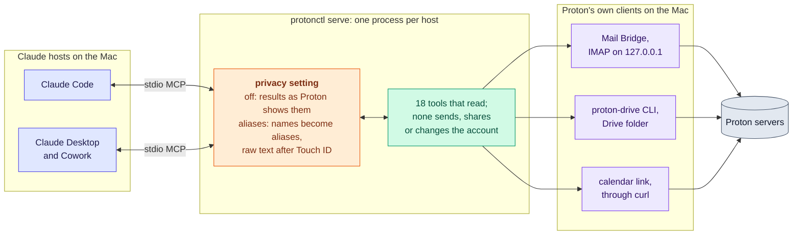

# RFC-0001: protonctl, a Proton connector for Claude

| | |
|---|---|
| **Status** | Accepted 2026-10-02. Revised 2026-10-04: read-only (Phase 1b withdrawn), and a privacy layer ([section 6](rfc-0001/06-privacy.md)) to build in Phases 2 to 7. Later on 2026-10-04 the privacy layer became optional: one setting, `off` or `aliases`, for every service and host on the Mac (Q26; [section 4, Settings](rfc-0001/04-design.md#settings)). |
| **Built** | Phase 1a: reads for Mail, Drive and Calendar. The Claude Code and Cowork tests remain. |
| **Next** | Phase P1, so protonctl builds and tests on Linux ([section 11](rfc-0001/11-platforms.md)); then Phase 2: the privacy setting and aliases mode ([section 9](rfc-0001/09-rollout.md)). |
| **Reviewed** | Against the code on 2026-10-04 (commit 7786b3e): claims corrected, open questions Q19 to Q25 added, and milestones listed in [section 9](rfc-0001/09-rollout.md). The standing [security and privacy review](rfc-0001/security-privacy-review.md) holds the threat model, the invariants and the tradeoffs. |

## At a glance

## Summary

- **One small Rust binary, `protonctl`, runs as a local MCP server over stdio
  and as a plain CLI.** It implements none of Proton's cryptography and never
  sees the Proton password or private keys: every encrypted operation goes
  through Proton's own signed clients. Its own cryptography is SHA-256 and
  SHA-1 digests of files and the pin on Bridge's TLS certificate (through
  `ring` and rustls) and, from Phase 2, the privacy layer's keyed pseudonyms
  ([section 6](rfc-0001/06-privacy.md)).
- **Mail** goes through Proton Mail Bridge (local IMAP, pinned TLS
  certificate, no SMTP). **Drive** reads its namespace from the Proton Drive
  app's local folder and reads content through the official `proton-drive`
  CLI.
- **Calendar is read-only through a Full-view share link** (decision Q1).
  Proton has no calendar API; with this link Proton's server decrypts the
  calendar each time it is fetched, and changes can take up to 8 hours to
  show. **Contacts are out of scope** (no API, no CardDAV).
- **Read-only (decided 2026-10-04).** protonctl cannot send, share, draft,
  label, move or delete. Those capabilities do not exist, which is stronger
  than an approval prompt: Anthropic reports that users approve roughly 93%
  of permission prompts. The writes planned for Phase 1b are withdrawn.
- **Privacy layer (decided 2026-10-04, optional by Q26; Phases 2 to 7).**
  One setting chooses what Claude sees. In `aliases` mode every MCP result
  is tokenized: people, organizations, places, addresses, phone numbers,
  account numbers and URLs become stable aliases such as
  `amber-falcon-river`, with coarse hints and an encrypted reference in a
  lookup table. Untokenized text reaches Claude through the `reveal_*`
  tools, one item at a time, and only after Touch ID (Phase 3); until
  GLiNER (Phase 5), a name that only free text carries (a subject, a body,
  a file name) can still pass in plaintext. protonctl writes nothing
  derived from mail or files to disk; the Claude hosts keep their own
  transcripts and logs ([section 5](rfc-0001/05-security.md)). In `off`
  mode protonctl returns names, IDs and files as Proton's clients show
  them: a read-only stand-in for Claude's Google connectors.
- **One binary serves both hosts.** Claude Code registers it with
  `claude mcp add`; Claude Desktop and Cowork read one `mcpServers` entry.
  Cowork runs local MCP servers on the Mac host, outside its VM, which is the
  only way it can reach Bridge and the Keychain.

## Constraints

- Test fixtures are synthetic; never commit real mail, files or calendar
  data, and never write real Proton data inside the repository, gitignored
  paths included.
- Gates run locally (`scripts/check.sh`, from the pre-commit hook). Install is
  `cargo install --path` from the reviewed checkout.
- macOS on Apple silicon, and Linux from Phase P (Q29): a feature with no
  Linux mechanism that meets its requirement is absent there
  ([section 11](rfc-0001/11-platforms.md)).

## Contents

| Part | What it holds |
|---|---|
| [Background](rfc-0001/background.md) | Proton's programmatic surfaces, the Claude hosts, interface conventions, design principles |
| [1. Goals and non-goals](rfc-0001/01-goals.md) | Goals, the design target, non-goals |
| [2. Requirements](rfc-0001/02-requirements.md) | R1 to R26, and which privacy mode each applies in |
| [3. Options considered](rfc-0001/03-options.md) | Architecture, backends, privacy-layer choices, language, state, packaging, gates, libraries |
| [4. Design](rfc-0001/04-design.md) | Components, command line, [Settings](rfc-0001/04-design.md#settings), MCP tools, results, safety model, files |
| [5. Security](rfc-0001/05-security.md) | Trust boundaries, threats and controls, residual risks |
| [6. Privacy](rfc-0001/06-privacy.md) | Disclosure and retention, and the privacy layer: pipeline, identifiers, hints, raw reads |
| [7. Testing](rfc-0001/07-testing.md) | The tests built, and those planned for the privacy layer |
| [8. Review process](rfc-0001/08-review-process.md) | What is checked at the end of each phase |
| [9. Rollout and milestones](rfc-0001/09-rollout.md) | Phases 0 to 7, milestones M1.1 to M7.3 |
| [10. Open questions](rfc-0001/10-open-questions.md) | Q1 to Q36, and what was declined |
| [11. Platforms](rfc-0001/11-platforms.md) | macOS and Linux: what is macOS-specific, how Rust projects handle it, Linux options per service, Phase P |
| [Appendix A](rfc-0001/appendix-a-phase-0.md) | Phase 0 findings on Bridge, the Drive CLI and the calendar feed |
| [Appendix B](rfc-0001/appendix-b-proton-code.md) | Proton's open-source code, surveyed 2026-10-03 |
| [Appendix C](rfc-0001/appendix-c-roleplay.md) | Role-play of aliases mode: how Claude names people it only knows by alias |
| [Low-level design: the privacy layer](rfc-0001/lld-privacy-layer.md) | Code structure, types, data model, keys, the pipeline, errors, the setting, sequences |
| [API specification](rfc-0001/lld-api.md) | Every tool, parameter and result field per mode; errors; command line; config; wire formats |
| [Security and privacy review](rfc-0001/security-privacy-review.md) | Threat model: assets, data flows, invariants, STRIDE and LINDDUN threats, tradeoffs |

Requirements are numbered R1 to R26 ([section 2](rfc-0001/02-requirements.md)),
open questions Q1 to Q36 ([section 10](rfc-0001/10-open-questions.md)), and
milestones M1.1 to M7.3 and MP0 to MP5 ([section 9](rfc-0001/09-rollout.md)).
