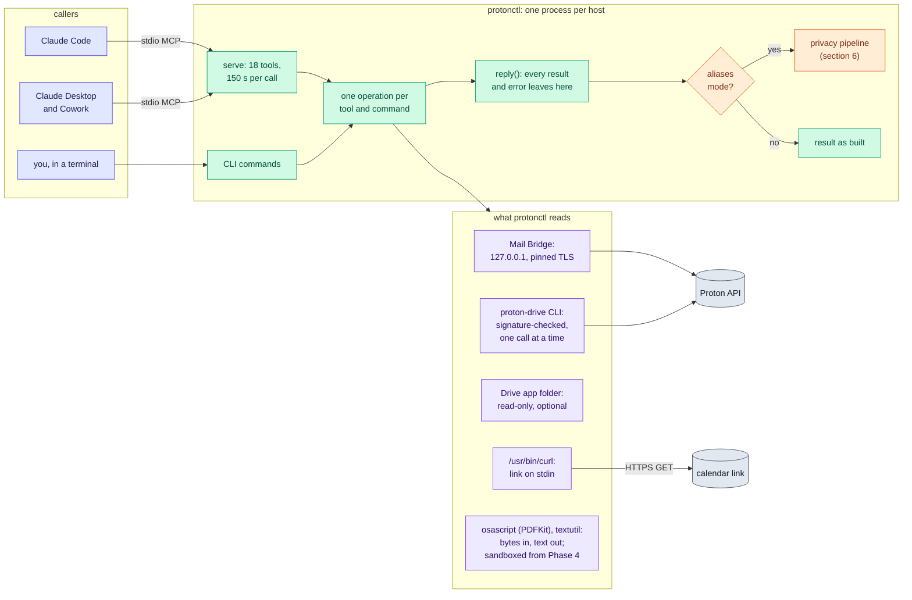
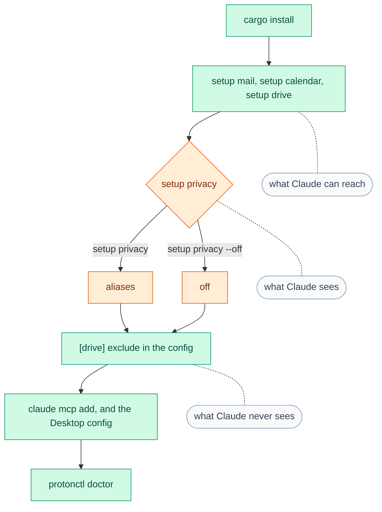
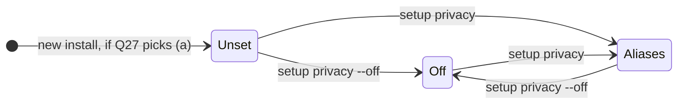
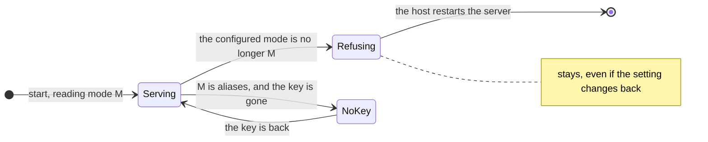
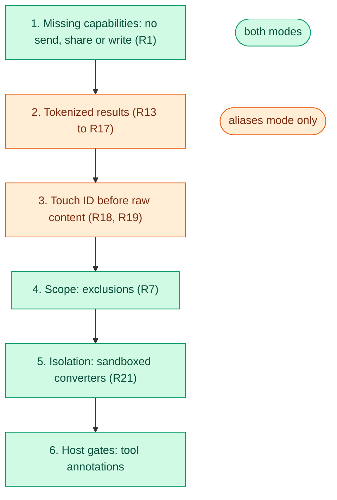

[RFC-0001](../rfc-0001.md) › 4. Design

# 4. Design

## Components



Each CLI command and MCP tool calls the same operation, so behaviour lives in
one place and the CLI has no capability the MCP surface lacks, except saving
a file where `--out` names (R10, R19). In aliases mode, MCP results pass the
privacy pipeline from Phase 2, and CLI output from Phase 3; the CLI's
`--raw` output and the `reveal_*` tools skip it, and only after user
presence (R18, R19).

## Command line, as built

```
protonctl serve                                   MCP over stdio
protonctl setup calendar --id ID [--name NAME]    share link on stdin; stored in the Keychain
protonctl setup mail --address USER [--port N]    Bridge password on stdin; pins Bridge's certificate
protonctl doctor                                  check every service; exit 1 if any fails
protonctl status                                  what protonctl reaches and every secret it holds
protonctl logout                                  delete protonctl's Keychain items; print Proton-side revoke steps
protonctl calendar list | events | search QUERY | event EVENT_ID
protonctl drive search QUERY | ls [PATH] | stat PATH | cat PATH | get PATH [--out DIR] | tree [PATH] | manifest [PATH]
protonctl mail search QUERY | count QUERY [--by FIELD] | message MESSAGE_ID | thread THREAD_ID | labels
protonctl mail attachment MESSAGE_ID INDEX [--out DIR]
```

Output is JSON on stdout; logs go to stderr. Exit codes: 0 success, 1 failure,
2 usage error. Writes are no longer planned. Still to build:
`protonctl setup privacy` (makes the privacy key if there is none and sets
the mode to aliases, R20, R26), `protonctl setup privacy --off`,
`protonctl setup drive`, `protonctl rotate-key`, and `--raw` on every
command that prints content in aliases mode (R19). `logout` will also
delete the privacy key, after which no old reference or handle resolves;
whether it keeps the key unless asked, so that aliases survive a sign-out
and setup, is settled in M2.1.

## Settings

Proposed 2026-10-04 with Q26; Q27 and Q28 hold the open parts.

A user makes three choices. Everything else is found automatically, or is
not a setting.



| Choice | Made by | Values |
|---|---|---|
| What Claude can reach | one setup command per service; a service is on only once set up | `setup mail`; `setup calendar`, once per calendar; `setup drive` |
| What Claude sees | `protonctl setup privacy`, or `protonctl setup privacy --off` | `off` or `aliases`, for every service and host on the Mac |
| What Claude never sees | `[drive] exclude` in the config | Drive paths |

```toml
[privacy]
mode = "aliases"   # or "off"; written by `protonctl setup privacy`
```

- **Services.** Mail and each calendar are on once set up, as built. Drive
  is on today whenever the Proton Drive app's folder or the CLI is found
  (`Drive::new` in `src/drive/mod.rs`), so it is the one service a user
  cannot leave out, short of excluding `/`. `protonctl setup drive` would
  check the CLI's signature and sign-in, find the app's folder and write a
  `[drive]` table; Drive is then on when the config has that table, so a
  config that already has one keeps working.
- **Privacy mode.**
  - `off`: results as built: names, Proton IDs, digests, page images, and
    the download and export folders. The 18 tools keep their names and
    parameters: a read-only stand-in for Claude's Gmail, Calendar and
    Drive connectors.
  - `aliases`: the privacy layer ([section 6](06-privacy.md)): aliases, references,
    handles, keyed digests, no images, no content on disk, `reveal_*`
    behind Touch ID, and the CLI tokenized. It has no `download_file` or
    `export_drive_manifest`, and Drive tools take `fileId` handles.
  - One mode for everything. A person shown by name in one result and by
    alias in another is paired with that alias in every transcript under
    the key (Q21), so a mode per service or per host would make that
    pairing routine. The parts are not separate switches either: a plain
    Proton ID beside an alias still links the item, and handles beside
    plain names hide little.
- **Exclusions** stay as built and apply in both modes (R7). Mail labels
  have none (declined on 2026-10-03).
- **Found automatically, set only to override:** `time_zone`,
  `[drive] folder` and `cli`, `[mail] port`. Optional, and off until set:
  `[export] folder`, in off mode only.
- **The same in both modes, and not settings:** read-only (R1), secrets in
  the Keychain (R2), the network rule (R3), tool hints (R4), hidden
  characters and provenance (R6), exclusions (R7), the time limit (R8),
  the signature check and the certificate pin (R9), calendar freshness
  (R12), sandboxed converters (R21) and clean logs (R25). None of these
  costs the user anything a setting could give back, so a switch would
  only be a way to lose one by mistake.

### Changing the mode (R26)



A running server holds the mode it started in:



- The two modes offer different tools, and the hosts keep the tool list a
  server gave them, so a running server refuses every call once the
  configured mode differs from the one it started in, and keeps refusing
  if the setting changes back, until the host restarts it. It never serves
  off-mode results after the user chose aliases.
- In aliases mode a missing privacy key refuses every call. protonctl never
  makes a key by itself, which would change every alias, and never falls
  back to off.
- `setup privacy --off` keeps the key, so aliases are unchanged if aliases
  mode comes back. Turning aliases mode on does not hide what earlier
  off-mode transcripts hold, and an item seen in both modes (the same date
  and size) can pair a name with its alias across transcripts; a
  `rotate-key` when aliases mode comes back keeps that pairing out of new
  transcripts.
- `status`, `doctor`, `get_status` and the server's `instructions` name
  the mode, so the user and Claude know whether names are aliases.

## MCP tools

Registered in both hosts as `proton`, which is what tool names and
permission rules use; the server calls itself `protonctl`. The
[API specification](lld-api.md#mcp-tools) gives each mode's parameters
and result fields.

| Tool | Kind | Backend | State |
|---|---|---|---|
| `get_status` | read | all | built |
| `list_calendars`, `list_events`, `search_events`, `get_event` | read | ICS link | built; tokenized in aliases mode (Phase 2) |
| `search_files`, `list_folder`, `get_file_metadata`, `read_file_content` | read | folder, else CLI | built; files not on this Mac come through the CLI; without the app's folder, list and stat do too and search is off; `read_file_content` returns text a page at a time, PDF and document text through macOS's PDFKit and `textutil`, a PDF's pages (a scan's unasked) as images, and images as image content. In aliases mode, Phase 2 tokenizes them, takes `fileId` handles in place of paths, and drops page images and image content (R22), and Phase 4 turns images and scans into OCR text; off mode keeps them as built |
| `list_drive_tree` | read | folder, CLI for SHA-1 | built; a page of rows at a time, by a cursor that names the folder in progress; keyed digests in aliases mode (Phase 2) |
| `download_file` | read | CLI | built; `export: true` saves into the export folder, `inline: true` returns the bytes as an embedded resource; off mode only from Phase 2 (R10, R22) |
| `export_drive_manifest` | local write | folder, CLI for SHA-1 | built; writes into the export folder only; off mode only from Phase 2 (R10) |
| `search_threads`, `count_messages`, `get_thread`, `get_message`, `list_labels`, `get_attachment` | read | Bridge | built; in aliases mode tokenized (Phase 2), `get_attachment` as text only |
| `reveal_message`, `reveal_attachment`, `reveal_file_content`, `reveal_event` | read, raw | Bridge, CLI, ICS link | aliases mode only, Phase 3: one handle per call, user presence first (R18) |
| Summary and question views on `get_message`, `get_thread`, `read_file_content` | read | local model | aliases mode, Phase 6 |
| `create_draft`, `update_draft`, `modify_messages`, `trash_messages`, `create_folder`, `upload_file`, `move_files`, `restore_files`, `trash_files` | write | Bridge, CLI | withdrawn 2026-10-04 (R1) |

Claude Code allow rules for the tools that only read:
`mcp__proton__get_status`, `mcp__proton__get_event`,
`mcp__proton__get_file_metadata`, `mcp__proton__get_message`,
`mcp__proton__get_thread`, `mcp__proton__list_*`, `mcp__proton__search_*`,
`mcp__proton__count_*`, `mcp__proton__read_*`. In off mode
`get_attachment`, `download_file` and `export_drive_manifest` can leave
files behind (the download folder for an hour, the export folder until
someone deletes them), so they stay on ask, and M1.6 marks the first two
`readOnlyHint: false` as the third is. The `reveal_*` tools match none of these, so they
stay on ask; Touch ID gates them either way. Whether Claude Code matches a
glob inside a tool name, rather than only a whole server or one tool, is
checked in the Phase 1a Claude Code test (M1.1); if it does not, the rules
list each tool by name. A rule for the whole server (`mcp__proton`) would
also allow `reveal_*`. Setting `_meta["anthropic/requiresUserInteraction"]`
on `reveal_*` as well would add Claude Code's own prompt on every call;
whether that second prompt is worth it is left to Phase 3.

## Results and untrusted content

Results are compact JSON. Each names its
third-party-authored fields in `provenance`, reports
`hiddenCharactersRemoved`, and marks truncation. The server's `instructions`
state the convention once. Tool parameters reject unknown names, so a
misspelled `start_time` is an error the model can correct rather than a
silently ignored value; `search_events` is the exception, since it flattens
`list_events`' window and serde cannot check unknown names through a
flattened struct. In aliases mode a result also carries `entities`,
`detectors` and, when R23 calls for it, `guidance`; [section 6](06-privacy.md) shows an
example.

## Safety model

Strongest layer first; revised 2026-10-04 for a read-only connector.



1. Missing capabilities (R1): no send, share or write, so nothing to approve
   and nothing to trick.
2. In aliases mode, tokenized results (R13 to R17): what leaves is
   pseudonymous unless the user approves one raw item.
3. In aliases mode, user presence for raw content (R18, R19): an agent
   cannot pass Touch ID, and protonctl, not the model, writes the prompt;
   the item's name, which a third party wrote, comes last, cut and quoted.
4. Scope: exclusions (R7).
5. Isolation: converters run in a sandboxed helper (R21).
6. Host gates: annotations for Desktop and Cowork.

None of these layers reaches the host's other tools in the same session
(a web fetch, a shell, another connector), which injected text can use to
send on whatever protonctl returned ([section 5](05-security.md)).

## Files

| What | Where |
|---|---|
| Binary | `~/.cargo/bin/protonctl` (Q12 weighs a path the user cannot write) |
| Config | `~/.config/protonctl/config.toml` (no secrets; format in `src/config.rs`; `[privacy] mode` from Phase 2, unless Q28 moves it to the Keychain) |
| Secrets | Keychain service `protonctl`, accounts `calendar/<id>`, `bridge/<address>` and, in aliases mode, `privacy-key` |
| Downloads | `~/Library/Caches/protonctl/downloads/<pid>/` (mail attachments and Drive files); off mode only from Phase 2 |
| Cloud-only Drive files | in aliases mode, from Phase 2, a per-process RAM disk, only if `proton-drive` cannot stream to stdout |
| Exports | the folder `[export] folder` names: `drive/<Drive path>`, `mail/<messageId>/<index>-<name>`, `manifests/drive-<UTC time>.jsonl`; off mode only from Phase 2 |
| On Linux | the same names under XDG folders: `$XDG_CACHE_HOME/protonctl`, `$XDG_STATE_HOME/protonctl`; secrets in the Secret Service ([section 11](11-platforms.md)) |
| Not protonctl's, but holding its results | Claude Code's transcripts under `~/.claude/projects/`; Claude Desktop's logs under `~/Library/Logs/Claude/` ([section 5](05-security.md)) |

---

[← 3. Options considered](03-options.md) · [Contents](../rfc-0001.md#contents) · [5. Security →](05-security.md)
