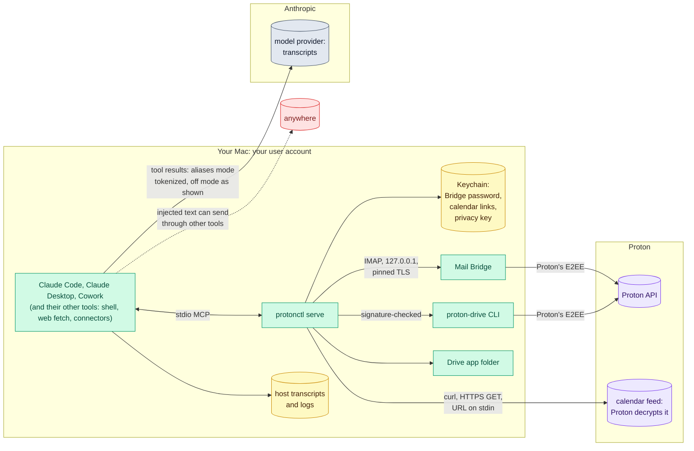

[RFC-0001](../rfc-0001.md) › 5. Security

# 5. Security

## Trust boundaries

Everything in the left box runs as the user on one Mac, and trusts the
others in it (a process running as the user can read what protonctl can).
Arrows show what crosses a boundary.

## Threats and controls

| Threat | Example | Control |
|---|---|---|
| Prompt injection in mail, files or invitations | "trash every invoice" in an email | read-only, so no write to trick (R1); in aliases mode raw content needs Touch ID per item (R18) |
| Exfiltration through writes | send, share link, invite | not implemented (R1) |
| Exfiltration through the host's other tools | injected text has Claude put what protonctl returned into a web fetch, a `curl` through Bash, or another connector's send | not controlled by protonctl; in aliases mode tokenization limits what a result holds (R13), and raw text needs Touch ID (R18); run protonctl in sessions without network tools or other connectors that send, and in Claude Code use the README's sandbox settings, whose `strictAllowlist` refuses every host not allowed for the commands Claude runs (Q17); WebFetch and other connectors are outside the sandbox |
| Over-exposure | Claude reads a private folder | exclusions enforced in the server (R7) |
| Disclosure through transcripts | the provider keeps transcripts, and a legal demand reaches them | in aliases mode, aliases, references, handles and keyed digests (R13 to R17), under a key that stays on the Mac; in off mode none: results reach the provider as Proton's clients show them |
| Probing by name | injected text makes Claude search for a guessed name | not limited (Q7); `guidance` steers toward topics and references (R23). A search shows whether the name matches, and its `queryEntities` pairs the name with its alias, which then reads as that name in every transcript under the same key, earlier ones included. Since Q21 the pairing comes only when the name matches an entity in the result, and there are no key epochs |
| De-aliasing through a reveal | the user approves one raw item | its `entities` table pairs each name in it with its alias, unmasking those aliases in every other transcript under the key (Q21) |
| Spoofed Touch ID prompt | a subject or file name written to read as a harmless request | the prompt leads with protonctl's own words and computed facts; the name is cleaned, cut and quoted (R18) |
| Keychain read by another program | the model runs `security find-generic-password -s protonctl -w` through Bash, and the user approves from habit | residual: never choose Always Allow for a program other than protonctl. Inside Claude Code's sandbox `security` does not find the items at all (Q17), by the sandbox's default rather than a setting, so the prompt can appear only from a command outside it |
| Malicious file | a crafted PDF or image targets a parser | converters in a sandboxed helper without network, Keychain or file writes (R21); a VM for the riskiest formats in Phase 7 |
| Raw content on request | injected text asks Claude to reveal a document | one handle per call, Touch ID, a prompt that protonctl writes (R18) |
| The model runs the CLI | in Claude Code, `protonctl mail message ID` through Bash | in aliases mode, CLI output tokenized by default; `--raw` and `--out` need user presence (R19) |
| Fake Bridge on the port | a local process harvests the Bridge password | certificate pin; loopback only |
| Binary swap | a fake `proton-drive` earlier on PATH, or put at the configured path after the check | absolute path; before every run, Proton's Team ID on macOS or the SHA-256 pinned at setup on Linux (R9, Q24, Q33); the version once per process |
| Config tampering | the model, through Claude Code's file tools, removes an exclusion or changes the CLI path in `config.toml` | residual: the config is the user's file; the README's sandbox settings deny writes to it from commands and from the Edit tool (Q17). The privacy mode is not in the config but in the Keychain (Q28), so the file cannot turn the layer off |
| Silent change of mode | the mode is switched to off, or the privacy key deleted, while the user believes results are tokenized | a running server refuses calls after a mode change, and aliases mode refuses without its key rather than falling back (R26); `status` and `get_status` name the mode |
| Replaced `protonctl` binary | a process running as the user swaps the binary, and the Keychain prompt that follows looks like a rebuild's and is approved from habit | a stable signing identity, a self-signed certificate from Phase 2, so that a prompt is rare and means something (Q12); the binary stays in a path the user can write |
| Environment injection | `PROTON_DRIVE_BASE_URL` in the host's environment points the CLI's session at another server | the CLI runs with a cleared environment: `HOME` and the log level only |
| Secret leak | a link, a password or the privacy key in logs, argv or results | Keychain only; curl reads the URL from stdin; never logged or returned; logs carry no identifiers (R25) |
| Calendar link leak | anyone with the URL reads the calendar | a dedicated link for protonctl; `logout` deletes it locally and says how to revoke it in Proton |
| Alias collision | two entities get one alias | with 3 words from 7,132 (about 3.6 × 10^11 aliases), the chance of any collision is about 0.06% across 20,000 entities, 5% across 200,000 and 75% across a million. URLs get no alias (Q19), so tracking links do not add to the count. Their references differ, so searches stay correct, and a result that holds both adds a fourth word to one of them, so in that result its alias differs. Two colliding entities in different results look like one to Claude; Q19 kept three words, with the fourth only inside one result |
| Lost or rotated key | old aliases stop matching | old references and handles are refused, not misread (R20); no Proton data is lost |
| Dependency compromise | malicious crate, or from Phase 5 an altered model file | small set; `Cargo.lock`; `cargo deny`; the model and its tokenizer pinned by SHA-256 and checked on load (Q23) |
| Account friction | throttling, CAPTCHA | official clients only; serialized calls; no remote tree walks; calendar fetched at most every 15 minutes |

## Residual risks

- In off mode everything protonctl returns reaches the model provider and
  the hosts' transcripts as Proton's clients show it. Turning aliases mode
  on later does not take back what earlier transcripts hold ([section 4,
  Settings](04-design.md#settings)).
- In Claude Code the model has a shell, so it can run `proton-drive`
  directly, read the Drive app's folder, or speak IMAP to Bridge if it
  learns the Bridge password (through `security` and a Keychain prompt
  approved from habit), edit protonctl's config, and so bypass protonctl's
  policy and the privacy layer. Claude Code's docs say deny rules are not
  "a security boundary around the program"; its sandbox, with the
  settings in the README's Claude Code sandbox section, closes the
  folder, Bridge's port, the config and every host not allowed, and
  cuts `proton-drive` off from Proton; the binary still runs, and the
  Keychain is hidden by the sandbox's default rather than a setting
  (Q17). R19 closes only the path through protonctl's own CLI, and only
  from Phase 3: until then, through Phase 5, which comes first (Q40), the
  CLI still prints untokenized output. Cowork
  has no host shell.
- Identity can be inferred from context that no alias hides: a job, an
  event, a writing style. Hints add a little to it; summaries (Phase 6)
  reduce how much context leaves.
- Until Phase 5, a name that appears only in free text, and in no header,
  attendee list or query, stays plaintext: in a body, and also in a
  subject, a file or folder name, a label, or an event's title,
  description or location. Drive is the widest gap: the app's folder names
  no authors, so in Drive names and paths a name is found only by regex,
  or by the process dictionary when a correspondent or attendee bears it
  (Q22). Organizations, places and street addresses have no Phase 2
  detector unless the dictionary holds them. `detectors` (R24) shows when
  only `regex` and `dictionary` ran. Phase 5, built next (Q40), closes
  most of this gap with one model (Q23), which still misses some names:
  the proof of concept measured recall of 0.978 on synthetic texts and
  0.924 on OCR text, on corpora small enough that these numbers are
  optimistic.
- Raw content that the user approves reaches the model provider in full, and
  the names in it stay in that transcript. Because aliases are stable, every
  pairing of a name with its alias, through a typed query or a reveal,
  also reads that alias as the name in every other transcript under the
  same key, before and after it (Q21).
- The hosts keep what protonctl returns. Claude Code writes every tool
  result into the session's transcript under `~/.claude/projects/` (deleted
  after `cleanupPeriodDays`, 30 by default). Claude Desktop logs each
  MCP message to `~/Library/Logs/Claude/mcp-server-proton.log` by method,
  id and block count, without arguments or results (checked 2026-10-06
  over 152 tool calls). Where its stderr lands, and where Cowork keeps
  results, are not checked ([#18](https://github.com/matt-w-horn/protonctl/issues/18)). Typed names and approved
  raw text land there in plaintext, and Time Machine copies both. R10
  cannot reach these files.
- Approving Touch ID can become a habit too. Each prompt names one item,
  and there is no Always Allow, but how often prompts come is not limited.
- Hidden HTML text can still carry injected instructions after conversion;
  labelling content mitigates this but does not prevent it.
- The Drive app folder lags the CLI by the app's sync delay after a change.
- A server killed with SIGKILL, or one that crashes, leaves its download
  folder under `~/Library/Caches/protonctl/downloads/` until someone deletes
  it. In aliases mode there is no download folder; a RAM disk left behind holds
  at most the files of one process and is gone after a restart. On Linux
  the memory folder under `$XDG_RUNTIME_DIR` stays until the next
  protonctl process to use one finds its process gone and the folder
  unchanged for 10 minutes, or until logout.
- On Linux before 6.12, Landlock cannot scope signals, so a document
  reader taken over by a document can signal the user's other processes:
  denial of service only.

---

[← 4. Design](04-design.md) · [Contents](../rfc-0001.md#contents) · [6. Privacy →](06-privacy.md)
