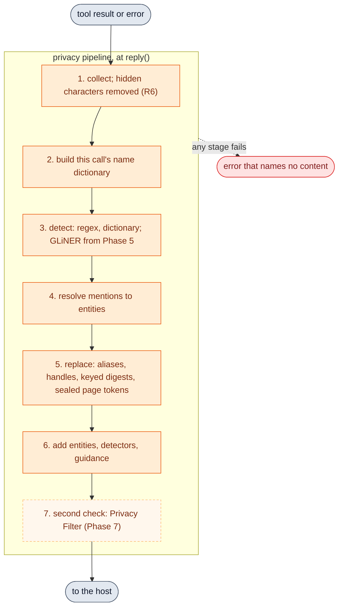
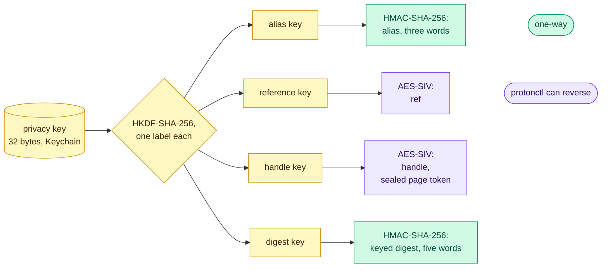
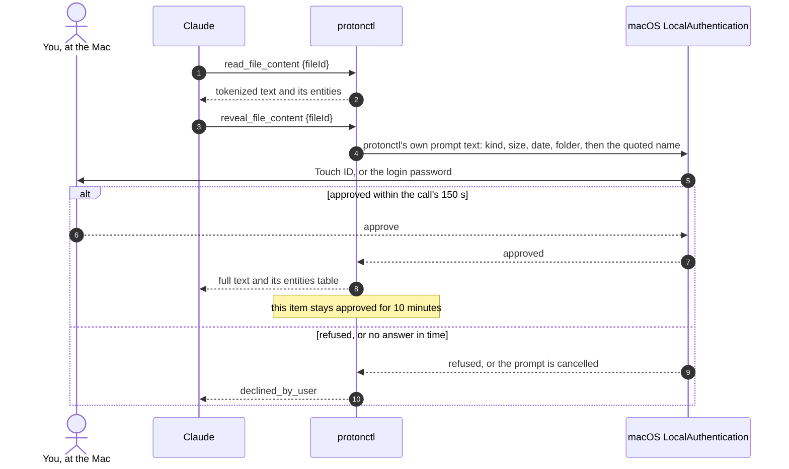

[RFC-0001](../rfc-0001.md) › 6. Privacy

# 6. Privacy

## Disclosure and retention

- **Flagged once:** whatever Claude reads leaves Proton's zero-access model
  and is processed by Anthropic under the Claude account's terms. In
  aliases mode that is the tokenized form, unless the user approves a raw
  read.
  Check the account's model-training setting before connecting mail.
- **Calendar link (decision Q1, confirmed by Q9):** "When the URL is used,
  Proton Mail has access to this key to decrypt the calendar." Limits: a
  dedicated link, fetches at most every 15 minutes, Limited view (busy/free
  only) for any calendar whose details Claude does not need.
- Minimization: search returns metadata, plus 200-character text snippets
  only when a call asks for them; content only on explicit reads;
  exclusions apply before results exist. In aliases mode all of it is
  tokenized.
- Retention: protonctl keeps its config and, in aliases mode, the privacy
  key. The hosts keep what protonctl returned in their transcripts and logs
  ([section 5](05-security.md)). In off mode the export folder, when one is configured, keeps
  what was exported until someone deletes it; choose a folder that no sync
  service mirrors unless that is wanted. Aliases mode has no export folder
  (R10). The Phase 1b write log is withdrawn.
  Bridge's and the CLI's caches belong to Proton's clients. protonctl runs the
  CLI with `PROTON_DRIVE_LOG_LEVEL=ERROR`, which stops its DEBUG messages; it
  still writes metric events (counts, sizes, timings, its crypto model; no
  names or IDs) to `~/Library/Logs/proton-drive-cli`.
- No telemetry. protonctl's own sockets go only to 127.0.0.1.

## Privacy layer (decided 2026-10-04; aliases mode, Phases 2 to 7)

In aliases mode ([section 4, Settings](04-design.md#settings)), the
privacy layer makes every result pseudonymous before it reaches the model,
and keeps the pseudonyms stable without storing any state. It protects the people in the user's mail, files and calendar from disclosure
through the provider's transcripts. It cannot stop the model from inferring
identity from context ([section 5](05-security.md)).
The [low-level design](lld-privacy-layer.md) says how it is built into
the code, and the [API specification](lld-api.md) gives every tool,
field, error and wire format.

### Pipeline



The pipeline runs in aliases mode on every MCP result, errors included,
and, from Phase 3, on CLI output. Every tool's result already leaves
through one function, `reply()` in `src/serve.rs`, which also turns errors into `isError`
results; the pipeline goes there, so no tool can skip it, and a failure in
any step returns an error that names no content (R13).

1. Collect the result as today, from Bridge, the Drive folder or CLI, or the
   calendar feed. Detection runs on a copy of each text with every hidden
   character removed, its offsets mapped back to the original, so that
   neither a hidden character nor its `\u{...}` escape in a Drive name (R6)
   can split a name the detectors would otherwise find.
2. Build the name dictionary: display names and addresses from the
   result's headers (From, To, Cc, Reply-To, Sender), calendar organizers
   and attendees, Drive owners and authors, and the names in the query;
   and, for the whole process (Q22), every correspondent's display name
   from All Mail's ENVELOPE (1.9 s for about 20,000 messages,
   [Appendix A](appendix-a-phase-0.md)) and every calendar attendee, built
   on the first aliases-mode call and held in memory only, so that a
   correspondent's name is found in Drive names, subjects and titles too.
   Until Phase 5 the server knows a query term is a name only when an
   operator holds it (`from:`, `to:`, `cc:`, `bcc:`), a regex finds it, or
   the dictionary already has it; a bare name among topic words ("Alice
   Chen contract") is not recognized, so `queryEntities` and R23's
   guidance miss it, unless the process dictionary holds the name.
3. Detect: regex with validators (an email address; a phone number checked
   as assigned with `phonenumber`; a card number by the Luhn check; an IBAN
   by mod-97; a URL; a domain name; an IP address; a US Social Security
   number by its format rules; a one-time code or password after a label
   such as "code", "password" or "PIN" on the same line; the local
   account name in a path), the dictionary over all text with
   `aho-corasick`, and from Phase 5 GLiNER for people, organizations and
   locations. Street addresses have no Phase 2 detector.
4. Resolve each mention to an entity (below).
5. Replace each mention with its alias and build the `entities` table;
   replace IDs with handles, digests with keyed digests, and page tokens
   with sealed ones (R16).
6. Add `detectors` and, where R23 calls for it, `guidance`.
7. From Phase 7, check the finished result with a second detector, Privacy
   Filter. A hit withholds that item.

The `entities` table counts toward the result's size: a page holds 20,000
characters of text by default because 100,000 measured 110,496 characters
of JSON, over Claude Code's 25,000-token limit (`src/extract.rs`), and a
newsletter can name hundreds of URLs. Pages shrink to fit the table. URLs
are kept out of it (Q19): each becomes `link N` with its domain's alias in
parentheses, numbered within the result, with no word alias and no
`ref`.

### Canonical values and entity resolution

- A canonical name is the name in Unicode NFKC, case folded, without
  diacritics, with whitespace collapsed, honorifics (from a multilingual
  list: Mr, Ms, Dr, Herr, Frau, M., Mme, Sr., Sra. and others) removed
  only before a full name, and "Chen, Alice" reordered to "Alice Chen". A canonical email address is
  the address in lower case.
- A person's alias comes from the canonical name. An email address has its
  own alias, listed under the person's `addresses` when a header pairs them.
  A name with two addresses can be one person or two people who share a
  name; the table shows both addresses, so a reader can tell.
- From Phase 5, short forms in one item ("Alice", "Ms. Chen") join the full
  name when exactly one candidate fits, and similar names in one result are
  marked `maybeSameAs` instead of merged. Two aliases for one person cost a
  missed link; one alias for two people silently mixes their words. The
  rule accepts the first error to avoid the second.
- Known limits: inflected names (a German genitive, Slavic case endings) and
  names written in another script get their own aliases unless an email
  address links them.
- Canonical rules must not merge two people, the error the rule above
  avoids. Diacritics are removed from Latin, Greek and Cyrillic letters
  only: in Devanagari, Thai or Arabic the marks are letters, and removing
  them makes different names one. An honorific goes only before a full
  name, a given name and a surname ("Dr Alice Chen" and "Alice Chen" are
  one person): before a surname alone it is the only thing that tells
  "Mr Chen" from "Mme Chen", and `M.` and `Sr.` also stand for an initial
  and for Senior. Case folding is Unicode's, without Turkish rules.
- Names (person, organization, location) share one tag in the alias
  HMAC (Q19, [low-level design](lld-privacy-layer.md#constructions)), so
  a display name typed `person` in Phase 2 and `organization` by GLiNER
  in Phase 5 keeps its alias, at the cost that a person and an
  organization with the same canonical name share one. Changes to the
  canonical rules or the word list change aliases; the `v1` in the key
  labels versions them, and `get_status` reports it.

### Identifiers

One key in the Keychain gives every identifier; nothing maps them back on
disk (principle 8).



| Identifier | Construction | Size | Written as | protonctl can reverse it |
|---|---|---|---|---|
| Alias | HMAC-SHA-256 under the alias key, over a type tag and canonical value; first 8 bytes reduced modulo the list length cubed | about 38 bits | three words: `amber-falcon-river` | no |
| Reference (`ref`) | AES-SIV under the reference key, over type and canonical value padded to 32 bytes | 48 bytes for most names | base64url, 64 characters | yes |
| Handle | AES-SIV under the handle key, over item kind and Proton ID, or a Drive path as stored (Q20) | 33 bytes for a 16-character message ID; for a Drive file, the path plus 17 bytes, or padded to 32 bytes as a `ref` is (R16) | base64url, 44 characters for a message | yes |
| Sealed page token | AES-SIV under the handle key, over the token's kind and today's token | 17 bytes more than today's token | base64url | yes |
| Keyed digest | HMAC-SHA-256 under the digest key, over the algorithm's name and the raw digest; first 64 bits | 64 bits | five words | no |

AES-SIV here is the 512-bit-key form (two AES-256 keys, `Aes256Siv`), with
no nonce, so equal inputs give equal outputs, which is what makes refs and
handles stable; HKDF gives each key its own label. Padding is unambiguous
(a 0x80 byte, then zeros), so a value that ends in zeros survives.

The words come from the EFF large word list (7,776 words), curated to drop
words that read as loaded, or as names and brands such as "jordan" and
"apple", or as a kind of place, organization, role or relation ("clinic",
"school", "legal", "mother"), which Claude could take as facts about an
entity ([Appendix C](appendix-c-roleplay.md)). The curated list keeps at least 7,132 words, so five words hold 64
bits (Q18). Aliases and keyed digests stay words whatever they cost in
tokens, since people read them in prose (Q16). Field names stay as they are:
`messageId`, `threadId` and `eventId` hold handles, and Drive tools take
`fileId` in place of `path`, since a path carries names.

### Hints

At most three per entity, each true of many people:

- role in this result: sender, recipient, cc, organizer, attendee, owner,
  mentioned;
- relation: you, your organization (the domain of your own address, unless
  it is a shared provider such as proton.me or pm.me, where it would mark
  every Proton user), external;
- domain type: webmail, government, education or organization in Phase 2;
  finer types such as news or law firm wait for a local model (Phase 6).
  Never a country, which together with a domain type can narrow a person
  down.

A title from a signature, such as "counsel", also waits for Phase 6.

### Names in the chat

A name typed in the current call's query gets its alias in that call's
result, like any other name. As typed, it appears only as a key of
`queryEntities`, which maps it to its alias. Claude carries the pair from then on; the server keeps no record of the
names Claude typed. When a query matches by similarity rather than exactly (Phase 5), the
result keeps the alias and adds `matchedQuery`, so it never discloses a
spelling the user did not type. The pair also outlives the chat: the alias
is the same in every transcript under the key, so whoever reads this
transcript can read that alias as the name in all of them. Q21 limits
`queryEntities` to names that match an entity in the result, keeps the
pair in `reveal_*` results, where Claude needs it, and leaves
`rotate-key` to the user rather than to a schedule, since epochs would end
Q8's stability.

### Raw reads (Phase 3)



1. Claude calls `reveal_file_content {"fileId": "<handle>"}` after a
   tokenized read fell short.
2. protonctl asks for Touch ID with its own text, for example: "Send the
   full text of a Drive document (14 pages, modified 2026-09-30) to
   Claude? Its names and contents will reach the model provider. Name:
   'Interview – Alice Chen.docx', in '/Projects'". The names, which people
   wrote, come last, cleaned, cut to 60 characters and quoted (R18).
3. On approval it returns the text, never images. Names stay as written,
   while IDs, digests and page tokens are still handles and keyed digests
   (R16, R17); an `entities` table pairs each name with its alias (Q21). On refusal or timeout it
   returns `declined_by_user`; a prompt open when the call's 150 s end is
   cancelled.
4. The approval covers that item for 10 minutes, so its later pages need no
   second prompt.

From Phase 2 until Phase 4, a scan or an image has no text to give, and
`reveal_*` returns no images, so neither is readable through protonctl.
Whether a reveal may return page images after Touch ID, as raw text is
returned, is not decided ([docs/todo.md](../todo.md), Decisions).

### Guidance

Each line is under 200 characters:

- After a query named someone in plaintext: "This query put 'Alice Chen' in
  the transcript. To keep names out, search by topic or by the person's
  `ref`."
- After a result was cut short or paged: "More results exist. Narrow by
  topic or date before paging."

### No content on disk

| Source | Path |
|---|---|
| Mail and attachments | Bridge's IMAP into memory |
| Drive files the app has synced | read from the app's folder, which adds no copy |
| Drive files not on this Mac | a per-process RAM disk, since `proton-drive` writes downloads only into a folder (Q14); on Linux, `$XDG_RUNTIME_DIR` |
| Conversion | bytes to `osascript` (PDFKit) or `textutil` on stdin today, text back on stdout; under a sandbox profile from Phase 4 (R21). On Linux, poppler or pandoc inside `protonctl convert`, under Landlock and seccomp (Q34) |

The helpers run with an empty environment, so they find the real home and
per-user temporary folders through the system rather than `HOME` or
`TMPDIR`; whether they write anything there is what the no-disk test
watches ([section 7](07-testing.md)), which is not built
([docs/todo.md](../todo.md), T7). Proton's own clients keep their caches (Bridge's
encrypted store, the Drive app's folder, the CLI's cache), and the hosts
keep their transcripts and logs ([section 5](05-security.md)); R10 covers neither.

### Who uses it, and how

- Claude names people by the role the results show, with the alias in
  parentheses the first time ("your lawyer (amber-falcon-river)"), as the
  aliases-mode instructions ask; a role-play found it did so even unasked
  ([Appendix C](appendix-c-roleplay.md)). The server adds nothing for it.
- A person reads aliases with their hints. To search for someone they know,
  they type the name, which puts it in the transcript and pairs it with the
  alias. To see who an alias is, they open the item in Proton: Claude gives
  its date, folder and tokenized subject. When the exact text matters, they
  approve one raw read.
- A subagent reads the same aliases from the same key and gets an
  `entities` table with every result, so it needs nothing from its parent's
  context. It searches by `ref`.
- A long chat, an agent's notes or Claude's memory can keep aliases and
  references: they stay valid until `rotate-key`, on every host, because
  Claude Code and Claude Desktop read the same key. A change to the
  canonical rules, the word list or a detector's typing also changes some
  aliases (Q19), and a Drive handle goes stale when its path changes (Q20).

### Example

A search row and its table, in aliases mode. Refs are ciphertext; the ones shown are random placeholders.

```json
{
  "messages": [
    {"messageId": "kq3Vt9oPq…", "date": "2026-09-30T17:05:00+00:00",
     "from": "amber-falcon-river <copper-lantern-mist>",
     "subject": "Re: tidal-oak-ember renewal"}
  ],
  "entities": {
    "amber-falcon-river": {"type": "person",
      "hints": ["sender", "external", "organization"],
      "addresses": ["copper-lantern-mist"], "ref": "GwZIvo_D…"},
    "copper-lantern-mist": {"type": "email", "hints": ["organization"],
      "ref": "eD_bULXO…"},
    "tidal-oak-ember": {"type": "organization", "hints": ["external"],
      "ref": "TFlJfQtw…"}
  },
  "detectors": ["regex", "dictionary"]
}
```

---

[← 5. Security](05-security.md) · [Contents](../rfc-0001.md#contents) · [7. Testing →](07-testing.md)
