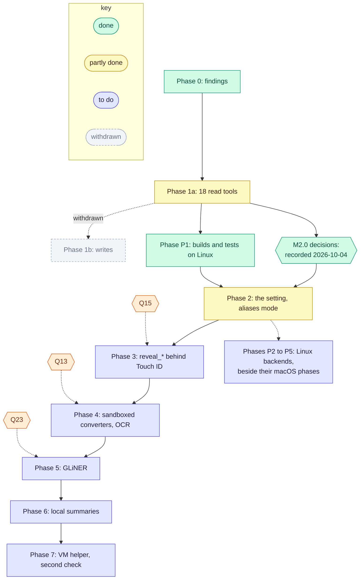

[RFC-0001](../rfc-0001.md) › 9. Rollout and milestones

# 9. Rollout

## Phases

| Phase | Contents | State |
|---|---|---|
| 0 | Install Bridge, log in, enable All Mail, IMAP over SSL; measure the `--noninteractive` cold start; record `X-Pm-*` headers, UIDPLUS, label-removal semantics on a sandbox message, BODY search on encoded parts; record the CLI's path format, JSON shapes and `fs info` fields; create a dedicated calendar link and note its caching headers. Findings go in [Appendix A](appendix-a-phase-0.md). | Recorded ([Appendix A](appendix-a-phase-0.md)), except the label-removal semantics, which moved to Phase 1b because measuring them writes to the mailbox; withdrawn with Phase 1b |
| 1a | `serve`, `setup`, `doctor`, `status`, `logout`; read tools for Mail, Drive and Calendar; registration in both hosts; Cowork local and cloud test | Calendar, Drive and Mail reads built, `download_file` included, 18 tools; the 17 built by then passed `scripts/live-check.py` (2026-10-03), and `list_drive_tree` and PDF page images came after; a full live run and the Claude Code and Cowork tests to do (M1.1, M1.2) |
| 1b | The maintainer writes the policy table: a class for each write tool, and what the server does with each class; Mail and Drive write tools; sandbox write tests | withdrawn 2026-10-04: protonctl is read-only (Q5) |
| 2 | The privacy setting (R26) and `setup drive`; then aliases mode: the privacy pipeline for all three services at once, at `reply()`, over results, errors and page tokens, failing closed: privacy key, aliases, references, handles, sealed page tokens, keyed digests, the `entities` table, `detectors` and `guidance`; regex with validators and the name dictionary; `download_file`, `export_drive_manifest`, the CLI's `drive manifest`, the `export` and `inline` options, the export and download folders, page images, image content and inline bytes absent in aliases mode and kept in off mode; a panic hook in both modes (R25); the leak test and the `live-check.py` checks. The CLI may be tokenized here too, ahead of Phase 3, since in Phase 2 it is the easy way around the pipeline in Claude Code | built and tested on Linux 2026-10-04, except M2.8 (cloud-only reads) and M2.10 (live checks); the Keychain code and every live check wait for a Mac; the CLI is not tokenized |
| 3 | In aliases mode, the `reveal_*` tools, and the CLI tokenized with `--raw` and `--out` behind user presence; Claude Code sandbox settings documented (Q17) | to do; answer Q15 first |
| 4 | PDFKit and `textutil` under a sandbox profile, directly or behind `protonctl convert`, in both modes; Vision OCR for images and scans in aliases mode | to do; answer Q13 first |
| 5 | GLiNER (multilingual) through `gline-rs`; short forms within an item; `maybeSameAs`; recall measured on a labeled synthetic corpus | to do; answer Q23 first |
| 6 | Summary and question views from a local model, written with aliases; finer domain types and titles from signatures as hints | to do; Q23 names the runtime |
| 7 | A Linux VM helper for the riskiest formats; Privacy Filter as the second check; an optional allowlist of names kept in plaintext | to do |
| P0 to P5 | Linux ([section 11](11-platforms.md)): P1 builds and tests on Linux before Phase 2; P2 Mail and Calendar; P3 Drive; P4 converters with Phase 4; P5 presence with Phase 3 | P1 done 2026-10-04; Q30 to Q35 decided the same day; the rest to do |

## Milestones

Each milestone ends when its exit check passes; code locations are those
of 2026-10-04. A milestone that depends on an open question starts once
that question is answered in [section 10](10-open-questions.md).

### Phase 1a, to close

- M1.1 Host tests. Register with `claude mcp add` and in
  `claude_desktop_config.json`; run `get_status` from Claude Code, Claude
  Desktop, Cowork on the Mac and, from 2026-10-06, a Cowork cloud task.
  Check whether the allow rules' globs (`mcp__proton__get_*`) match, and
  record where each host keeps tool results and stderr. Exit: findings in
  [Appendix A](appendix-a-phase-0.md); the allow rules in [section 4](04-design.md) and the README corrected if the
  globs do not match.
- M1.2 A full `scripts/live-check.py` run over all 18 tools, with
  `list_drive_tree` and PDF page images. Exit: every check passes.
- M1.3 Say read-only where the model reads it: the server's
  `instructions` (`src/serve.rs`) and `get_status`'s `cannot`
  (`src/main.rs`) still list only send, share and permanent delete; the
  README says read-only since 2026-10-04. Exit: a test on both texts,
  since the surface snapshot does not hold the instructions. Done
  2026-10-04: both texts hold `serve::CANNOT`, and the test failed when a
  word was dropped from the instructions.
- M1.4 Drive set up like the other services, as Q26's proposal, confirmed
  on 2026-10-04, says: `protonctl setup drive` checks the CLI's signature and
  sign-in, finds the app's folder and writes `[drive]`; `App::load` in
  `src/main.rs` builds a `Drive` only when the config has that table;
  `doctor` and `status` say how to turn Drive on; the README gains "Add
  Drive". Exit: Drive is off without the table and on with it. Built
  2026-10-04 (the exit test failed against the old automatic Drive); the
  signature and sign-in steps run only on a Mac, so the first live
  `setup drive` is part of the Mac check.
- M1.5 R6 in Drive errors. `list_folder`'s "not a folder" error
  (`src/drive/mod.rs:540`, `format!("not a folder: {path}")`) shows a
  folder name's hidden characters raw, where every other message uses
  `escape_hidden`; and two errors pass on the Drive CLI's own text
  uncleaned, which can repeat a node's name: up to 500 characters of its
  stderr or stdout (`src/drive/cli.rs:188`) and its JSON report
  (`src/drive/mod.rs:1273`). Escape the path and `clean` the CLI's text.
  Exit: tests with U+202E in a file name, and in the stand-in CLI's
  output, see none of it raw, each shown to fail before the fix; no other
  `bail!`, `anyhow!`, `format!` or `with_context` in `src/drive/` passes
  on a path or the CLI's text unescaped or uncleaned. Done 2026-10-04: the
  three tests failed first, each showing U+202E raw; every other error
  site escapes Drive paths already or names only protonctl's own paths.
- M1.6 Hints that match what each tool does. `download_file` and
  `get_attachment` can save files that outlive the call (the download
  folder for an hour, the export folder until someone deletes them), yet
  set `readOnlyHint: true` (`src/serve.rs`); MCP defines that hint as not
  modifying the environment. Set it false for both in off mode, as
  `export_drive_manifest` has; aliases mode saves nothing, so its
  `get_attachment` keeps true. Exit: the surface snapshot. Done
  2026-10-04 for off mode, the only mode built, with `idempotentHint`
  false too, since each saving call writes a new copy; aliases mode's
  `true` comes with M2.11.

### Before Phase 2: decisions

- M2.0 Confirm Q26's proposal and answer Q27 (mode of a new install), Q28
  (where the mode lives), Q14 (stdout or RAM disk), Q16 (token cost), Q18
  (word list), Q19 (alias input, word count, URLs), Q20 (Drive handles),
  Q21 (pairing), Q22 (entity types, dictionary scope), Q12 (signing), Q24
  (CLI check per run) and Q25 (`/security-review`).
  Exit: each recorded as decided in [section 10](10-open-questions.md), and R14 to R17 and R26
  updated to match. Done 2026-10-04: the maintainer chose Q27 and
  delegated the rest.

### Phase 2: tokenized results

M2.11 comes first: every other Phase 2 milestone runs only in aliases mode.

- M2.1 Privacy key. `protonctl setup privacy` stores 32 random bytes as
  text (hex or base64, since `secret::get` in `src/secret.rs` reads UTF-8)
  under account `privacy-key`; HKDF subkeys; `rotate-key`; `status` and
  `logout` include it; a running server reloads the key when the key ID in
  the item's comment changes. Exit: stability, rotation and redaction
  tests. Done 2026-10-04 on Linux: `setup privacy`, `setup privacy --off`
  and `rotate-key` (the last two ask first, on a terminal only) and the
  reload by key ID, with the
  subkey, rotation and decoding tests in `src/privacy/key.rs`. The
  Keychain calls compile in the macOS lint and run only on a Mac.
- M2.2 Identifiers, in a new `src/privacy/` module: canonical form, alias,
  `ref`, handle, sealed page token, keyed digest, the curated word list
  compiled in. Settle `ring` or RustCrypto for HMAC and HKDF ([section 3](03-options.md)).
  Exit: round-trip, tamper, idempotence, merge and collision tests. Done
  2026-10-04 with `ring` (HMAC, HKDF) and `aes-siv`; the word list is the
  EFF large list less 644 words (7,132).
- M2.3 Detectors: regex with validators (email, phone through
  `phonenumber`, Luhn, IBAN, URL, domain, IP) and the dictionary through
  `aho-corasick`. Exit: each detector's tests on the synthetic corpus.
  Done 2026-10-04, with Q22's secret, Social Security number and account
  types, and the process dictionary of correspondents and attendees.
- M2.4 The pipeline at `reply()` in `src/serve.rs`: JSON results, errors,
  notes and page tokens; `entities`, `detectors`, `guidance`; the table
  counted toward the page size; fail closed. Exit: the leak test passes
  for every tool, errors included, and the fail-closed test. Done
  2026-10-04, with the differences the design's
  [As built](lld-privacy-layer.md#as-built) section lists: the pipeline
  runs in `Server::call`, the table is not counted toward the page size,
  and a result over the cap fails at once. The leak tests run on a
  synthetic mail search and events and on real Drive results; the policy
  coverage runs over every tool's results except `list_calendars` and
  `get_status`, which are checked through aliases mode instead. No input
  is known to make a stage panic, so the panic path to
  `pipeline_failed` is untested.
- M2.5 Inputs: `messageId`, `threadId`, `eventId`, `fileId` and
  `pageToken` take handles; name and address parameters take `ref`s;
  exclusions checked on each decrypted path. Exit: tampered handles and
  refs refused; an excluded file reached through a handle reads "not
  found". Done 2026-10-04: both exit tests pass.
- M2.6 Outputs that R16 and R17 remove: Proton's `nodeId` and
  `revisionId`, raw `sha256`, `sha1` and `claimedSha1`, threadIds built
  from `Message-Id`, the hosts and IP addresses in the
  `Authentication-Results` header that `raw: true` returns, and local
  paths in `get_status`. Exit: `live-check.py`'s pattern checks. Built
  2026-10-04; the exit check is M2.10's live run.
- M2.7 Off mode only: `download_file` and `export_drive_manifest` are
  registered in `src/serve.rs` only in off mode; `src/export.rs` and
  `[export]` in `src/config.rs`, the download folder and its sweep
  (`src/content.rs`, the timer in `serve::run`), `Attached` and the page
  images in `src/extract.rs`, `get_attachment`'s `export` and `inline`, the
  CLI's `drive manifest`, and `drive get`'s `--export` and `--inline` stay,
  and aliases mode refuses them. If M2.0 takes R10 for both modes instead,
  this milestone deletes them, as the 2026-10-04 revision planned. Exit:
  each mode's surface snapshot; the forbidden-name and exact-set tests; the
  no-disk test in aliases mode. Done 2026-10-04: aliases mode saves
  nothing, and a non-text attachment returns its `reason` alone.
- M2.8 Cloud-only reads through a per-process RAM disk, since the CLI
  cannot write to stdout (Q14), with the checks Q14 lists.
  Exit: the no-disk test for a cloud-only read. To do, on a Mac: until
  then aliases mode refuses a cloud-only read with `invalid_argument`.
- M2.9 Logs: a panic hook that prints a fixed line, in both modes; keyed
  identifiers in every log line in aliases mode. Exit: the logs and panic
  tests. Done 2026-10-04: the hook prints the code location and never the
  message; protonctl's logs carry no identifiers, so no log key was built
  (R25).
- M2.10 `scripts/live-check.py`, the README and the tool descriptions
  updated, for both modes; the role-play of [Appendix C](appendix-c-roleplay.md)
  repeated on real results in aliases mode, with only its findings
  recorded. Exit: a live run passes in each mode, counts only. The tool
  descriptions and the README are updated; the live runs and the
  role-play wait for a Mac.
- M2.11 The setting (R26): the Keychain item `privacy-mode` (Q28), and no
  mode until the user sets one (Q27); `setup privacy` and `setup privacy --off` in
  `src/main.rs`; the mode in `status`, `doctor`, `get_status` and the
  `instructions`; tools registered by mode in `src/serve.rs`; a running
  server refuses calls after a mode change, and aliases mode refuses
  without its key. Exit: the settings tests. Done 2026-10-04 on Linux,
  where the setting cannot be read, so every call gives
  `privacy_mode_unreadable`; the settings tests use a stand-in store.

### Phase 3: raw reads

- M3.1 Answer Q15: the LocalAuthentication route (an `osascript`
  script, a Swift helper or `objc2`) and whether its prompt appears under
  each host and inside Claude Code's sandbox. Exit: a prompt seen in each.
- M3.2 `reveal_message`, `reveal_attachment`, `reveal_file_content`,
  `reveal_event`, with an injectable checker, the 10-minute approval,
  cancellation at the time limit, and the prompt's form (R18). Exit: the
  user-presence tests.
- M3.3 The CLI tokenized by default; `--raw`, `drive get` and `mail
  attachment` behind user presence (R19). Exit: CLI tests.
- M3.4 Answer Q17 and document the Claude Code sandbox settings. Exit:
  each denial seen to work.

### Phase 4: isolated converters

- M4.1 Answer Q13; the sandbox profile; PDFKit and `textutil` under it.
  Exit: the converter sandbox test.
- M4.2 Vision OCR for images and scans, replacing `"text": null` (R22).
  Exit: a synthetic page's words come back.

### Phase 5: names in free text

- M5.1 Answer Q23: model runtime, weights shipped and pinned by SHA-256,
  licences. Exit: a build with no network fetch.
- M5.2 GLiNER detector, short forms, `maybeSameAs`. Exit: recall recorded
  per entity type and language.

### Phases 6 and 7

- M6.1 Summary and question views from a local model, finer hints. Exit:
  the leak test passes over the views.
- M7.1 The Linux VM helper; M7.2 Privacy Filter as the second check; M7.3
  the optional allowlist. Exit for each: the leak and recall tests.

### Phase P: platforms

- MP0 Answer Q30 to Q35, and confirm whether Claude Desktop, Bridge's core
  and the Drive CLI ship for Linux. Exit: each recorded in section 10.
  The availability facts are recorded in [section 11](11-platforms.md#linux-availability-mp0-findings-2026-10-04)
  (2026-10-04): all three ship for Linux, Claude Desktop in beta. Q30 to
  Q35 were decided the same day. Done.
- MP1 Builds and tests on Linux, before Phase 2: `src/platform/` with the
  traits of [section 11](11-platforms.md); `security-framework` and the
  `std::os::macos` and `std::os::darwin` uses behind `cfg`; Linux
  implementations that report "not available on Linux"; download expiry
  by the time in the folder's name; `deny.toml` targets; find out whether
  `cargo check --target` works across systems. Exit: `scripts/check.sh`
  passes in a Linux container, and the macOS snapshots are unchanged.
  Done 2026-10-04: the gate passes on Linux, no snapshot changed, and from
  Linux the gate also lints the macOS build. No trait was needed yet
  ([section 11](11-platforms.md#how-rust-projects-handle-platform-differences)).
- MP2 Mail and Calendar on Linux: the secret store (Q31), Bridge started
  as Q32 decides, `setup`, `doctor`, `status`. Exit: a live check on a
  Linux machine, counts only. Built 2026-10-05
  ([section 11](11-platforms.md#the-secret-service-as-built-p2)): the
  store's tests pass against a throwaway GNOME Keyring, and with the built
  binary `setup privacy`, `status`, `doctor`, `get_status` over MCP,
  `privacy_mode_changed` after a change, `rotate-key` and `logout` all
  worked against it. With no Secret Service, setup refuses and writes no
  file. The live check needs a Linux desktop with Bridge signed in.
- MP3 Drive on Linux as Q33 decides. Exit: the Drive tests against the
  stand-in CLI, and a live check if the CLI exists for Linux. Built
  2026-10-05: `setup drive` pins the CLI's SHA-256 in `[drive]` and pins
  an updated CLI after asking; every run checks the pin under the CLI's
  lock, and macOS's signature check moved to every run too (Q24). The pin
  tests (a changed CLI never runs again, and one with no pin never runs)
  and the Drive tests pass against stand-in CLIs. The live check needs a
  Linux machine signed in to Proton.
- MP4 Converters and their sandbox on Linux (Q34), with Phase 4. Exit: the
  converter sandbox test on Linux.
- MP5 User presence on Linux (Q35), with Phase 3, or no `reveal_*` there.
  Exit: the user-presence tests, or the surface snapshot without
  `reveal_*` on Linux.

---

[← 8. Review process](08-review-process.md) · [Contents](../rfc-0001.md#contents) · [10. Open questions →](10-open-questions.md)
