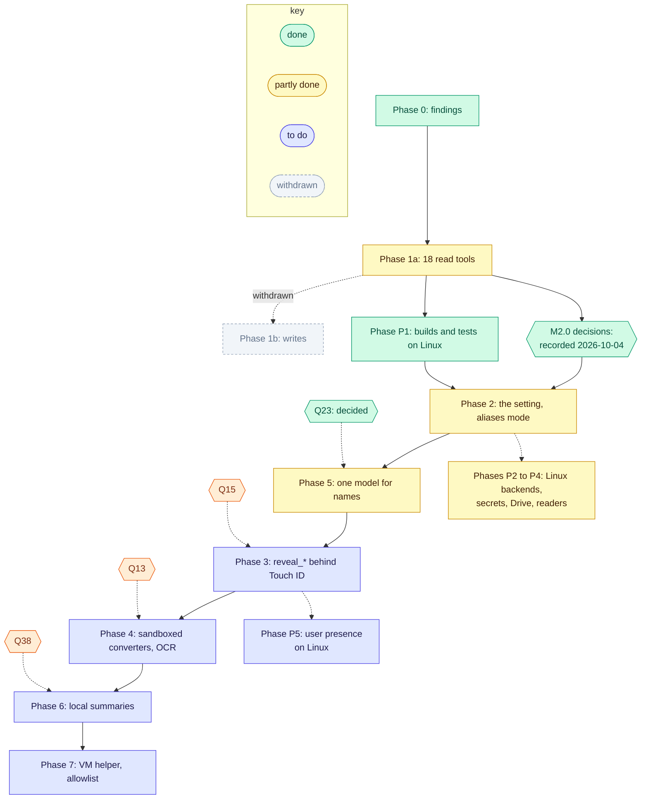

[RFC-0001](../rfc-0001.md) › 9. Rollout and milestones

# 9. Rollout

## Phases

| Phase | Contents | State |
|---|---|---|
| 0 | Install Bridge, log in, enable All Mail, IMAP over SSL; measure the `--noninteractive` cold start; record `X-Pm-*` headers, UIDPLUS, label-removal semantics on a sandbox message, BODY search on encoded parts; record the CLI's path format, JSON shapes and `fs info` fields; create a dedicated calendar link and note its caching headers. Findings go in [Appendix A](appendix-a-phase-0.md). | Recorded ([Appendix A](appendix-a-phase-0.md)), except the label-removal semantics, which moved to Phase 1b because measuring them writes to the mailbox; withdrawn with Phase 1b |
| 1a | `serve`, `setup`, `doctor`, `status`, `logout`; read tools for Mail, Drive and Calendar; registration in both hosts; Cowork local and cloud test | Calendar, Drive and Mail reads built, `download_file` included, 18 tools; the 17 built by then passed `scripts/live-check.py` (2026-10-03), and `list_drive_tree` and PDF page images came after; the full off-mode live run passed (M1.2); Claude Code passed in off mode on 2026-10-06, and the Claude Desktop and Cowork tests have not run (M1.1; [#18](https://github.com/matt-w-horn/protonctl/issues/18)) |
| 1b | The maintainer writes the policy table: a class for each write tool, and what the server does with each class; Mail and Drive write tools; sandbox write tests | withdrawn 2026-10-04: protonctl is read-only (Q5) |
| 2 | The privacy setting (R26) and `setup drive`; then aliases mode: the privacy pipeline for all three services at once, at `reply()`, over results, errors and page tokens, failing closed: privacy key, aliases, references, handles, sealed page tokens, keyed digests, the `entities` table, `detectors` and `guidance`; regex with validators and the name dictionary; `download_file`, `export_drive_manifest`, the CLI's `drive manifest`, the `export` and `inline` options, the export and download folders, page images, image content and inline bytes absent in aliases mode and kept in off mode; a panic hook in both modes (R25); the leak test and the `live-check.py` checks. The CLI may be tokenized here too, ahead of Phase 3, since in Phase 2 it is the easy way around the pipeline in Claude Code | built and tested on Linux 2026-10-04; on a Mac the same day, M2.8 (cloud-only reads), the setup commands, signing (Q12) and the aliases-mode live run passed, and the off-mode live run passed (M1.2); the role-play on real results and the other Mac checks have not run ([#16](https://github.com/matt-w-horn/protonctl/issues/16), [#17](https://github.com/matt-w-horn/protonctl/issues/17), [#18](https://github.com/matt-w-horn/protonctl/issues/18), [#19](https://github.com/matt-w-horn/protonctl/issues/19) and [#20](https://github.com/matt-w-horn/protonctl/issues/20)); the defects below are open; the CLI is not tokenized |
| 3 | In aliases mode, the `reveal_*` tools, and the CLI tokenized with `--raw` and `--out` behind user presence; Claude Code sandbox settings documented (Q17) | to do; answer Q15 first. The sandbox settings are documented (M3.4, 2026-10-07) |
| 4 | PDFKit and `textutil` under a sandbox profile, directly or behind `protonctl convert`, in both modes; Vision OCR for images and scans in aliases mode; on Linux, poppler and pandoc in `protonctl convert` (MP4) and Tesseract for OCR | to do on macOS; answer Q13 first. On Linux the readers were built 2026-10-05, ahead of this phase (MP4); OCR is to do |
| 5 | One model finds names in free text: Otter (multilingual, Q23) through `tract`, as configuration (files pinned by SHA-256, labels, threshold); recall measured per entity type and language on a labeled synthetic corpus; the dictionary's name rules stay until that evaluation shows one redundant | built 2026-10-08 (M5.2; [#60](https://github.com/matt-w-horn/protonctl/issues/60)), before Phases 3 and 4 (Q40): recall 0.930 and precision 0.950 on 315 mentions in 28 languages, at a threshold of 0.15; the weights are not yet shipped by `scripts/install.sh`, and the README says how to make them |
| 6 | Summary and question views from a local model, written with aliases; finer domain types and titles from signatures as hints | to do; Q38, open, names the runtime |
| 7 | A Linux VM helper for the riskiest formats; an optional allowlist of names kept in plaintext. Privacy Filter as a second check was dropped on 2026-10-05 (Q39) | to do |
| P0 to P5 | Linux ([section 11](11-platforms.md)): P1 builds and tests on Linux before Phase 2; P2 Mail and Calendar; P3 Drive; P4 converters with Phase 4; P5 presence with Phase 3 | P0 and P1 done 2026-10-04, with Q30 to Q35 decided; P2 to P4 built 2026-10-05, without OCR, and the live checks of P2 and P3 have not run ([#27](https://github.com/matt-w-horn/protonctl/issues/27) and [#28](https://github.com/matt-w-horn/protonctl/issues/28)); P5 to do |

## Milestones

Each milestone ends when its exit check passes; code locations are those
of 2026-10-04. A milestone that depends on an open question starts once
that question is answered in [section 10](10-open-questions.md).

### Phase 1a, to close

- M1.1 Host tests. Register with `claude mcp add` and in
  `claude_desktop_config.json`; run `get_status` from Claude Code, Claude
  Desktop, Cowork on the Mac and, from 2026-10-06, a Cowork cloud task.
  Check whether the allow rules' globs (`mcp__proton__get_*`) match, and
  record where each host keeps tool results and stderr. Exit: findings in
  [Appendix A](appendix-a-phase-0.md); the allow rules in [section 4](04-design.md) and the README corrected if the
  globs do not match. Claude Code done 2026-10-06 in off mode (Appendix
  A, Hosts); no allow rule for protonctl was configured, so the globs are
  not checked. Claude Desktop, Cowork, the cloud task and aliases mode
  have not run ([#18](https://github.com/matt-w-horn/protonctl/issues/18)).
- M1.2 A full `scripts/live-check.py` run over all 18 tools, with
  `list_drive_tree` and PDF page images. Exit: every check passes. Done
  2026-10-04 at 21:45 Pacific, in off mode against the installed binary:
  all 18 tools passed, `list_drive_tree` among them; two `download_file`
  calls took 4.3 s and 4.7 s, and `export_drive_manifest` wrote a
  complete manifest of 19,364 rows
  ([#18](https://github.com/matt-w-horn/protonctl/issues/18)). Whether the
  PDF page-image check ran then is not recorded. On 2026-10-06, after
  `1432169` was installed, the run failed it: the script took the first
  PDF over 1 KB, which was over the 64 MiB read limit, so no page came
  back. It now takes a PDF of 1 KB to 64 MiB, and the run that followed
  passed every check, page images included (4 images, 4 labels).
- M1.3 Say read-only where the model reads it: the server's
  `instructions` (`src/serve.rs`) and `get_status`'s `cannot`
  (`src/main.rs`) still list only send, share and permanent delete; the
  README says read-only since 2026-10-04. Exit: a test on both texts,
  since the surface snapshot does not hold the instructions. Done
  2026-10-04: both texts hold `serve::CANNOT`, and the test failed when a
  word was dropped from the instructions.
- M1.4 Drive set up like the other services, as Q26's proposal, confirmed
  on 2026-10-04, says: `protonctl setup drive` checks the CLI's signature and
  sign-in, finds the app's folder and writes `[drive]`; `App::load` in
  `src/main.rs` builds a `Drive` only when the config has that table;
  `doctor` and `status` say how to turn Drive on; the README gains "Add
  Drive". Exit: Drive is off without the table and on with it. Built
  2026-10-04 (the exit test failed against the old automatic Drive); the
  signature and sign-in steps run only on a Mac, where `setup drive`
  passed the same day and refused a second run.
- M1.5 R6 in Drive errors. `list_folder`'s "not a folder" error
  (`src/drive/mod.rs:540`, `format!("not a folder: {path}")`) shows a
  folder name's hidden characters raw, where every other message uses
  `escape_hidden`; and two errors pass on the Drive CLI's own text
  uncleaned, which can repeat a node's name: up to 500 characters of its
  stderr or stdout (`src/drive/cli.rs:188`) and its JSON report
  (`src/drive/mod.rs:1273`). Escape the path and `clean` the CLI's text.
  Exit: tests with U+202E in a file name, and in the stand-in CLI's
  output, see none of it raw, each shown to fail before the fix; no other
  `bail!`, `anyhow!`, `format!` or `with_context` in `src/drive/` passes
  on a path or the CLI's text unescaped or uncleaned. Done 2026-10-04: the
  three tests failed first, each showing U+202E raw; every other error
  site escapes Drive paths already or names only protonctl's own paths.
- M1.6 Hints that match what each tool does. `download_file` and
  `get_attachment` can save files that outlive the call (the download
  folder for an hour, the export folder until someone deletes them), yet
  set `readOnlyHint: true` (`src/serve.rs`); MCP defines that hint as not
  modifying the environment. Set it false for both in off mode, as
  `export_drive_manifest` has; aliases mode saves nothing, so its
  `get_attachment` keeps true. Exit: the surface snapshot. Done
  2026-10-04 for off mode, the only mode built, with `idempotentHint`
  false too, since each saving call writes a new copy; aliases mode's
  `true` came with M2.11.

### Before Phase 2: decisions

- M2.0 Confirm Q26's proposal and answer Q27 (mode of a new install), Q28
  (where the mode lives), Q14 (stdout or RAM disk), Q16 (token cost), Q18
  (word list), Q19 (alias input, word count, URLs), Q20 (Drive handles),
  Q21 (pairing), Q22 (entity types, dictionary scope), Q12 (signing), Q24
  (CLI check per run) and Q25 (`/security-review`).
  Exit: each recorded as decided in [section 10](10-open-questions.md), and R14 to R17 and R26
  updated to match. Done 2026-10-04: the maintainer chose Q27 and
  delegated the rest.

### Phase 2: tokenized results

M2.11 comes first: every other Phase 2 milestone runs only in aliases mode.

- M2.1 Privacy key. `protonctl setup privacy` stores 32 random bytes as
  text (hex or base64, since `secret::get` in `src/secret.rs` reads UTF-8)
  under account `privacy-key`; HKDF subkeys; `rotate-key`; `status` and
  `logout` include it; a running server reloads the key when the key ID in
  the item's comment changes. Exit: stability, rotation and redaction
  tests. Done 2026-10-04 on Linux: `setup privacy`, `setup privacy --off`
  and `rotate-key` (the last two ask first, on a terminal only) and the
  reload by key ID, with the
  subkey, rotation and decoding tests in `src/privacy/key.rs`. The
  Keychain calls compile in the macOS lint and run only on a Mac. There,
  on 2026-10-04, `setup privacy` made the key and then kept it, and
  `rotate-key` refused without a terminal; a rotation under a running
  server has not been checked there ([#17](https://github.com/matt-w-horn/protonctl/issues/17)).
- M2.2 Identifiers, in a new `src/privacy/` module: canonical form, alias,
  `ref`, handle, sealed page token, keyed digest, the curated word list
  compiled in. Settle `ring` or RustCrypto for HMAC and HKDF ([section 3](03-options.md)).
  Exit: round-trip, tamper, idempotence, merge and collision tests. Done
  2026-10-04 with `ring` (HMAC, HKDF) and `aes-siv`; the word list is the
  EFF large list less 644 words (7,132).
- M2.3 Detectors: regex with validators (email, phone through
  `phonenumber`, Luhn, IBAN, URL, domain, IP) and the dictionary through
  `aho-corasick`. Exit: each detector's tests on the synthetic corpus.
  Done 2026-10-04, with Q22's secret, Social Security number and account
  types, and the process dictionary of correspondents and attendees.
- M2.4 The pipeline at `reply()` in `src/serve.rs`: JSON results, errors,
  notes and page tokens; `entities`, `detectors`, `guidance`; the table
  counted toward the page size; fail closed. Exit: the leak test passes
  for every tool, errors included, and the fail-closed test. Done
  2026-10-04, with the differences the design's
  [As built](lld-privacy-layer.md#as-built) section lists: the pipeline
  runs in `Server::call`, the table is not counted toward the page size,
  and a result over the cap fails at once. The leak tests run on a
  synthetic mail search and events and on real Drive results; the policy
  coverage runs over every tool's results except `list_calendars` and
  `get_status`, which are checked through aliases mode instead. The leak
  test over every tool (2026-10-05) found two leaks, both fixed: a
  Chinese one-word name was never found, and a page asked to start inside
  a name showed its tail. The
  panic path to `pipeline_failed` is tested with a panic that test builds
  plant in the rewrite stage. Building that test found a real one: text
  shaped like an IBAN with a digit from another script panicked the
  detectors, and so failed the whole result; the IBAN pattern now takes
  ASCII digits only (2026-10-05).
- M2.5 Inputs: `messageId`, `threadId`, `eventId`, `fileId` and
  `pageToken` take handles; name and address parameters take `ref`s;
  exclusions checked on each decrypted path. Exit: tampered handles and
  refs refused; an excluded file reached through a handle reads "not
  found". Done 2026-10-04: both exit tests pass.
- M2.6 Outputs that R16 and R17 remove: Proton's `nodeId` and
  `revisionId`, raw `sha256`, `sha1` and `claimedSha1`, threadIds built
  from `Message-Id`, the hosts and IP addresses in the
  `Authentication-Results` header that `raw: true` returns, and local
  paths in `get_status`. Exit: `live-check.py`'s pattern checks. Built
  2026-10-04; the exit check, M2.10's live run, passed in aliases mode on
  a Mac the same day.
- M2.7 Off mode only: `download_file` and `export_drive_manifest` are
  registered in `src/serve.rs` only in off mode; `src/export.rs` and
  `[export]` in `src/config.rs`, the download folder and its sweep
  (`src/content.rs`, the timer in `serve::run`), `Attached` and the page
  images in `src/extract.rs`, `get_attachment`'s `export` and `inline`, the
  CLI's `drive manifest`, and `drive get`'s `--export` and `--inline` stay,
  and aliases mode refuses them. If M2.0 takes R10 for both modes instead,
  this milestone deletes them, as the 2026-10-04 revision planned. Exit:
  each mode's surface snapshot; the forbidden-name and exact-set tests; the
  no-disk test in aliases mode. Done 2026-10-04 for the tools: aliases
  mode saves nothing, and a non-text attachment returns its `reason`
  alone. Done 2026-10-07 for the CLI: in aliases mode `drive manifest`
  and the `--export` and `--inline` options are refused, and the no-disk
  test runs each of them ([#73](https://github.com/matt-w-horn/protonctl/issues/73)).
- M2.8 Cloud-only reads through a per-process RAM disk, since the CLI
  cannot write to stdout (Q14), with the checks Q14 lists.
  Exit: the no-disk test for a cloud-only read. Done 2026-10-04 on macOS
  27: `platform::memory_disk` attaches and mounts the disk without admin
  rights, and the test failed with the download folder in its place. The
  checks are recorded in [Appendix A](appendix-a-phase-0.md#memory-disk-m28),
  with a live read of a cloud-only file the same day. Linux built
  2026-10-05: `platform::memory_disk` makes a folder under
  `$XDG_RUNTIME_DIR`, used only when it is on tmpfs, owned by the user
  with mode 0700, and every active swap is zram or on dm-crypt at every
  level below it; the folder goes once read, after a failed download, and
  at exit, and `doctor` checks it in aliases mode. The Linux no-disk test
  passes, and failed when the read went to the download folder.
  Since 2026-10-07 the CLI's Mail and Drive commands run in aliases mode
  as the tools do, so a cloud-only `drive cat` goes through the folder in
  memory too ([#73](https://github.com/matt-w-horn/protonctl/issues/73)).
- M2.9 Logs: a panic hook that prints a fixed line, in both modes; keyed
  identifiers in every log line in aliases mode. Exit: the logs and panic
  tests. Done 2026-10-04: the hook prints the code location and never the
  message; protonctl's logs carry no identifiers, so no log key was built
  (R25).
- M2.10 `scripts/live-check.py`, the README and the tool descriptions
  updated, for both modes; the role-play of [Appendix C](appendix-c-roleplay.md)
  repeated on real results in aliases mode, with only its findings
  recorded. Exit: a live run passes in each mode, counts only. The tool
  descriptions and the README are updated. The aliases-mode live run
  passed on a Mac on 2026-10-04, all 16 tools of that mode, after a fix
  for page edges that cut an address in two (in `f0414dd`); the off-mode
  live run passed the same day, all 18 tools (M1.2). The role-play has
  not run ([#18](https://github.com/matt-w-horn/protonctl/issues/18)).
- M2.11 The setting (R26): the Keychain item `privacy-mode` (Q28), and no
  mode until the user sets one (Q27); `setup privacy` and `setup privacy --off` in
  `src/main.rs`; the mode in `status`, `doctor`, `get_status` and the
  `instructions`; tools registered by mode in `src/serve.rs`; a running
  server refuses calls after a mode change, and aliases mode refuses
  without its key. Exit: the settings tests. Done 2026-10-04 on Linux;
  the settings tests use a stand-in store. Since MP2 (2026-10-05) Linux
  reads the setting from the Secret Service, and every call gives
  `privacy_mode_unreadable` only while no Secret Service runs.

### Phase 2: defects found on real results

Found on 2026-10-04 by the first aliases-mode reads of the maintainer's
own Drive, Mail and Calendar ([Appendix C](appendix-c-roleplay.md#first-real-results-2026-10-04)).
Examples here are synthetic. Each is open until a test or the evaluation
(D1) shows it fixed: D1 is [#13](https://github.com/matt-w-horn/protonctl/issues/13), and D2 to
D8 are [#1](https://github.com/matt-w-horn/protonctl/issues/1) to [#7](https://github.com/matt-w-horn/protonctl/issues/7).

- D1 No evaluation of the privacy layer. Nothing measured what passes
  raw: the leak test plants exact values, and Phase 5's recall
  measurement (M5.2) comes after the gaps below. Built 2026-10-04:
  `what_passes_raw_per_form` in `src/privacy/eval.rs` reports, per form
  and entity type, what comes back raw, with a word left, with a second
  alias, or typed wrong ([section 7](07-testing.md)); its snapshot holds
  the numbers each fix below moves
  ([#13](https://github.com/matt-w-horn/protonctl/issues/13)).
- D2 Short forms of a name pass raw. The dictionary holds correspondents'
  full display names, so a surname alone ("Lee v. Acme", "Dr. Lee") and a
  given name alone are not found. M5.2 planned short forms within an
  item; this is the measured case. Fixed 2026-10-04 for known names: the
  dictionary holds each person's given name, surname and name without
  middle names, joined or linked as [section 6](06-privacy.md) says
  ([#1](https://github.com/matt-w-horn/protonctl/issues/1)).
- D3 Initials pass raw ("JL", "J.L.", "call with JL"). Nothing detects them.
  Fixed 2026-10-04 for the people in a result's own headers
  ([#2](https://github.com/matt-w-horn/protonctl/issues/2)).
- D4 Misspelled names pass raw, from typing and above all from OCR ("Jonh
  Lee", "J0hn Lee", "John Lce"). Fixed 2026-10-04 for known names: a run
  within one edit per word, OCR's confusions counting as none, is its
  own alias linked to the name
  ([#3](https://github.com/matt-w-horn/protonctl/issues/3)). The dictionary matched exact text after
  case and accent folding only.
- D5 Project names pass raw ("the Falcon rewrite", a paper's title, a
  folder named for a project), in text and in Drive paths and names,
  which run through the detectors only. Projects have no entity type and
  no source of names.
  Moved to Phase 5 on 2026-10-04: a project's name is in no header, so
  finding it needs the model Q23 chose on 2026-10-05
  ([#4](https://github.com/matt-w-horn/protonctl/issues/4)). Fixed
  2026-10-08 by M5.2's model: 37 of 39 project mentions found (0.949),
  7 of them typed `product` or `organization`, which keeps the alias
  since names share one class (Q19); one of the two `in-text` cases
  still passes raw. Drive paths and names go through the model as every
  text does.
- D6 One entity gets several aliases: a person's full name and another
  form of it in one result each got their own alias. Fixed 2026-10-04 for
  known names: a form joins its full name or is linked to it by
  `maybeSameAs`, and the evaluation has no second alias left unlinked
  ([#5](https://github.com/matt-w-horn/protonctl/issues/5)).
- D7 Organizations and products are typed `person`, or pass raw.
  Correspondents' display names enter the dictionary as people, so an
  employer, a storage service or an assistant that sends mail becomes a
  person alias, and the model cannot tell what it is; a company that
  never sent mail (an agency, a product's maker) is not found at all.
  The first half fixed 2026-10-04: a display name is typed `organization`
  when it names its own address's domain, whole or as its first word,
  which is then its short form ("Acme" for "Acme Billing" at
  acme.example); no list of words is kept
  ([#6](https://github.com/matt-w-horn/protonctl/issues/6)). The second
  half, names in no header, moved to Phase 5's model
  ([#43](https://github.com/matt-w-horn/protonctl/issues/43)), and was
  fixed 2026-10-08 by M5.2: 62 of 65 organization mentions found
  (0.954), both organizations that never sent mail among them, and 12
  of 14 products (0.857). The cost is the product label's precision,
  0.444: words such as "smoke detectors" and "caulk clear" become
  aliases, which hides them but leaks nothing.
- D8 A folder made online-only in the Drive app lists as empty, with no
  note, in both modes: its listing is not on the Mac, and `entries_in` in
  `src/drive/mod.rs` returns nothing when `read_dir` gives nothing
  ([Appendix A](appendix-a-phase-0.md#memory-disk-m28)). Fixed
  2026-10-04: `list_folder` lists such a folder through the CLI, with a
  note, or says its contents are not on this computer when the CLI
  cannot, and a tree row marks it `cloudOnly`; not yet checked live, since
  no folder was online-only that day
  ([#7](https://github.com/matt-w-horn/protonctl/issues/7)).

### Phase 3: raw reads

- M3.1 Answer Q15: the LocalAuthentication route (an `osascript`
  script, a Swift helper or `objc2`) and whether its prompt appears under
  each host and inside Claude Code's sandbox. Exit: a prompt seen in each.
- M3.2 `reveal_message`, `reveal_attachment`, `reveal_file_content`,
  `reveal_event`, with an injectable checker, the 10-minute approval,
  cancellation at the time limit, and the prompt's form (R18). Exit: the
  user-presence tests.
- M3.3 The CLI tokenized by default; `--raw`, `drive get` and `mail
  attachment` behind user presence (R19). Exit: CLI tests.
- M3.4 Answer Q17 and document the Claude Code sandbox settings. Exit:
  each denial seen to work. Done 2026-10-07 on Claude Code 2.1.293,
  macOS only: the README's [Claude Code
  sandbox](../../README.md#claude-code-sandbox) section, each denial
  seen with the settings and its probe seen to pass without them
  (Q17). Two of the six are not what the question assumed: running
  `proton-drive` is not denied, its network is; and `security` is
  hidden by the sandbox's default, not by a setting.

### Phase 4: isolated converters

- M4.1 Answer Q13; the sandbox profile; PDFKit and `textutil` under it.
  Exit: the converter sandbox test.
- M4.2 Vision OCR for images and scans, replacing `"text": null` (R22).
  Exit: a synthetic page's words come back.

### Phase 5: names in free text

- M5.1 Q23 answered 2026-10-05: Otter through `tract`, weights shipped
  and pinned by SHA-256, Apache-2.0. Exit: a build with no network
  fetch. Done in part 2026-10-08 with M5.2: the two files are read from
  `~/Library/Application Support/protonctl/model` (on Linux
  `$XDG_DATA_HOME/protonctl/model`), pinned by SHA-256 in
  `src/privacy/detect/model.rs`, and nothing is fetched at run time
  (`deny.toml` bans HTTP clients; `tokenizers` is built without its HTTP
  features). Not done: `scripts/install.sh` does not ship the weights;
  the README's "Install the name model" says how to make them with
  `scripts/otter-export.py`.
- M5.2 The model detector, for names in no header: people,
  organizations, projects, products and locations, the labels Q23
  measured, and street addresses only if Phase 5 adds a label for them
  (D5, D7; [#4](https://github.com/matt-w-horn/protonctl/issues/4),
  [#43](https://github.com/matt-w-horn/protonctl/issues/43)); short forms,
  initials, misspellings and `maybeSameAs` of known names were built in
  Phase 2 (D2 to D4, D6). Exit: recall recorded per entity type and
  language. Built 2026-10-08 ([#60](https://github.com/matt-w-horn/protonctl/issues/60)):
  `src/privacy/detect/model.rs` runs `otter.onnx` with `tract` 0.23.8 on
  four threads, in windows of 256 tokens overlapping by 64, after the
  dictionary, adding only the names neither the patterns nor the
  dictionary claimed (`detect::add_model`), once per result over every
  text of it (`pipeline::State::model_pass`). The exit is the snapshot
  `what_passes_raw_with_the_model` in `src/privacy/eval.rs`, whose
  numbers [section 7](07-testing.md) records: recall 0.930 over 315
  mentions (people 0.935, organizations 0.954, projects 0.949, products
  0.857, locations 0.818), precision 0.950 (1.000 for people,
  organizations and projects, 0.962 for locations, 0.444 for products),
  28 languages. Street addresses have no label, so none is found. Each
  requirement below, where it is met: the configuration is the constants
  at the top of `model.rs` (`ONNX_SHA256`, `TOKENIZER_SHA256`, `LABELS`,
  `THRESHOLD` 0.15, set by `eval::threshold_sweep`); the dictionary's
  rules stay, none shown redundant; `model::escape` replaces each special
  token by as many `*`; `pinned_bytes` checks each file's SHA-256 and
  `Model::load_from` runs `SELF_TEST` before serving, and
  `Privacy::check` refuses every aliases-mode call with
  `name_model_unavailable` when either fails, until a restart (R13);
  `Model::find` checks the deadline before each window and
  `pipeline::run` fails the call as timed out when it has passed.
  `detectors` names `model` on every aliases-mode result, and `doctor`
  prints where the model loaded from or why it did not, with the folder.
  Requirements:
  - The model is configuration: its ONNX file and tokenizer, pinned by
    SHA-256, its labels and its threshold, set on a corpus larger than
    the proof of concept's. A new model replaces it only when recall per
    entity type and language does not fall, and raises the format
    version (Q19, Q23).
  - The dictionary's name rules stay. One is removed only when the
    evaluation (D1) shows that nothing it finds passes raw without it
    (Q23).
  - Text from a result never adds to the model's prompt: before
    tokenizing, every special token of the tokenizer that appears in the
    text (`[LABEL]`, `<bos>` and the rest) is replaced by a string of the
    same byte length that is not a token, so offsets hold. A test plants
    each one in a message and checks that the names around it are still
    found. Unescaped, one `[LABEL]` in an email made Otter's own
    `predict()` refuse the text (Q23).
  - The model file and tokenizer are checked against their pinned SHA-256
    when loaded, and the detector runs a fixed sentence at start and
    refuses to serve unless it finds that sentence's names: a model that
    finds nothing fails the same way a missing one does, closed (R13).
  - Inference stops between windows once the call's deadline has passed,
    so a call cut off at 150 s does not keep the CPU busy.

### Phases 6 and 7

- M6.1 Summary and question views from a local model, finer hints, once
  Q38 names its runtime. Exit: the leak test passes over the views.
- M7.1 The Linux VM helper; M7.2 the optional allowlist. Exit for each:
  the leak and recall tests. (M7.2 was Privacy Filter as a second check,
  dropped on 2026-10-05, Q39.)

### Phase P: platforms

- MP0 Answer Q30 to Q35, and confirm whether Claude Desktop, Bridge's core
  and the Drive CLI ship for Linux. Exit: each recorded in section 10.
  The availability facts are recorded in [section 11](11-platforms.md#linux-availability-mp0-findings-2026-10-04)
  (2026-10-04): all three ship for Linux, Claude Desktop in beta. Q30 to
  Q35 were decided the same day. Done.
- MP1 Builds and tests on Linux, before Phase 2: `src/platform/` with the
  traits of [section 11](11-platforms.md); `security-framework` and the
  `std::os::macos` and `std::os::darwin` uses behind `cfg`; Linux
  implementations that report "not available on Linux"; download expiry
  by the time in the folder's name; `deny.toml` targets; find out whether
  `cargo check --target` works across systems. Exit: `scripts/check.sh`
  passes in a Linux container, and the macOS snapshots are unchanged.
  Done 2026-10-04: the gate passes on Linux, no snapshot changed, and from
  Linux the gate also lints the macOS build. No trait was needed yet
  ([section 11](11-platforms.md#how-rust-projects-handle-platform-differences)).
- MP2 Mail and Calendar on Linux: the secret store (Q31), Bridge started
  as Q32 decides, `setup`, `doctor`, `status`. Exit: a live check on a
  Linux machine, counts only. Built 2026-10-05
  ([section 11](11-platforms.md#the-secret-service-as-built-p2)): the
  store's tests pass against a throwaway GNOME Keyring, and with the built
  binary `setup privacy`, `status`, `doctor`, `get_status` over MCP,
  `privacy_mode_changed` after a change, `rotate-key` and `logout` all
  worked against it. With no Secret Service, setup refuses and writes no
  file. The live check, on a Linux desktop with Bridge signed in, has not
  run ([#27](https://github.com/matt-w-horn/protonctl/issues/27)).
- MP3 Drive on Linux as Q33 decides. Exit: the Drive tests against the
  stand-in CLI, and a live check if the CLI exists for Linux. Built
  2026-10-05: `setup drive` pins the CLI's SHA-256 and pins an updated
  CLI after asking; every run checks the pin under the CLI's lock, and
  macOS's signature check moved to every run too (Q24). Since 2026-10-07
  ([#72](https://github.com/matt-w-horn/protonctl/issues/72)) the pin
  lives in the Secret Service, not `[drive]`, the first setup asks too,
  and each call runs the sealed memfd copy it checked. The pin tests (a
  changed CLI never runs again, one with no pin never runs, one swapped
  in after the check never runs, and a pin in the config is not trusted)
  and the Drive tests pass against stand-in CLIs. The live check, on a
  Linux machine signed in to Proton, has not run
  ([#62](https://github.com/matt-w-horn/protonctl/issues/62)).
- MP4 Converters and their sandbox on Linux (Q34), with Phase 4. Exit: the
  converter sandbox test on Linux. Built 2026-10-05, ahead of Phase 4
  ([section 11](11-platforms.md#the-document-readers-as-built-p4)):
  poppler and pandoc in `protonctl convert` under Landlock and seccomp. The
  sandbox test passes, and fails without the seccomp filter or with all of
  `/etc` readable. OCR (Tesseract) waits for Phase 4's M4.2.
- MP5 User presence on Linux (Q35), with Phase 3, or no `reveal_*` there.
  Exit: the user-presence tests, or the surface snapshot without
  `reveal_*` on Linux.

---

[← 8. Review process](08-review-process.md) · [Contents](../rfc-0001.md#contents) · [10. Open questions →](10-open-questions.md)
