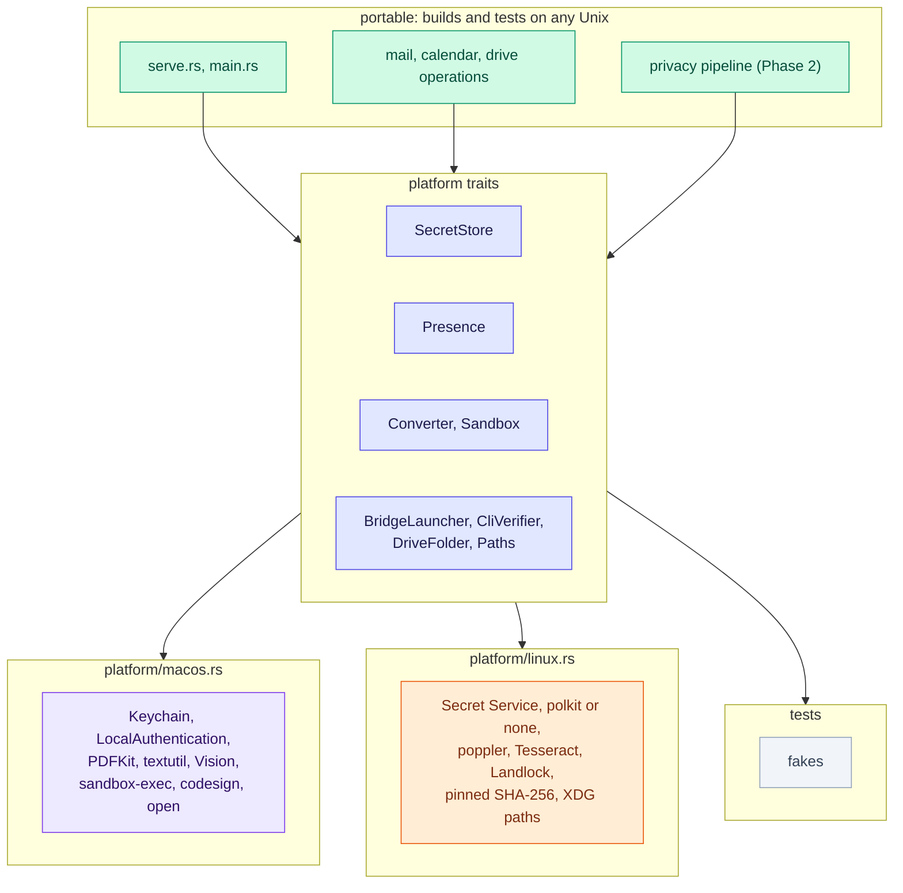

[RFC-0001](../rfc-0001.md) › 11. Platforms

# 11. Platforms: macOS and Linux

Proposed 2026-10-04. Q29 records the decision to support Linux; Q30 to
Q35 hold the choices this section recommends but does not settle. No code
changes until they are answered.

## Why

- **Building and testing.** Cloud containers and most CI run Linux, and
  protonctl does not compile there today. On 2026-10-04 `cargo check
  --all-targets` on Linux (Rust 1.97, `--ignore-rust-version`) failed with
  four errors in the binary and two more in the tests, all from the
  macOS-only APIs in the table below. Every other module compiled, so most
  of the 132 tests could run on Linux once those few sites are isolated.
- **Users.** Proton Mail Bridge ships for Linux, and Claude Code runs on
  Linux. Claude Desktop, and so Cowork, has no Linux release known to this
  RFC (to confirm in MP0).

## What is macOS-specific today

From the code at commit 7786b3e:

| Area | macOS mechanism | Where | Builds on Linux | Runs on Linux |
|---|---|---|---|---|
| Secrets (R2) | Keychain through `security-framework` | `src/secret.rs:7-8` | no | no |
| Cloud-only files | `st_flags() & SF_DATALESS` through `std::os::macos` | `src/drive/mod.rs:15, 314` | no | no |
| A test of the download sweep | `FileTimes::set_created` through `std::os::darwin` | `src/content.rs:403-411` | no (test only) | no |
| Download expiry (R10) | the folder's creation time, `Metadata::created()` | `src/content.rs:263` | yes | only where the filesystem records birth time; elsewhere a folder never expires |
| Drive folder discovery | `~/Library/CloudStorage/ProtonDrive-*` | `src/drive/mod.rs:283` | yes | finds nothing |
| Drive CLI check (R9) | `/usr/bin/codesign` and Apple Team ID `2SB5Z68H26` | `src/drive/cli.rs:85-96` | yes | fails |
| Bridge on demand (Q2) | `/usr/bin/open -g -j -b com.protonmail.bridge` | `src/mail/mod.rs:213` | yes | fails |
| PDF text and page images | `/usr/bin/osascript` with PDFKit | `src/extract.rs:240, 300` | yes | fails |
| Word, RTF, OpenDocument | `/usr/bin/textutil` | `src/extract.rs:187` | yes | fails |
| Cache folder | `~/Library/Caches/protonctl` | `src/config.rs:94` | yes | the wrong place |
| Planned | LocalAuthentication (R18), `sandbox-exec` (R21), Vision (R21, R22), a RAM disk (R10, Q14), a Keychain attribute for the key ID (R20) | | | |

Already portable: IMAP over rustls, the certificate pin, calendar parsing,
the MCP server (rmcp over stdio), tokio's process handling and Unix
signals, and `/usr/bin/curl`, which most Linux distributions install at
that path (`doctor` checks it).

## How Rust projects handle platform differences

The options, weighed for this crate:

| Option | How it looks | Benefit | Cost | Verdict |
|---|---|---|---|---|
| A. `cfg` at each call site | `#[cfg(target_os = "macos")]` blocks inside `secret.rs`, `drive/mod.rs` and the rest | quickest to write | platform logic spreads through every module; a branch missed on one OS shows only when that OS builds | only for one-line differences |
| B. One platform module per OS, chosen at compile time | `src/platform/mod.rs` declares `#[cfg(target_os = "macos")] mod macos;` and `#[cfg(target_os = "linux")] mod linux;`, each exporting the same functions and types; the standard library's own `sys` module works this way | platform code in one place; no runtime cost; each OS's file compiles only on that OS | the two files can drift apart in signature, which shows only when the other OS builds | **recommended, with C** |
| C. A trait per platform service | `SecretStore`, `Presence`, `Converter`, `Sandbox`, `BridgeLauncher`, `CliVerifier`, `DriveFolder`, `Paths`; B supplies each default implementation | tests use fakes on any OS (the low-level design already plans `KeySource` and `Presence` this way); one OS can offer more than one backend | a little indirection; dynamic dispatch costs nothing that matters here | **recommended, with B** |
| D. Cargo features | `--features secret-service` and the like | optional heavy dependencies (Tesseract, GLiNER) only when wanted | Cargo features must be additive, so using them to pick an OS breaks `--all-features`; OS choice belongs to `cfg` | only for optional backends |
| E. Cross-platform crates | `keyring` (Keychain, Secret Service, keyutils, Windows), `directories`, `landlock` | less code to own, maintained by others | a wrapper may hide a control a requirement needs: the non-synchronizing Keychain item (R20), the key-ID attribute (R20), the ACL behaviour (section 5) | case by case: yes for XDG paths; for secrets, `security-framework` stays on macOS and the Linux backend is chosen in Q31 |
| F. A workspace split | a `protonctl-core` crate with no OS dependency, and the binary crate with the platform adapters | the core builds and tests anywhere by construction, and the boundary is visible in review | more Cargo plumbing and two crates to version, against goal 4 | later, if the platform layer grows past a few files |
| G. A fork or a binary per OS | two code bases | none worth it | duplicated code | rejected |

Recommended (Q30): **B and C together**, with target-specific
dependencies in `Cargo.toml`
(`[target.'cfg(target_os = "macos")'.dependencies] security-framework`),
features only for optional heavy backends (D), and crates where no control
is lost (E). A feature with no Linux mechanism that meets its requirement
is **absent** on Linux, not weaker: the tool is not registered, and
`get_status` says why. Revisit F when `src/platform/` passes about a
tenth of the crate.

## Platform services

| Service | Requirement | macOS | Linux options | Proposed Linux default | Question |
|---|---|---|---|---|---|
| Secret store | R2, R20 | login Keychain | Secret Service over D-Bus (GNOME Keyring, KWallet), through the `secret-service` or `keyring` crate; kernel keyutils (lost at reboot); `pass` (GPG) | Secret Service; with none running (a headless machine), refuse to store secrets, never a plaintext file | Q31 |
| Bridge on demand | Q2 | `open` the Bridge app hidden | start Bridge's core with `--noninteractive`; a systemd user unit the user enables; or require Bridge running | require it running, and print how to enable the unit | Q32 |
| Drive CLI check | R9 | `codesign`, Team ID, version | does Proton ship the CLI for Linux? If so: a SHA-256 pinned at `setup drive`, as Bridge's certificate is pinned; Proton's release signature if published; a path the user cannot write | pin at setup | Q33 |
| Drive folder | the namespace, cloud-only files | the Drive app's folder, `SF_DATALESS` | no official Proton Drive app for Linux is known to this RFC (to confirm): the CLI-only mode built for Macs without the app, with search off | CLI only | Q33 |
| Converters | R21 | `osascript` (PDFKit), `textutil`, Vision | poppler-utils (`pdftotext`, `pdftoppm`); pandoc or LibreOffice for documents; Tesseract for OCR; or Rust crates (`pdf-extract`, `lopdf`) inside the sandboxed helper | external tools when installed; otherwise the result says the file cannot be read on this machine, and why | Q34 |
| Sandbox | R21 | a `sandbox-exec` profile (Q13) | Landlock (files from Linux 5.13, network from 6.7) through the `landlock` crate, with a seccomp filter; or bubblewrap | Landlock and seccomp in `protonctl convert` | Q34 |
| User presence | R18 | LocalAuthentication: Touch ID or the login password | polkit (`pkcheck --allow-user-interaction`, needs an authentication agent, so a desktop session); fprintd; a FIDO2 security key's touch (works on both systems); none | polkit where an agent runs; otherwise no `reveal_*` tools | Q35 |
| Content off disk | R10, Q14 | a RAM disk | `memfd_create`, which never touches a filesystem, or `/dev/shm` | `memfd_create` | Q14 |
| Download expiry | R10 | folder creation time | birth time is not recorded everywhere; the time in the folder's name, or its modification time | the time in the name | MP1 |
| Paths | | `~/Library/Caches`, `~/Library/Logs` | `$XDG_CACHE_HOME`, `$XDG_STATE_HOME`; the config path is already XDG | XDG | |

## Hosts by platform

| Host | macOS | Linux |
|---|---|---|
| Claude Code | yes | yes |
| Claude Desktop | yes | no release known (to confirm) |
| Cowork | yes, through Claude Desktop | no |

On Linux the only host is Claude Code, so the model always has a shell:
the residual risk that it runs `proton-drive`, reads files or speaks
IMAP around protonctl ([section 5](05-security.md)) is the normal case
there, and Claude Code's sandbox settings (Q17) matter more.

## Testing

- The platform-independent tests run on both systems, and `scripts/check.sh`
  runs on Linux, so a cloud container covers everything but the platform
  files.
- Each platform file is tested on its own system; the traits' fakes run
  everywhere.
- `deny.toml` checks `aarch64-apple-darwin` today; its `[graph] targets`
  gains `x86_64-unknown-linux-gnu` and `aarch64-unknown-linux-gnu`.
- Checking one system's code from the other (`cargo check --target`) would
  catch signature drift between the platform files, but `ring`'s build
  script compiles C for the target, so a Linux machine needs an Apple
  cross toolchain to check the macOS target. MP1 finds out what works;
  otherwise each system checks its own file, and the gate runs on both
  before a merge.
- The RFC's constraint that gates run locally stays; a hosted CI with
  macOS and Linux runners is an option, not a requirement.

## Rollout

| Phase | Contents | Before |
|---|---|---|
| P0 | Answer Q30 to Q35; confirm the Linux availability of Claude Desktop, Bridge's core and the Drive CLI | P1 |
| P1 | Builds and tests on Linux: `src/platform/` with the traits above; target-specific dependencies; Linux implementations that report "not available on Linux"; the macOS-only test moved behind `cfg`; download expiry by the time in the folder name; `deny.toml` targets; `scripts/check.sh` on Linux | Phase 2, so the privacy layer is built and tested in Linux containers |
| P2 | Mail and Calendar on Linux: the secret store (Q31), Bridge started by the user (Q32), `setup`, `doctor` and `status` | alongside Phase 2 |
| P3 | Drive on Linux, as Q33 decides | after P2 |
| P4 | Converters and their sandbox on Linux (Q34) | with Phase 4 |
| P5 | User presence on Linux (Q35), or no `reveal_*` there | with Phase 3 |

Milestones MP0 to MP5 in [section 9](09-rollout.md#phase-p-platforms)
carry the exit checks.

---

[← 10. Open questions](10-open-questions.md) · [Contents](../rfc-0001.md#contents) · [Appendix A: Phase 0 findings →](appendix-a-phase-0.md)
