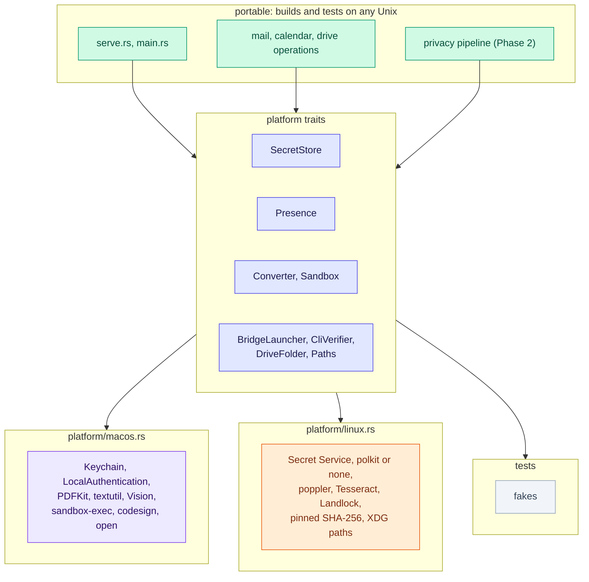

[RFC-0001](../rfc-0001.md) › 11. Platforms

# 11. Platforms: macOS and Linux

Proposed 2026-10-04. Q29 records the decision to support Linux; Q30 to
Q35, decided the same day, adopt the choices this section recommends
([section 10](10-open-questions.md) gives each reason). Phase P1 is built
(2026-10-04): protonctl builds and passes its gates on Linux. Phases P2
to P4 are built (2026-10-05): the Secret Service holds its secrets, the
Drive CLI is pinned by its SHA-256, and poppler and pandoc read documents
in a sandbox. The live checks of P2 and P3, on a Linux desktop signed in
to Proton, have not run ([#27](https://github.com/matt-w-horn/protonctl/issues/27) and [#28](https://github.com/matt-w-horn/protonctl/issues/28)).

## Why

- **Building and testing.** Cloud containers and most CI run Linux, and
  before P1 protonctl did not compile there. On 2026-10-04 `cargo check
  --all-targets` on Linux (Rust 1.97, `--ignore-rust-version`) failed with
  four errors in the binary and two more in the tests, all from the
  macOS-only APIs in the table below. Every other module compiled. After
  P1, every test runs on Linux except the two of macOS's document
  readers; from P4, Linux has its own readers' tests.
- **Users.** Proton Mail Bridge, the Drive CLI, Claude Code and, in beta,
  Claude Desktop all ship for Linux (below).

## Linux availability (MP0 findings, 2026-10-04)

Checked on 2026-10-04. This container's network policy blocks proton.me,
so Proton's facts come from its GitHub repositories, and the two marked
"reported" from news sites only.

| Component | On Linux | Source |
|---|---|---|
| Claude Desktop | beta since the week of 2026-06-29: Ubuntu 22.04+ and Debian 12+, x86_64 and arm64, from Anthropic's apt repository; Chat, Cowork and Code. Cowork runs its tasks in a QEMU/KVM virtual machine the app hosts. Its Linux page does not say whether local MCP servers load from `claude_desktop_config.json`, or where | [Claude Desktop on Linux](https://code.claude.com/docs/en/desktop-linux), [release notes, week 27](https://code.claude.com/docs/en/whats-new/2026-w27) |
| Proton Mail Bridge | v3.27.0 (2026-09-09) ships an x86_64 `.rpm` and an Arch `PKGBUILD` on GitHub, each with a GPG `.sig` and Proton's public key; `--noninteractive` (`-n`) starts it with no interface, and "you still need to set up a supported keychain" | [releases](https://github.com/ProtonMail/proton-bridge/releases), [BUILDS.md](https://github.com/ProtonMail/proton-bridge/blob/master/BUILDS.md) |
| Proton Drive CLI | Linux builds, `linux/x64` and `linux/x64-baseline` (for CPUs without AVX2); requires "libsecret (e.g., GNOME Keyring, KWallet)"; sign-in through a browser (`auth login`). The README documents no checksum or signature for releases. An arm64 build and version 0.8.0 of 2026-08-13 are reported | [the CLI's README](https://github.com/ProtonDriveApps/sdk/blob/main/cli/README.md); reported by [Neowin](https://www.neowin.net/news/proton-releases-proton-drive-cli-for-windows-mac-and-linux/) |
| Proton Drive app | none released; a native Linux client is reported in development since June 2026, with no date | reported by [OMG! Ubuntu](https://www.omgubuntu.co.uk/2026/06/proton-drive-linux-client) |

What these facts meant for Q31 to Q33 and the hosts:

- Q31: Bridge and the Drive CLI each need a system keychain on Linux, the
  CLI through libsecret, so a machine that runs them already has the
  Secret Service that Q31 recommends.
- Q32: Bridge's `-n` mode exists, as assumed.
- Q33: the CLI exists for Linux. With no published checksum or signature
  found, pinning its SHA-256 at `setup drive` stays the proposal; the
  CLI-only mode stays the default until a Linux Drive app ships.
- Hosts: Claude Desktop and Cowork reach Linux. Whether they start a local
  MCP server there, and how Cowork's VM reaches it, is not checked
  ([#29](https://github.com/matt-w-horn/protonctl/issues/29)).

## What is macOS-specific

Before P1 (commit 7786b3e), the Keychain calls, the cloud-only check and a
test's `FileTimes::set_created` did not compile on Linux, and download
expiry read a folder's creation time, which not every Linux filesystem
records. After P1:

| Area | macOS mechanism | Where | On Linux |
|---|---|---|---|
| Secrets (R2) | Keychain through `security-framework`, a macOS-only dependency | `src/platform/macos.rs`, `src/platform/linux.rs` | the Secret Service through the `secret-service` crate, a Linux-only dependency (Q31, built 2026-10-05) |
| Cloud-only files | `st_flags() & SF_DATALESS` | `src/platform/macos.rs` | none, since no Drive app makes placeholders |
| Download expiry (R10) | the time in each download folder's name, on both systems | `src/content.rs` | the same |
| Drive folder discovery | `~/Library/CloudStorage/ProtonDrive-*` | `src/platform/macos.rs` | no place to look: the CLI-only mode |
| Drive CLI check (R9) | `/usr/bin/codesign` and Apple Team ID `2SB5Z68H26`, before every run, on a copy in a new 0700 folder, which then runs (Q24, #72) | `src/drive/cli.rs` | the SHA-256 pinned at `setup drive` in the Secret Service item `drive-cli-pin`, before every run, on a sealed memfd copy, which then runs (Q33, built 2026-10-05; the copy and the store since 2026-10-07, #72) |
| Bridge on demand (Q2) | `/usr/bin/open -g -j -b com.protonmail.bridge` | `src/mail/mod.rs` | never started; when Bridge is not running, the error says to run it as a systemd user unit, which the README shows (Q32) |
| PDF text and page images; Word, RTF, OpenDocument | `/usr/bin/osascript` with PDFKit; `/usr/bin/textutil`; each in `protonctl convert` under a `sandbox-exec` profile (Q13, built 2026-10-07) | `src/extract.rs`, `src/convert.rs`, `src/platform/macos.rs` | poppler (`pdftotext`, `pdftoppm`) and pandoc, each in `protonctl convert`'s sandbox (Q34, built 2026-10-05); text and images read as on macOS |
| Cache folder | `~/Library/Caches/protonctl` | `src/platform/macos.rs` | `$XDG_CACHE_HOME/protonctl`, else `~/.cache/protonctl` |
| Content off disk (R10, Q14) | a RAM disk, made with `diskutil` and `newfs_hfs` (M2.8) | `src/platform/macos.rs`, `src/platform/linux.rs` | a 0700 folder under `$XDG_RUNTIME_DIR` (built 2026-10-05) |
| Key ID (R20) | the Keychain item's comment | `src/platform/macos.rs`, `src/platform/linux.rs` | the item's `comment` attribute |
| Planned | LocalAuthentication (R18), `sandbox-exec` (R21), Vision (R21, R22) | | |

Already portable: IMAP over rustls, the certificate pin, calendar parsing,
the MCP server (rmcp over stdio), tokio's process handling and Unix
signals, and `/usr/bin/curl`, which most Linux distributions install at
that path (`doctor` checks it).

## How Rust projects handle platform differences

The options, weighed for this crate:

| Option | How it looks | Benefit | Cost | Verdict |
|---|---|---|---|---|
| A. `cfg` at each call site | `#[cfg(target_os = "macos")]` blocks inside `secret.rs`, `drive/mod.rs` and the rest | quickest to write | platform logic spreads through every module; a branch missed on one OS shows only when that OS builds | only for one-line differences |
| B. One platform module per OS, chosen at compile time | `src/platform/mod.rs` declares `#[cfg(target_os = "macos")] mod macos;` and `#[cfg(target_os = "linux")] mod linux;`, each exporting the same functions and types; the standard library's own `sys` module works this way | platform code in one place; no runtime cost; each OS's file compiles only on that OS | the two files can drift apart in signature, which shows only when the other OS builds | **recommended, with C** |
| C. A trait per platform service | `SecretStore`, `Presence`, `Converter`, `Sandbox`, `BridgeLauncher`, `CliVerifier`, `DriveFolder`, `Paths`; B supplies each default implementation | tests use fakes on any OS (the low-level design already plans `KeySource` and `Presence` this way); one OS can offer more than one backend | a little indirection; dynamic dispatch costs nothing that matters here | **recommended, with B** |
| D. Cargo features | `--features secret-service` and the like | optional heavy dependencies (Tesseract) only when wanted; Phase 5's name model is not one, since it ships with every install (Q23) | Cargo features must be additive, so using them to pick an OS breaks `--all-features`; OS choice belongs to `cfg` | only for optional backends |
| E. Cross-platform crates | `keyring` (Keychain, Secret Service, keyutils, Windows), `directories`, `landlock` | less code to own, maintained by others | a wrapper may hide a control a requirement needs: the non-synchronizing Keychain item (R20), the key-ID attribute (R20), the ACL behaviour (section 5) | case by case: yes for XDG paths; for secrets, `security-framework` stays on macOS and the Linux backend is chosen in Q31 |
| F. A workspace split | a `protonctl-core` crate with no OS dependency, and the binary crate with the platform adapters | the core builds and tests anywhere by construction, and the boundary is visible in review | more Cargo plumbing and two crates to version, against goal 4 | later, if the platform layer grows past a few files |
| G. A fork or a binary per OS | two code bases | none worth it | duplicated code | rejected |

Recommended, and decided (Q30): **B and C together**, with target-specific
dependencies in `Cargo.toml`
(`[target.'cfg(target_os = "macos")'.dependencies] security-framework`),
features only for optional heavy backends (D), and crates where no control
is lost (E). A feature with no Linux mechanism that meets its requirement
is **absent** on Linux, not weaker: the tool is not registered, and
`get_status` says why. Revisit F when `src/platform/` passes about a
tenth of the crate.

P1 built B: `src/platform/mod.rs` declares each item once and forwards it
to `macos.rs` or `linux.rs`, so a file whose signature drifts fails to
compile on its own system, and the macOS build check below catches it
from Linux. No trait exists yet: the first fake or second backend that
needs one adds it (C). Two one-line refusals, the Drive CLI check and
opening Bridge, are `cfg!` tests at their call sites (A).

## Platform services

| Service | Requirement | macOS | Linux options | Linux choice | Question |
|---|---|---|---|---|---|
| Secret store | R2, R20 | login Keychain | Secret Service over D-Bus (GNOME Keyring, KWallet), through the `secret-service` or `keyring` crate; kernel keyutils (lost at reboot); `pass` (GPG) | Secret Service; with none running (a headless machine), refuse to store secrets, never a plaintext file | Q31 |
| Bridge on demand | Q2 | `open` the Bridge app hidden | start Bridge's core with `--noninteractive`; a systemd user unit the user enables; or require Bridge running | require it running, and print how to enable the unit | Q32 |
| Drive CLI check | R9 | `codesign`, Team ID, version | the CLI ships for Linux (MP0); no release signature or checksum found: a SHA-256 pinned at `setup drive`, as Bridge's certificate is pinned; Proton's signature if one is published; a path the user cannot write | pin at setup, checked before every run | Q33 |
| Drive folder | the namespace, cloud-only files | the Drive app's folder, `SF_DATALESS` | no Proton Drive app for Linux yet (MP0): the CLI-only mode built for Macs without the app, with search off | CLI only | Q33 |
| Converters | R21 | `osascript` (PDFKit), `textutil`, Vision | poppler-utils (`pdftotext`, `pdftoppm`); pandoc or LibreOffice for documents; Tesseract for OCR; or Rust crates (`pdf-extract`, `lopdf`) inside the sandboxed helper | external tools when installed; otherwise the result names the package to install. Built 2026-10-05 with poppler and pandoc; OCR waits for Phase 4 | Q34 |
| Sandbox | R21 | a `sandbox-exec` profile (Q13) | Landlock (files from Linux 5.13, network from 6.7) through the `landlock` crate, with a seccomp filter; or bubblewrap | Landlock and seccomp in `protonctl convert` (built 2026-10-05) | Q34 |
| User presence | R18 | LocalAuthentication: Touch ID or the login password | polkit (`pkcheck --allow-user-interaction`, needs an authentication agent, so a desktop session); fprintd; a FIDO2 security key's touch (works on both systems); none | polkit where an agent runs; otherwise no `reveal_*` tools | Q35 |
| Content off disk | R10, Q14 | a RAM disk | `memfd_create`, which never touches a filesystem; `/dev/shm`; `$XDG_RUNTIME_DIR`, a per-user memory file system | `$XDG_RUNTIME_DIR`, since the CLI writes into a folder, which a `memfd_create` file is not (Q14); used only when it is tmpfs, the user's own with mode 0700, and every swap is zram or dm-crypt (built 2026-10-05) | Q14 |
| Download expiry | R10 | the time in the folder's name, since MP1 | the same | the time in the name (built) | MP1 |
| Paths | | `~/Library/Caches` | `$XDG_CACHE_HOME`; the config path is already XDG | XDG | |

## The Secret Service as built (P2)

- The `secret-service` crate 5.2, over zbus on tokio, with its pure-Rust
  encryption: about 38 crates, all under licences `deny.toml` allows.
- Each item has the label `protonctl/<account>` and the attributes
  `service`, `account` and, where macOS has the item's comment,
  `comment`. Two items for one account are an error, not a choice.
- A call that carries a secret uses an encrypted session, as libsecret
  does by default; one that reads or deletes by attributes uses a plain
  session. The per-call reads of the privacy setting are attribute reads,
  so a call costs about 3 ms in a debug build instead of about 94 ms.
  Any program of the user can call the Secret Service itself, so the
  encryption guards only against a program watching the session bus.
- The Secret Service cannot change a secret and its attributes in one
  call, so `rotate-key` writes the key first and its ID second, and a
  reader that sees a new key under the old ID reads the ID once more.
- zbus's blocking calls start their own runtime, which tokio forbids on a
  thread running async code, so each call runs on a short-lived thread of
  its own.
- A locked collection is unlocked through the desktop's prompt, for a
  write as for a read. When no prompt can show, as with no display, every
  call fails at once ("prompt dismissed"), so a call answers
  `privacy_mode_unreadable`. With no Secret Service running, every call
  fails with a message naming Q31, and nothing is written to a file.
- `scripts/check.sh` tests the store against a throwaway GNOME Keyring in
  a private D-Bus session, so the user's keyring is never touched; other
  unit tests refuse to reach any service but `protonctl-test`.

## The document readers as built (P4)

- `protonctl convert <job>` is a hidden command, the same on both
  systems. The server starts it as `/proc/self/exe`, so a binary replaced
  while the server runs still converts (on macOS as its own path), with an
  empty environment, the document on stdin and a 60 s limit. It reads no
  config, secret or session: it enters the sandbox, then `exec`s the
  reader, which inherits the sandbox. On macOS it `exec`s `sandbox-exec`
  with the readers' profile in front of `osascript` or `textutil` instead
  (Q13), and the jobs below print the same shapes from PDFKit.
- The jobs: `pdf-text` (`pdftotext -enc UTF-8 - -`, one form feed after
  each page, which also gives the page count: a glyph a document maps to
  a form feed comes out as a line break), `pdf-page` (`pdftoppm
  -singlefile -jpeg -scale-to 2000`, one page per run) and `document`
  (`pandoc --sandbox -t plain`, for `.docx`, `.odt` and `.rtf`). pandoc
  cannot read `.doc`. `pdfinfo` is not used: it prints a document's own
  metadata before the page count, unescaped, so a Title could set it.
- The sandbox: Landlock lets the reader read and run what is under `/usr`,
  `/lib`, `/lib64` and `/bin`, read `/etc/ld.so.cache`, `/etc/fonts` and
  `/var/cache/fontconfig`, and open `/dev/null`; nothing else, so not the
  home folder, `/tmp`, `/proc` or the rest of `/etc`. It also refuses TCP
  (Linux 6.7 and later), abstract Unix sockets and signals to processes
  outside (6.12 and later). A seccomp filter, on every kernel, refuses
  `socket`, `io_uring_setup` and changes to a file's metadata; a signal or
  pidfd for any process but the reader's own, and a file owner, which
  would carry `SIGIO` to another process, so before 6.12 too a reader
  signals no other process; `fork`, `vfork` and a `clone` that is not a
  thread, so nothing the reader starts outlives its 60 s limit; and any
  change to a resource limit. A second filter answers `clone3`, whose
  flags a filter cannot read, as a kernel without it does (`ENOSYS`), so
  libc starts threads with `clone`. A kernel that does not enforce Landlock
  refuses to read documents rather than read them unconfined.
- Memory (#71): each reader has 2 GiB of address space, and pandoc runs
  with `+RTS -M1g -RTS`, a 1 GiB heap, so a document built to fill memory
  stops with "Heap exhausted" in about a second instead of growing until
  the 60 s limit; the review measured 9.7 GB from a 620 KB Word file. A
  real 2 MB Word file of 5.7 MB of text reads in 1 GiB, and fails in
  768 MiB (pandoc 3.1.3). The core size is 1: the kernel writes no core
  file below a page and gives none to a `|` handler such as
  systemd-coredump or apport at exactly 1, so a crashed reader's memory,
  which holds the document, is not written to disk. An `@` socket handler
  (Linux 6.17 and later) is given the core whatever the limit.
- A reader that cannot read the document (a damaged PDF, one that needs a
  password) gives a `reason` in the result. A sandbox that cannot be set up
  exits with code 70, which no reader uses, and the call fails; `doctor`
  runs `convert check` to say why.
- A reader taken over by a hostile document can still print what it may
  read, which reaches the result: the system's programs, libraries and
  font configuration, nothing of the user's.
- Tests: the sandbox probes (in `src/platform/linux.rs`) check every denial
  above from a child process, and fail without the seccomp rules or with
  all of `/etc` readable; `tests/convert.rs` runs each job through the
  built binary, reads each reader's limits from `/proc`, stops the
  document built to fill memory, and reads a PDF and a Word file through
  `drive cat`, with the stand-in CLI's pin in a throwaway keyring, which
  `scripts/check.sh` starts (Q33, #72).

## Hosts by platform

| Host | macOS | Linux |
|---|---|---|
| Claude Code | yes | yes |
| Claude Desktop | yes | beta, Ubuntu and Debian (MP0); whether it loads local MCP servers is not checked ([#29](https://github.com/matt-w-horn/protonctl/issues/29)) |
| Cowork | yes, through Claude Desktop | through Claude Desktop's beta, in a QEMU/KVM virtual machine; not checked ([#29](https://github.com/matt-w-horn/protonctl/issues/29)) |

On Linux the model usually has a shell, in Claude Code or Claude
Desktop's Code tab: the residual risk that it runs `proton-drive`, reads
files or speaks IMAP around protonctl ([section 5](05-security.md)) is
the normal case there, and Claude Code's sandbox settings (Q17) matter
more.

## Testing

- The platform-independent tests run on both systems, and `scripts/check.sh`
  runs on Linux, so a cloud container covers everything but the macOS
  platform file and macOS's readers.
- Each platform file is tested on its own system; the traits' fakes run
  everywhere. On Linux that includes the Secret Service against a
  throwaway GNOME Keyring in a private D-Bus session (when
  `gnome-keyring-daemon` is installed), the readers' sandbox from a child
  process, and the readers themselves (poppler-utils and pandoc are
  required).
- `deny.toml` checks `aarch64-apple-darwin`, `x86_64-unknown-linux-gnu`
  and `aarch64-unknown-linux-gnu`.
- On Linux, `scripts/check.sh` also runs clippy on the macOS build
  (`--target aarch64-apple-darwin`), so a change to `macos.rs` or to code
  only macOS compiles is checked there too. `ring`'s build script compiles
  C for the target, which Linux's `cc` cannot do for Apple; `clang`
  can, freestanding (`-ffreestanding -nostdinc` and ring's
  `RING_CORE_NOSTDLIBINC`), against a stub of the one Apple header ring
  includes (`scripts/apple-stub/TargetConditionals.h`). Nothing it builds
  is linked or run, so macOS tests still run only on a Mac. A planted type
  error in `macos.rs` failed the gate. The reverse, checking Linux from a
  Mac, is untried.
- The RFC's constraint that gates run locally stays; a hosted CI with
  macOS and Linux runners is an option, not a requirement.

## Rollout

| Phase | Contents | Before |
|---|---|---|
| P0 | Answer Q30 to Q35; confirm the Linux availability of Claude Desktop, Bridge's core and the Drive CLI. Done 2026-10-04 | P1 |
| P1 | Builds and tests on Linux: `src/platform/`; target-specific dependencies; Linux implementations that report "not available on Linux"; the macOS-only tests behind `cfg`; download expiry by the time in the folder name; `deny.toml` targets; `scripts/check.sh` on Linux, with the macOS build checked from there. Done 2026-10-04 | Phase 2, so the privacy layer is built and tested in Linux containers |
| P2 | Mail and Calendar on Linux: the secret store (Q31), Bridge started by the user (Q32), `setup`, `doctor` and `status`. Built 2026-10-05; the live check, on a Linux desktop, has not run ([#27](https://github.com/matt-w-horn/protonctl/issues/27)) | alongside Phase 2 |
| P3 | Drive on Linux, as Q33 decides. Built 2026-10-05; the live check, on a Linux machine signed in to Proton, has not run ([#28](https://github.com/matt-w-horn/protonctl/issues/28)) | after P2 |
| P4 | Converters and their sandbox on Linux (Q34). Built 2026-10-05, before Phase 4; OCR waits for it | with Phase 4 |
| P5 | User presence on Linux (Q35), or no `reveal_*` there | with Phase 3 |

Milestones MP0 to MP5 in [section 9](09-rollout.md#phase-p-platforms)
carry the exit checks.

---

[← 10. Open questions](10-open-questions.md) · [Contents](../rfc-0001.md#contents) · [Appendix A: Phase 0 findings →](appendix-a-phase-0.md)
