[RFC-0001](../rfc-0001.md) › Low-level design: the privacy layer

# Low-level design: the privacy layer

Draft, 2026-10-04. This file says how the privacy setting (R26) and aliases
mode ([section 6](06-privacy.md)) would be built into the code as it stood
at commit 7786b3e. [The API specification](lld-api.md) gives every tool,
parameter, result field, error, command and wire format. Where the RFC
leaves a choice open, this draft names the choice it is written with and
the question that can change it; each such choice stays inside one module.

Code locations are `file:line` at that commit. Phase 2 is now built
([section 9](09-rollout.md)), and its open checks are
[issues](https://github.com/matt-w-horn/protonctl/issues); the code is
the reference for how it behaves, and [As built](#as-built) lists where it
differs from this draft. Phases 3 to 5 below are still a design.

## Contents

1. [Scope and principles](#scope-and-principles)
2. [Code structure](#code-structure)
3. [Types](#types)
4. [Data model](#data-model)
5. [Keys and identifiers](#keys-and-identifiers)
6. [The pipeline](#the-pipeline)
7. [Errors in aliases mode](#errors-in-aliases-mode)
8. [The setting and its checks](#the-setting-and-its-checks)
9. [Raw reads and user presence](#raw-reads-and-user-presence)
10. [Sequences](#sequences)
11. [Concurrency and performance](#concurrency-and-performance)
12. [Testing hooks](#testing-hooks)
13. [Build order](#build-order)
14. [As built](#as-built)

## Scope and principles

- **One seam.** Every tool's result already leaves through `reply()`
  (`src/serve.rs:33-63`), and every tool's input arrives through a request
  struct. Aliases mode adds one step at each end: handles and refs are
  opened before the operation runs, and the pipeline runs inside `reply()`.
  The operations in `src/mail/`, `src/drive/` and `src/calendar/` keep
  returning `serde_json::Value` and do not learn about aliases.
- **Off mode is the code as built.** Off mode skips both steps, so its
  results, tests and snapshots stay as they are (Q26).
- **Fail closed.** A step that cannot finish returns an error that carries
  no content (R13). Nothing falls back to off mode (R26).
- **No state on disk.** Every identifier derives from one key (principle
  8); the only new state is in memory: the key, the mode, and Phase 3's
  approvals.
- **Testable without a Mac.** The Keychain, the clock and user presence sit
  behind small traits, so the pipeline's tests run anywhere `cargo test`
  runs, as the scripted Bridge and the stand-in CLI do today.

## Code structure

New files, under `src/privacy/`:

| File | Owns | Phase |
|---|---|---|
| `mod.rs` | `Mode`; `Privacy`, the runtime handle that `serve.rs` and `main.rs` hold; `Privacy::check()` (R26) | 2 |
| `key.rs` | the privacy key in the Keychain: create, load, reload on change, rotate; HKDF subkeys | 2 |
| `words.rs` | the curated word list (`include_str!`), numbers to words and back | 2 |
| `canon.rs` | canonical forms of names, addresses, phone numbers, domains, and of URLs for numbering them within a result | 2 |
| `ident.rs` | aliases, refs, handles, sealed page tokens, keyed digests | 2 |
| `detect/mod.rs` | the `Detector` trait, `Mention`, the detector registry | 2 |
| `detect/pattern.rs` | regex with validators: email, phone, card (Luhn), IBAN (mod-97), URL, domain, IP, US Social Security number, a labelled one-time code or password, the local account name in a path (Q22), a SHA-1 or SHA-256 digest in hex and a Proton message ID (R16, R17) | 2 |
| `detect/dict.rs` | the call dictionary over `aho-corasick` | 2 |
| `detect/gliner.rs` | GLiNER through `gline-rs` | 5 |
| `resolve.rs` | mentions to entities: merge rules, `maybeSameAs` | 2, 5 |
| `fields.rs` | the field policies: what each result field is (text, address, ID, digest, token, local path) | 2 |
| `pipeline.rs` | walks a result, applies policies and detectors, builds `entities`, `detectors`, `guidance` | 2 |
| `error.rs` | `Fault`, the content-free error codes of aliases mode | 2 |
| `presence.rs` | the `Presence` trait, the LocalAuthentication route (Q15), approvals | 3 |
| `reveal.rs` | the four `reveal_*` operations | 3 |
| `src/platform/mod.rs`, `macos.rs`, `linux.rs` | the platform traits (`SecretStore`, `Presence`, `Converter`, `Sandbox`, `BridgeLauncher`, `CliVerifier`, `DriveFolder`, `Paths`) and one implementation per system, chosen by `cfg` ([section 11](11-platforms.md)); `KeySource` and `Presence` above are two of them | P1 |

Changed files:

| File | Change | Milestone |
|---|---|---|
| `src/main.rs` | `App` gains `privacy: Privacy`; `setup privacy`, `setup privacy --off`, `setup drive`, `rotate-key`; `status` and `doctor` name the mode; `logout` deletes the key; `App::load` builds `Drive` only when `[drive]` exists | M1.4, M2.1, M2.11 |
| `src/serve.rs` | `reply()` takes `&Privacy`; tools disabled per mode; aliases-mode request structs; `instructions` per mode | M2.4, M2.5, M2.11 |
| `src/secret.rs` | the `privacy-mode` item (Q28); an attribute read and write of one item's comment (the key ID), for key reload; a read of an item's modification date, for `SettingWatch` | M2.1, M2.11 |
| `src/content.rs` | `Reply` gains `entities`; `Attached` stays for off mode | M2.4 |
| `src/drive/mod.rs` | error sites take a display name (the escaped path, or the handle in aliases mode) | M2.4 |
| `src/mail/read.rs`, `src/calendar/mod.rs` | error sites quoting third-party text get a fixed form in aliases mode | M2.4 |
| `src/platform/` | done in MP1: the Keychain, cache path, Drive app folder and cloud-only check per system; `security-framework` a macOS-only dependency. From MP2 to MP4 (2026-10-05), Linux's Secret Service, the memory folder for aliases-mode reads (M2.8), and the readers' sandbox ([section 11](11-platforms.md)). Traits arrive with their first fake or second backend (`KeySource`, `Presence`) | MP1, M2.1, M3.2 |
| `Cargo.toml` | `aes-siv`; HMAC and HKDF from `ring` or RustCrypto (M2.2); `phonenumber`; a case-folding crate; `aho-corasick` moved from transitive to direct | M2.2, M2.3 |

How the modules depend on each other (arrows point at what is used):

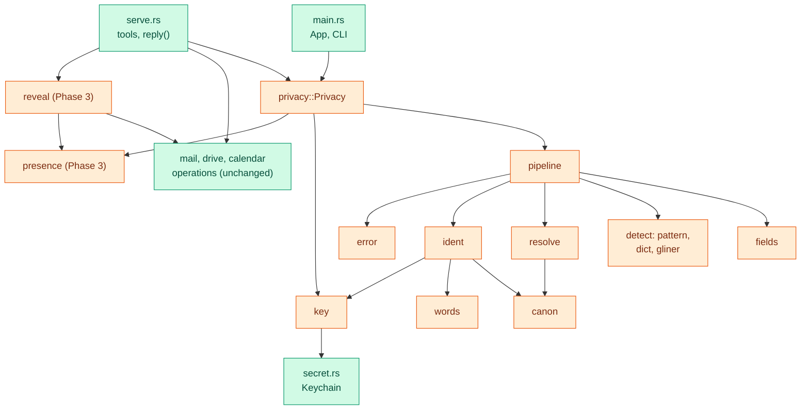

Orange is new; green exists and changes as the table above says. No
privacy module depends on `serve.rs`, `mail`, `drive` or `calendar`
except `reveal`, so the pipeline can be tested on JSON alone.

## Types

Sketches in Rust. Names and fields are the draft's; signatures follow the
crate's conventions (`anyhow::Result`, `secrecy` for secrets).

```rust
// privacy/mod.rs
#[derive(Clone, Copy, Debug, PartialEq, Eq, serde::Deserialize)]
#[serde(rename_all = "lowercase")]
pub enum Mode { Off, Aliases }

/// Held by `App`; one per process.
pub struct Privacy {
    started: Option<Mode>,           // the mode at start; None when none is set (Q27)
    refusing: AtomicBool,            // set once the configured mode differs; never cleared (R26)
    setting: SettingWatch,           // the Keychain item privacy-mode (Q28)
    keys: Option<KeyWatch>,          // Some in aliases mode
    approvals: Approvals,            // Phase 3
    presence: Box<dyn Presence>,     // Phase 3
    clock: Box<dyn Clock>,
}

impl Privacy {
    /// R26: refuse when no mode is set (Q27); once the configured
    /// mode differs from the start mode, and from then on; or when the key is gone.
    pub fn check(&self) -> Result<Session, Fault>;
}

/// What one call may use: the mode, and the keys as they were when the call
/// began. Owned and cheap to clone, so a blocking thread can hold it.
#[derive(Clone)]
pub struct Session { pub mode: Mode, keys: Option<Arc<Keys>> }
```

```rust
// privacy/key.rs
pub struct Keys {                    // all Zeroize on drop (R20)
    alias: HmacKey,
    reference: SivKey,               // 64 bytes: Aes256Siv
    handle: SivKey,
    digest: HmacKey,
    id: [u8; 16],                    // derived from the key; also in the item's comment
}
pub struct KeyWatch { current: RwLock<Arc<Keys>>, source: Box<dyn KeySource> }
pub trait KeySource: Send + Sync {
    fn key_id(&self) -> Result<Option<[u8; 16]>>;      // attribute read, no prompt
    fn load(&self) -> Result<Option<SecretBox<[u8; 32]>>>;
    fn store(&self, key: &SecretBox<[u8; 32]>) -> Result<()>;
    fn delete(&self) -> Result<bool>;
}
```

```rust
// privacy/ident.rs
pub enum EntityType { Person, Organization, Location, Address, Email, Phone, Card, Iban, Domain, Ip, Secret, NationalId, Account }
// A URL is not an entity: it is written as `link N (<domain alias>)`, numbered within one result (Q19).
pub enum ItemKind { Message, Thread, Event, DrivePath }
pub enum TokenKind { MailCursor, Offset, Tree, CalendarWindow, ThreadPage }

pub struct Alias(String);            // "amber-falcon-river"
pub struct Ref(String);              // base64url of AES-SIV output
pub struct Handle(String);           // base64url of AES-SIV output
pub struct KeyedDigest(String);      // five words

impl Session {
    pub fn alias(&self, t: EntityType, canonical: &str) -> Alias;
    pub fn reference(&self, t: EntityType, canonical: &str) -> Ref;
    pub fn open_ref(&self, r: &str) -> Result<(EntityType, String), Fault>;
    pub fn handle(&self, k: ItemKind, id: &str) -> Handle;
    pub fn open_handle(&self, k: ItemKind, h: &str) -> Result<String, Fault>;
    pub fn seal_token(&self, k: TokenKind, token: &str) -> String;
    pub fn open_token(&self, k: TokenKind, sealed: &str) -> Result<String, Fault>;
    pub fn keyed_digest(&self, algorithm: &str, raw_hex: &str) -> KeyedDigest;
}
```

```rust
// privacy/detect/mod.rs
pub struct Mention { pub start: usize, pub end: usize, pub entity: EntityType, pub value: String, pub source: &'static str }
pub trait Detector: Send + Sync {
    fn name(&self) -> &'static str;                       // "regex", "dictionary", "gliner"
    fn find(&self, text: &str, out: &mut Vec<Mention>) -> Result<()>;
}
```

```rust
// privacy/fields.rs
pub enum Policy {
    Plain,                       // dates, counts, sizes, enums, fixed notes
    Text,                        // free text: detectors and dictionary
    Address,                     // "Name <email>" or "email"
    Person,                      // {name, email, response}
    DrivePath,                   // each part as Text; the whole as a handle in `fileId`
    LocalPath,                   // a path on this Mac: a fixed placeholder
    Id(ItemKind),                // a handle
    Digest(&'static str),        // a keyed digest; the algorithm's name
    Token(TokenKind),            // a sealed page token
    Drop,                        // removed (R16): nodeId, revisionId
    Error,                       // text inside a successful result: Fault code only
}
pub struct FieldRule { pub pointer: &'static str, pub policy: Policy }  // "/messages/*/from"
pub fn rules(tool: &str) -> &'static [FieldRule];
```

```rust
// privacy/error.rs
pub enum Fault {
    NotFound, InvalidArgument(&'static str), InvalidHandle, InvalidRef, InvalidPageToken,
    Unavailable(Service), Timeout, TooLarge, DeclinedByUser,
    PrivacyModeUnset, PrivacyModeChanged { started: Mode, configured: Option<Mode> }, PrivacyKeyMissing,
    PipelineFailed, Internal,
}
```

```rust
// privacy/presence.rs (Phase 3)
pub struct Prompt { pub kind: &'static str, pub facts: Vec<String>, pub name: String }
pub enum Decision { Approved, Refused, TimedOut }
#[async_trait]   // or a boxed future; the crate has no async-trait today
pub trait Presence: Send + Sync {
    async fn confirm(&self, prompt: &Prompt, deadline: Instant) -> Result<Decision>;
}
pub struct Approvals { granted: Mutex<HashMap<[u8; 32], SystemTime>> }  // keyed by a hash of the handle
```

The same types as a class diagram:

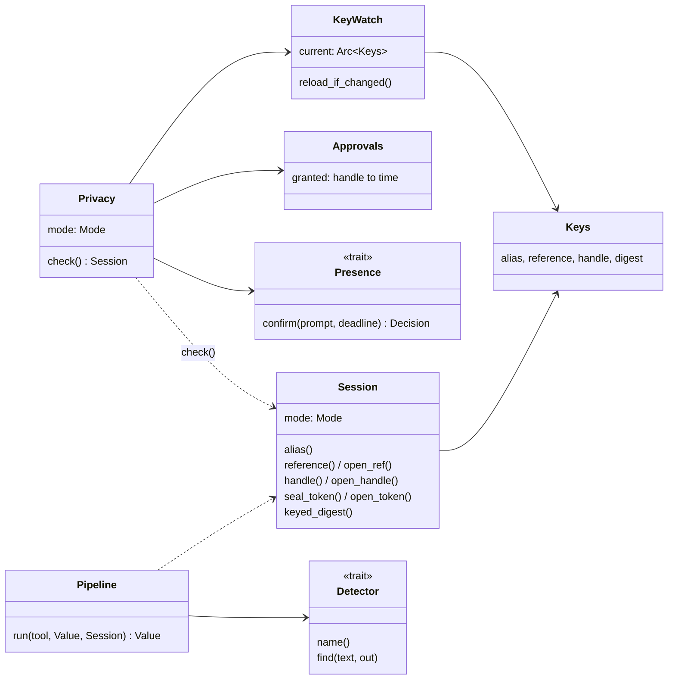

## Data model

What a tokenized result holds, and what each identifier stands for. Only
the privacy key is stored (in the Keychain); every box below exists in
memory for one call, or in the result. [Section 6](06-privacy.md#identifiers)
shows how the key gives each identifier.

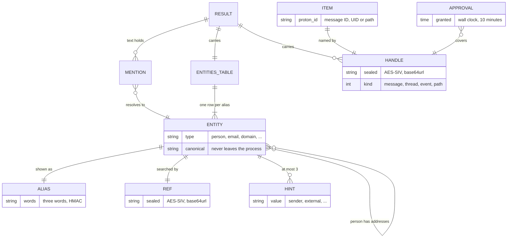

## Keys and identifiers

### Derivation

The privacy key is 32 bytes from the system's random source, stored as
base64url text (`src/secret.rs` reads UTF-8). HKDF-SHA-256 with no salt
expands it; each subkey has its own `info` label:

| Subkey | `info` | Length | Used by |
|---|---|---|---|
| alias | `protonctl v1 alias` | 32 | HMAC-SHA-256 |
| reference | `protonctl v1 ref` | 64 | `Aes256Siv` |
| handle | `protonctl v1 handle` | 64 | `Aes256Siv`, also for page tokens |
| digest | `protonctl v1 digest` | 32 | HMAC-SHA-256 |
| key ID | `protonctl v1 key id` | 16 | names the key in the item's comment (R20) |

The `v1` in each label is the format version. A future change to the
canonical rules or the word list can move to `v2` labels, which changes
every alias at once rather than some of them silently; `get_status`
reports the format version, and the release notes announce the change
(Q19).

### Constructions

[The API specification](lld-api.md#wire-formats) gives byte layouts. In
outline, with `||` for concatenation and `0x00` as a separator that cannot
occur inside the parts:

- **Alias**: `HMAC(alias, "v1" 0x00 tag 0x00 canonical)`, first 8 bytes as
  a big-endian `u64`, reduced modulo `N³` for a list of `N` words, then
  written as three words in base `N`. `tag` is `name` for person,
  organization and location, so a detector that retypes a name (Phase 5)
  keeps its alias, and the entity's own type for everything else (Q19).
  When two entities in one result share three words, the later one gets a
  fourth.
- **Ref**: `AES-SIV(reference, AD = "protonctl ref v1", type || canonical
  || 0x80 || 0x00…)`, padded to a multiple of 32 bytes; base64url without
  padding. One block of 16 bytes (the synthetic IV) precedes the
  ciphertext, so a name of up to 30 bytes gives 48 bytes, 64 characters.
- **Handle**: `AES-SIV(handle, AD = "protonctl handle v1", kind || id)`.
  A message ID has a fixed 16 characters and is not padded (33 bytes, 44
  characters). Thread IDs, event IDs and Drive paths vary in length and are
  padded as a ref is (R16).
- **Sealed page token**: `AES-SIV(handle, AD = "protonctl token v1", kind
  || token)`, padded when the token carries a path (a Drive tree token).
- **Keyed digest**: `HMAC(digest, algorithm 0x00 raw_digest_bytes)`, first
  8 bytes, written as five words (`N⁵ ≥ 2⁶⁴` once `N ≥ 7,132`).

AES-SIV with no nonce is deterministic: the same input gives the same
output, which is what makes refs and handles stable, and it reveals only
whether two values are equal, never the value. Both properties are the
point; the [review](security-privacy-review.md) weighs them.

### Canonical forms (`canon.rs`)

| Type | Canonical form |
|---|---|
| person, organization, location | NFKC; Unicode case folding without Turkish rules; diacritics removed from Latin, Greek and Cyrillic letters only; whitespace collapsed; honorifics removed only before a full name (a given name and a surname), so "Mr Chen" and "Mme Chen" stay apart; "Last, First" reordered |
| email | lower case; NFKC on the domain |
| phone | E.164 through `phonenumber` |
| card, IBAN | digits and capital letters only |
| URL (to number links within a result, Q19) | scheme and host in lower case; path and query kept; fragment removed |
| secret, national ID, account | as found, with whitespace removed |
| domain, IP | lower case; IPv6 in its compressed form |

Canonicalizing twice changes nothing (a property test in
[section 7](07-testing.md)).

### The key's life

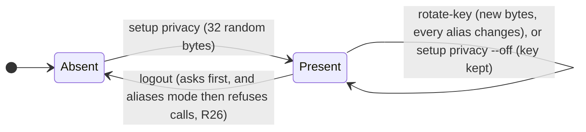

`setup privacy` and `rotate-key` write the key ID, the first 16 bytes of
HKDF over the key with the label `protonctl v1 key id`, in hex, into a
non-secret attribute of the item (its comment), in the same Keychain
update as the key. A running server reads that attribute on each call (an
attribute read, which needs no Keychain prompt, as `secret::accounts()`
reads accounts today). When it changes, the server loads the key, derives
its ID and keeps the key only if the two match, trying again on the next
call if not, so it never holds an old key under a new ID, and Claude Code
and Claude Desktop never mix two keys (R20). The item's modification date would not do: it has
whole-second resolution, so two changes in one second could go unseen.
Whether the attribute read avoids a prompt is checked in M2.1.

## The pipeline

### Where it runs

```rust
// serve.rs: a tool takes one Session for the whole call, opens its handles
// with it, and hands the operation to reply() as a closure over a page size.
async fn read_file_content(&self, p: Parameters<ReadReqAliases>) -> Result<CallToolResult, ErrorData> {
    let session = match self.app.privacy.check() {   // R26, once per call, before any I/O
        Ok(s) => s,
        Err(f) => return Ok(fault(f)),
    };
    let deadline = Instant::now() + CALL_LIMIT;      // one limit for everything below (R8)
    let (app, req) = (Arc::clone(&self.app), p.0);   // owned, so each attempt's future can hold them
    reply(session.clone(), "read_file_content", deadline, move |budget| {
        let (app, req, session) = (Arc::clone(&app), req.clone(), session.clone());
        async move {
            let path = session.open_handle(ItemKind::DrivePath, &req.file_id)?;
            app.drive()?.read_file_content(&req.to_req(path, budget), &app.drive_cli).await
        }
    })
    .await
}

async fn reply<R, F, Fut>(session: Session, tool: &'static str, deadline: Instant, op: F)
    -> Result<CallToolResult, ErrorData>
where
    R: Into<Reply>,
    F: Fn(Budget) -> Fut,
    Fut: Future<Output = Result<R>>,
{
    if session.mode == Mode::Off {
        content::sweep_downloads();                  // as today, before the call (R10)
        return today(tokio::time::timeout_at(deadline, op(Budget::Default)).await);
    }
    let attempt = async {
        for budget in [Budget::Default, Budget::Half] {          // one smaller retry over the size cap
            let value = op(budget).await.map_err(|e| Fault::from_error(&e))?.into();
            match pipeline::run_blocking(tool, value, session.clone()).await {
                Ok(v) => return Ok(v),
                Err(PipelineError::TooLarge) => continue,
                Err(_) => return Err(Fault::PipelineFailed),       // fail closed (R13)
            }
        }
        Err(Fault::TooLarge)
    };
    match tokio::time::timeout_at(deadline, attempt).await {    // operation, retry and pipeline share 150 s
        Ok(Ok(v)) => Ok(CallToolResult::success(vec![ContentBlock::text(v.to_string())])),
        Ok(Err(f)) => Ok(fault(f)),
        Err(_) => Ok(fault(Fault::Timeout)),
    }
}
```

`pipeline::run_blocking` runs the pipeline on a blocking thread
(`spawn_blocking`), so the deadline can end a call while a slow stage
(GLiNER, Phase 5) works; its late result is dropped. The Session is owned
and carries an `Arc` of the keys, so the thread holds the same keys the
call began with. The sketch shows ownership, not final signatures; M2.4
settles them.

In aliases mode `reply()` drops `Reply::attached` (R22): images and blobs
never become content blocks. The operations still return them in off
mode.

### Stages

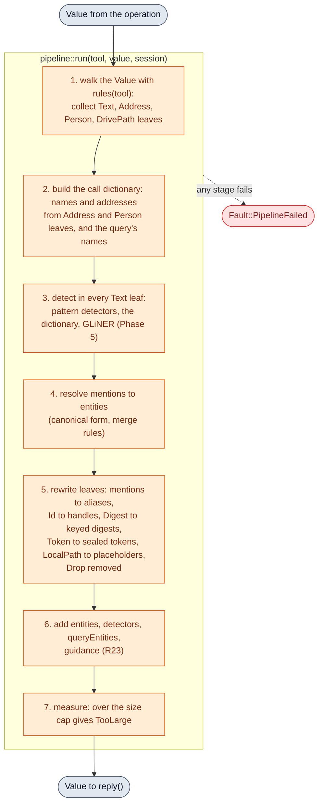

### Field policies (`fields.rs`)

Each tool has a list of rules: a JSON pointer pattern (`*` matches any
array index) and a policy. [The API specification](lld-api.md#mcp-tools)
lists every rule. Two rules keep the list honest:

- **Unlisted means dropped.** A string leaf that no rule names is removed,
  and the result names its JSON path in a `dropped` member, so the gap
  shows and nothing unlisted leaves. Treating it as text would not do: the
  detectors find addresses, numbers and names, never an opaque Proton ID,
  so a new ID field would pass in the clear (R16). The leak test
  ([section 7](07-testing.md)) plants Proton IDs, and the coverage test
  below catches the field in development.
- **Coverage test.** For each tool, the test walks a fixture result and
  fails on any string leaf that matches no rule, so a new field gets a
  rule when it is added. Numbers and booleans are always `Plain`.

### Resolution (`resolve.rs`)

1. Each mention's value is canonicalized for its type.
2. Mentions with equal (type class, canonical value) are one entity; the
   type class is `name` for person, organization and location (as the
   alias), so one string typed two ways in one result is one entity, typed
   by the most specific detector (`dictionary` over `gliner` over
   `regex`).
3. An `Address` leaf ("Name <email>") makes two entities, a person and an
   email, and records the email's alias under the person's `addresses`.
4. Overlapping mentions: the longest wins; on a tie, the earlier detector
   in the order above.
5. Collisions inside one result: entities with different canonical
   values that share three words are ordered by their refs. The first
   keeps three words; each later one takes a fourth word from the next 8
   bytes of its HMAC, then a fifth from the 8 after, until every alias in
   the result differs (past the 32 bytes of one HMAC, more bytes come from
   the HMAC over the same input and a counter). The order of the input
   does not matter (the collision row in [section 5](05-security.md)).
6. Short forms (`detect/dict.rs`, built 2026-10-04): a short form or
   initials join a full name when exactly one known name fits and the
   result's own headers hold it; otherwise the form is its own entity,
   and both rows carry `maybeSameAs`. A misspelling of a known name, from
   typing or OCR, is always its own entity, linked the same way.

### Replacement

Detection runs on a copy of each leaf with every hidden character
removed, keeping a map from the copy's offsets to the original's, so a
zero-width space inside a name (or its `\u{200B}` escape in a Drive name)
cannot split a name the detectors would otherwise find. Text is then
rewritten from the end to the start, so offsets stay valid. A mention
becomes its alias; the surrounding text stays. In a `DrivePath` leaf each
part is rewritten from the unescaped name and escaped (R6) afterwards; the
leaf's handle goes in a sibling `fileId`.

`queryEntities` pairs each name the caller typed in this call's query with
its alias, when the name matches an entity in the result. As typed, those
names appear only there; every other field shows their aliases (R13,
Q21).

### Size

The `entities` table counts toward the result. The pipeline measures the
serialized result against a cap set in M2.4 from Q16's token measurement,
below Claude Code's 25,000-token limit. Over the cap, `reply()` calls the
operation once more with half the page size or `maxChars`, inside the same
150 s deadline, then gives `TooLarge` with guidance to narrow the request. Paged operations take
their size from the request, so the retry is a field change, and the
caches that exist (mail UID map, the last Drive document) make it cheap.

## Errors in aliases mode

Errors today are `format!("{e:#}")` of an `anyhow` chain (`serve.rs:44`),
and many quote paths, labels, IDs and text from Proton's clients (the map
of every site is in the [API specification](lld-api.md#errors)). In
aliases mode an error result is JSON with a code and fixed text:

```json
{"error": "not_found", "message": "No item matches this fileId.", "detectors": ["regex", "dictionary"]}
```

`Fault::from_error` reads the chain for typed causes (`drive::cli::NotFound`,
`mail::NotListening`, timeouts, and new typed errors at the sites the API
specification lists) and maps the rest to `internal`. Rules:

- An error may echo what the caller sent (a query, a date it typed): the
  model already holds it. It never shows what a handle or ref decrypts to,
  or text from Bridge, the CLI or the feed.
- Errors inside a successful result (`protonError`, `calendars[].error`)
  get the same treatment through `Policy::Error`.
- Parameter errors raised by rmcp before a tool runs ("failed to
  deserialize parameters: …", rmcp 3.5 `handler/server/tool.rs`) quote
  only the caller's own arguments, so they stay as rmcp writes them.
- The original chain is not logged (R25); `protonctl doctor`, or the CLI
  with `--raw` after Touch ID, shows the detail to the user.

## The setting and its checks

`Privacy::check()` runs first in every call:

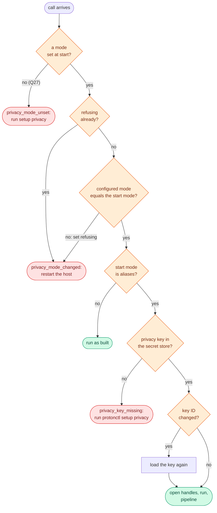

- **Reading the configured mode.** From the Keychain item
  `protonctl/privacy-mode` (Q28). `SettingWatch` reads the item's
  modification date, an attribute read that loads no secret and asks for
  no approval, and reads the value again only when the date changes. A
  value that cannot be read, or is neither `off` nor `aliases`, refuses
  every call, in either mode: an off-mode server that kept answering would serve names to
  a user who believes they switched to aliases. Once a server refuses
  because the mode changed, it keeps refusing even if the setting changes
  back, until the host restarts it.
- **Tools per mode.** rmcp 3.5's router holds one route per name:
  `merge` (and `+`) inserts by name, so a second route with the same name
  replaces the first, and `disable_route` hides a name entirely
  (`handler/server/router/tool.rs:436-480`). So the server never merges
  two routes of one name. It defines three routers with
  `#[tool_router(router = …)]`, which rmcp-macros 3.5 documents for
  combining routers: `shared` (tools whose parameters are the same in both
  modes, such as `get_status`, `list_calendars`, `list_labels`), `off`
  (the as-built `path` and `messageId` forms, `download_file`,
  `export_drive_manifest`) and `aliases` (the handle forms, and `reveal_*`
  from Phase 3). At startup it builds `shared() + off()` or
  `shared() + aliases()` for the mode it starts in, and
  `#[tool_handler(router = self.tool_router)]` serves that, as it does
  today.
- **No list-changed notification.** rmcp can send
  `notifications/tools/list_changed`, but a running server never changes
  its tools; it refuses calls until the host restarts it, because whether
  each host refreshes its cached list on that notification is untested.
- **Instructions** come in two texts, one per mode; the aliases text is in
  the [API specification](lld-api.md#server-instructions).

## Raw reads and user presence

Phase 3. [Section 6](06-privacy.md) has the sequence as the user sees it;
here is the state of one handle's approval:

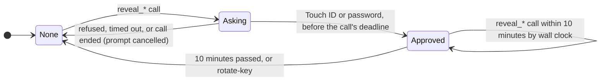

- `Approvals` is keyed by SHA-256 over the tool's name, the handle's
  bytes and, for `reveal_attachment`, the attachment's index, so one
  approval covers exactly the item its prompt named, and the map holds no
  handle in the clear. Approving an email's text does not approve its
  attachments; each attachment's prompt names it.
- The prompt runs in a child process (`osascript` with a JavaScript for
  Automation script, or a signed helper; Q15) started with
  `kill_on_drop(true)`, as `extract.rs` starts its helpers. When the call's
  deadline passes the child is killed, so a late answer has nowhere to
  arrive and approves nothing (R18).
- The prompt text is protonctl's: the kind, size and date, which it
  computes, then the item's name and its folder's, which people wrote,
  each cleaned (R6), cut to 60 characters and quoted.
- `reveal_*` results pass the pipeline with the reveal profile: the `Id`,
  `Token`, `Digest`, `LocalPath` and `Drop` policies apply as in any
  result, so no Proton ID, `Message-Id`, raw digest or local path leaves
  (R16, R17); `Text`, `Address` and `Person` leaves stay as written, with
  R6's cleaning and `provenance`. The `entities` table pairs each name with
  its alias by an added `name` member (Q21).

## Sequences

### A tool call in aliases mode

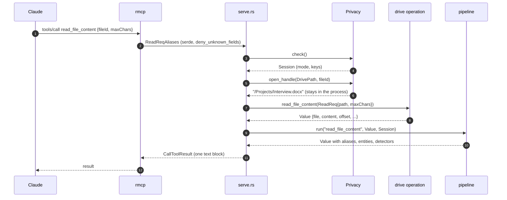

### `rotate-key` while servers run

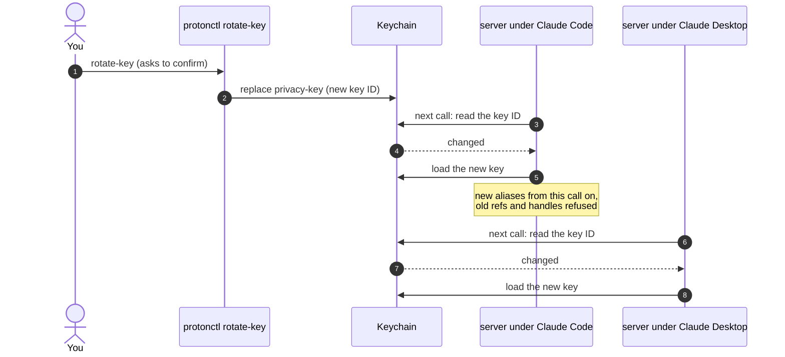

### A mode change while a server runs

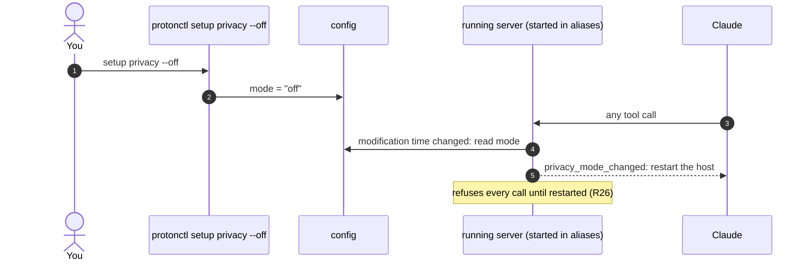

## Concurrency and performance

- `Privacy` is shared as `Arc` across concurrent calls. The keys sit in a
  `RwLock<Arc<Keys>>`; a call clones the `Arc` once in `check()`, so a
  reload never changes keys in the middle of a call.
- The Drive CLI stays serialized by its lock file (principle 6); the
  pipeline adds no I/O but the Keychain attribute read and a `stat` of the
  config per call.
- The pattern detectors and the dictionary are single passes over the
  text (`regex` and `aho-corasick` run in linear time); a 20,000-character
  page is one pass each. HMAC and AES-SIV cost microseconds per entity.
  Measured on 2026-10-05 in a release build in the Linux container, with
  a dictionary of 5,000 names (`time_on_a_full_page` in
  `src/privacy/pipeline.rs`, ignored by default): a 20,000-character page
  holding 150 entities took a median 20 ms, and a 40,000-character one
  28 ms; a process's first run took about 90 ms more. With 600 entities,
  both pages were refused as `too_large`: in that text each entity added
  about 185 characters to the result, so the cap of 90,000 holds roughly
  380 entities on a 20,000-character page. The misspelling pass (D4)
  compares each run of two or three words with the known names that
  share its first letter; measured on 2026-10-04 in a release build on
  a Mac, the same pages took a median 54 ms and 89 ms with it, against
  23 ms and 33 ms on that Mac without it.
- GLiNER (Phase 5) is the one stage with a real cost; its runtime is Q23.

## Testing hooks

| Hook | Real | In tests |
|---|---|---|
| `KeySource` | the Keychain item `protonctl/privacy-key` | a fixed key in memory, or none |
| `SettingWatch` | the Keychain item `protonctl/privacy-mode` (Q28) | a value the test changes |
| `Clock` | wall clock | a clock the test moves (approvals, R12-style freshness) |
| `Presence` | LocalAuthentication through Q15's route | approves, refuses, or never answers |
| Detectors | the registry | each alone, or a planted panic for the fail-closed test |

With these, every test listed for the privacy layer in
[section 7](07-testing.md) runs under `cargo test` against the scripted
Bridge, the stand-in CLI and a synthetic feed, and the leak test runs
every tool in aliases mode over a planted corpus.

## Build order

Milestones from [section 9](09-rollout.md), in the order this design builds
them:

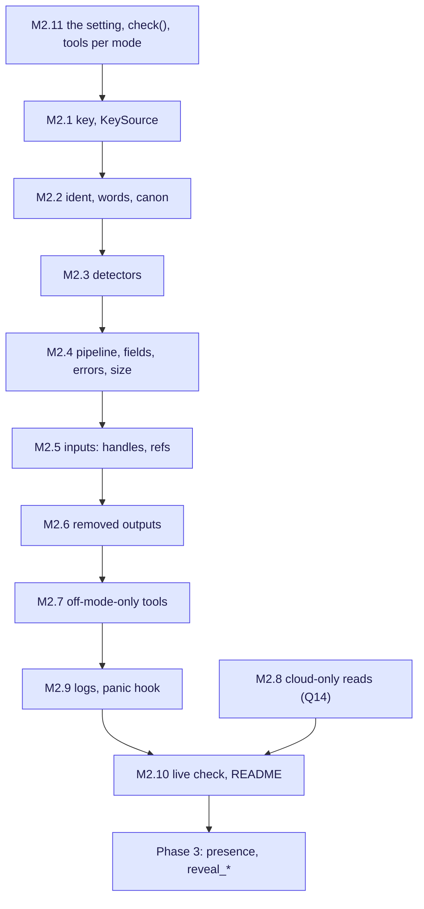

---

[← Appendix C: Role-play of aliases mode](appendix-c-roleplay.md) · [Contents](../rfc-0001.md#contents) · [API specification →](lld-api.md)

## As built

Phase 2 as built on 2026-10-04 differs from this draft here; the code is
the reference.

- **Where the pipeline runs.** Not inside `reply()`: `Server::call` in
  `src/serve.rs` runs the privacy check, then the operation, then, in
  aliases mode, the pipeline. Tools are registered from three routers:
  the tools shared by both modes, off mode's Drive and saving tools, and
  aliases mode's Drive tools, which take handles, and its `get_attachment`,
  which saves nothing. Off mode's surface snapshot is unchanged.
- **No `resolve.rs`.** Mentions become entities in the pipeline's registry
  (`src/privacy/pipeline.rs`), which also records `maybeSameAs`.
- **Field policies by name.** `src/privacy/fields.rs` gives a policy per
  member name, with the few differences by tool, not JSON pointer
  patterns. A test runs the coverage check over the mail snapshots, the
  calendar results and every Drive tool, so a new string field without a
  rule fails a test, as it would be dropped at run time.
- **No size retry.** A result over the cap of 90,000 characters gives
  `too_large` at once; the caller passes a smaller `maxChars` or
  `pageSize`. The `entities` table is not counted toward the page size.
- **No log key.** protonctl's own logs carry no identifiers, so R25 needs
  no keyed log IDs, and the key has no log subkey (the tables above no
  longer list one). A panic prints a fixed line with the code location,
  never its message (M2.9).
- **The setting's watch.** Each call reads the `privacy-mode` item's
  comment (the mode, read without the secret) and compares it with the
  mode at start; there is no check of the item's modification date.
  A setting that cannot be read gives `privacy_mode_unreadable`, a code
  the draft did not have; on Linux, every call gives it while no Secret
  Service runs.
- **Errors.** An operation's error reaches aliases mode only by its type:
  `content::Missing` gives `not_found`; `content::Invalid` carries the
  fault (`invalid_argument` with fixed text, or `invalid_page_token`) and
  off mode's text, which can quote the caller's input; `DiskForbidden`,
  `drive::cli::NotFound` and `mail::NotListening` have their own codes.
  Any other error gives `unavailable` for the tool's service. Off mode's
  text is unchanged.
- **Cuts.** Pages, snippets and calendar descriptions are cut from longer
  text before the pipeline sees them, so a cut inside a name or an
  address would leave each half to pass undetected; the first live
  aliases-mode check found `read_file_content` returning half an address
  raw. In aliases mode each cut (`Document::page`, `content::truncate`)
  asks `content::cut_at`, which runs the regex and the process dictionary
  within 4,096 bytes of the cut (`detect::around`) and moves the cut back
  to the start of a mention it would split, or past its end when the
  mention starts the piece, so a page always moves on. A snippet whose
  32 KiB fetch ends inside its first 200 characters still ends at an
  unchecked cut, since the text beyond it was never fetched.
- **No disk in aliases mode.** The call runs inside a task-local scope in
  which `content::downloads()` refuses, so no file is saved. A cloud-only
  Drive file is read through `content::memory_folder()` instead: a folder
  on a per-process RAM disk (`platform::memory_disk`, M2.8), or on Linux a
  folder under `$XDG_RUNTIME_DIR`, deleted once read; the disk is detached,
  or the folder deleted, at exit. Without one, the read fails as
  `DiskForbidden`.
- **The process dictionary (Q22).** Correspondents' display names come
  from the From, To and Cc headers of All Mail, and attendees' and
  organizers' names from the calendars that can be read. Both sources are
  read at once, each within 30 s, on the first aliases-mode call, and each
  only once per server process, so no later call waits on Bridge or the
  feed. A source that fails or is cut short keeps what it read, and every
  result names it in `dictionaryIncomplete` until the server restarts. A
  one-word name on the alias word list ("Support") is left out; the list
  is not every common word, so "Notifications" still joins. Each name
  comes with its address, which types it (`display_name_type` in
  `detect/dict.rs`): an organization when it names its own address's
  domain, whole or as its first word ("GitHub" from github.com, "Acme
  Billing" from acme.example), else a person. No list of words is kept:
  a sender the rule misses stays `person` until Phase 5's model types
  it, which changes the type shown, never the alias, since people and
  organizations share an alias class. A name the result types an
  organization anywhere is one in its `entities` table. Names match in
  any case, with Unicode case folding, and each address's domain joins the
  result's dictionary, so a domain whose top-level domain is not on the
  pattern's short list is still found beside its address.
- **Values a sender or organizer can write.** A calendar `status` and an
  attendee's reply, and mail's `origin` and `encryption` markers, are
  parsed into their standard values where they arrive, or `other`, in both
  modes; aliases mode keeps only known MIME types.
- **The check's time.** The privacy check, which can wait on a Keychain
  approval, runs off the async threads and within the call's 150 s.
- **Refs in queries.** A `ref:REF` term is opened before the query runs,
  and the value it holds joins the call's dictionary, so a result that
  echoes the query (`searched`) shows its alias.
- **A listing's own folder.** The top-level `path` of `list_folder` and
  `list_drive_tree` gets a `folderId` beside it.
