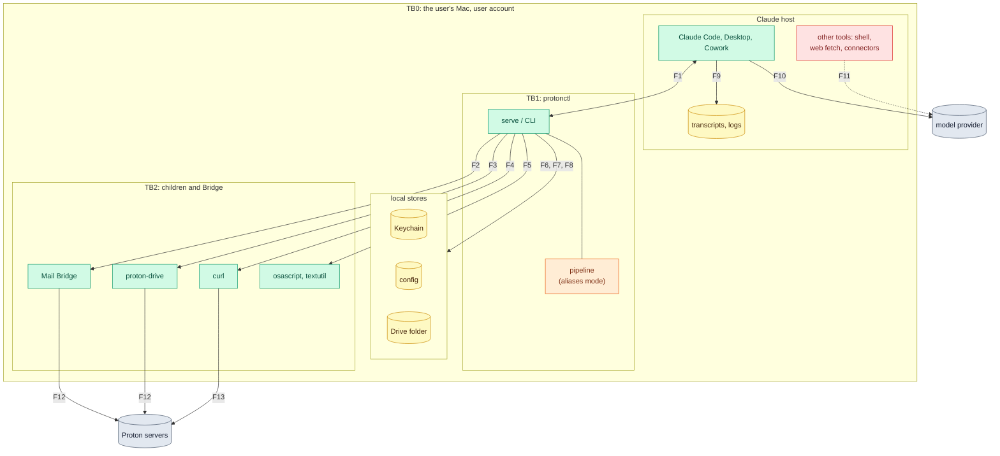

[RFC-0001](../rfc-0001.md) › Security and privacy review

# Security and privacy review

A standing threat model of protonctl: off mode as built at commit 7786b3e,
and aliases mode as [section 6](06-privacy.md), the
[low-level design](lld-privacy-layer.md) and the
[API specification](lld-api.md) describe it. It records the properties the
design must keep, what can break them, and the tradeoffs behind each
choice. It is re-run at the end of each phase ([section 8](08-review-process.md)).

## Method

The template is the OWASP Threat Modeling Cheat Sheet, which builds on the
Threat Modeling Manifesto's four questions. Each section answers one:

| Question | Section | Technique |
|---|---|---|
| What are we working on? | [1. System model](#1-system-model) | a data-flow diagram with trust boundaries |
| What can go wrong? | [3. Threats](#3-threats) | STRIDE for security; LINDDUN for privacy |
| What are we going to do about it? | [2. Invariants](#2-invariants), [3. Threats](#3-threats), [4. Tradeoffs](#4-tradeoffs) | Shostack's four responses: mitigate, eliminate, transfer, accept |
| Did we do a good enough job? | [5. Validation](#5-validation) | the cheat sheet's review questions |

Why these techniques: STRIDE fits a technical design with clear trust
boundaries, which protonctl has. Its purpose is privacy, which STRIDE's
security properties do not fully cover, and the cheat sheet names LINDDUN
(Linking, Identifying, Non-repudiation, Detecting, Data disclosure,
Unawareness and Unintervenability, Non-compliance) for that. Attack
trees, PASTA, OCTAVE and VAST were not used: protonctl has one user and
no business process or organization to model.

**Residual risk** after the response: **high** means an attacker or a
mistake can break an invariant or a goal of the RFC with no further step;
**medium** needs an unlikely step or a user error; **low** needs code
running as the user, or the harm is small.

The earlier review of the 2026-10-04 revision's text, and the fixes it
made, are in commit 7786b3e.

## 1. System model

### Scope

In scope: protonctl's process (server and CLI), its config and Keychain
items, its children (the Drive CLI, curl, `osascript` and `textutil`),
and what crosses from them to the Claude hosts. Out of scope, as non-goals
of [section 1](01-goals.md): code running as root, anyone with access to
the Proton account, Proton's own clients and servers, and the hosts'
internals beyond what they store.

### Assets

| ID | Asset | Why it matters |
|---|---|---|
| A1 | Mail, files and calendar content | the user's data, end-to-end encrypted at Proton |
| A2 | The identities of people in A1 | third parties who never chose to share with a model provider |
| A3 | Secrets: Bridge password, calendar links, privacy key | each opens A1 or reverses aliases |
| A4 | The Proton account's state | read-only is a promise (R1) |
| A5 | Transcripts at the provider and on the Mac | where A1 and A2 end up |

### Actors

| ID | Actor | Reach |
|---|---|---|
| T1 | Authors of third-party content: senders, file authors, invitation senders | text that Claude reads (prompt injection) |
| T2 | The model, acting on T1's text or its own mistake | every tool, and in Claude Code a shell |
| T3 | The model provider, and whoever obtains transcripts (a breach, a legal demand) | A5 |
| T4 | Other code running as the user | the Keychain after an approval, files, ports on 127.0.0.1 |
| T5 | The supply chain: crates, the Drive CLI binary, Bridge | code inside the trust boundary |
| T6 | The network between the Mac and Proton | the calendar GET; everything else is Proton's E2EE |

### Data flows and trust boundaries

| Flow | What crosses | Off mode | Aliases mode |
|---|---|---|---|
| F1 | tool calls and results | names, IDs, digests, images as Proton shows them | aliases, handles, keyed digests, refs; raw text only after Touch ID |
| F2 | IMAP commands and messages | EXAMINE and `BODY.PEEK` only | same |
| F3, F4, F5 | to the Drive CLI: paths in argv, a cleared environment; to curl: the link on stdin; to the converters: file bytes on stdin | as built | same; F5 sandboxed from Phase 4 |
| F6, F8 | reads of the Drive folder and the config | as built | same |
| F7 | secrets | Bridge password, links | plus the privacy key |
| F12 | Bridge's and the CLI's traffic | Proton's end-to-end encryption | same |
| F9, F10 | whatever F1 returned | everything | tokenized, and approved raw items |
| F11 | whatever the model sends on | not protonctl's | not protonctl's |
| F13 | the calendar link | Proton decrypts the calendar server-side | same |

## 2. Invariants

The properties the design must keep. Each names its requirement, the
modes it holds in, what enforces it, what checks it, and whether that
check exists. A property whose check is planned is a claim until the check
runs.

| ID | Invariant | Modes | Enforced by | Checked by | Status |
|---|---|---|---|---|---|
| I1 | protonctl never changes or sends from the account (R1) | both | no write paths; IMAP `EXAMINE` and `BODY.PEEK`; the Drive CLI called only for `list`, `info`, `download` and `--version` | forbidden-name test; IMAP command snapshots | built; an exact tool-set test, an IMAP verb allowlist and a stand-in CLI that refuses other calls are planned ([section 7](07-testing.md)) |
| I2 | protonctl never holds the Proton password or private keys (R2) | both | Bridge and the Drive CLI hold the session | by reading the code | built |
| I3 | Secrets live only in the Keychain and never reach argv, the environment, logs or results (R2, R3, R20, R25) | both | `secrecy` types; curl reads the link on stdin; the CLI runs with a cleared environment | the redaction test; the environment test on the stand-in CLI | built for two secrets; the privacy key planned |
| I4 | protonctl's sockets go only to 127.0.0.1; one HTTPS GET goes to `proton.me` through `/usr/bin/curl` (R3) | both | no HTTP crate; host check | `cargo deny` bans; the host property test | built |
| I5 | Bridge is pinned and the Drive CLI is Proton's (R9) | both | certificate pin; Team ID and version check | pin tests against a fake Bridge | built; the CLI check runs once per process (Q24) |
| I6 | An excluded item cannot be told from a missing one, in every tool (R7) | both | `resolve` checks the requested and the resolved path | exclusion and symlink tests; planned: through handles | built |
| I7 | Third-party text is marked as data and has no hidden characters (R6) | both | `clean`, `escape_hidden`, `provenance` | content property tests | built, except three Drive errors: a path shown unescaped and the Drive CLI's own text passed on uncleaned (milestone M1.5) |
| I8 | Every call ends within 150 s (R8) | both | `CALL_LIMIT` in `reply()` | by reading the code | built |
| I9 | Every result and error leaves through `reply()` | both | one function for 18 tools | planned: a test that calls each tool through the server | built; untested |
| I10 | In aliases mode nothing untokenized leaves because something failed (R13, R26) | aliases | the pipeline returns a fault on any error; no fallback to off | fail-closed test; leak test | planned |
| I11 | A server serves only the mode it started in (R26) | both | `Privacy::check()` before every call | settings tests | planned |
| I12 | In aliases mode no result holds a Proton ID, `Message-Id`, UID, raw digest or local path (R16, R17) | aliases | field policies; an unlisted string field is dropped and named in `dropped` | leak test with planted IDs; field coverage test | planned |
| I13 | Identifiers are deterministic under one key, and nothing maps them back on disk (R14, principle 8) | aliases | HMAC and AES-SIV from HKDF subkeys | stability and round-trip tests | planned |
| I14 | Raw content in aliases mode needs fresh user presence, for one item, with a prompt protonctl writes (R18, R19) | aliases | `Presence`, `Approvals`, the prompt's form | user-presence tests with an injectable checker | planned (Phase 3) |
| I15 | In aliases mode protonctl writes no content to disk (R10) | aliases | no download or export folder; RAM disk only if Q14 needs it | the no-disk test | planned |
| I16 | Logs and panics carry no content (R25) | both | WARN-level logs; a panic hook | the stderr test; a planted panic | logs built; the panic hook planned |
| I18 | A feature on Linux meets the same requirement as on macOS, or is absent ([section 11](11-platforms.md)) | both | tools registered per platform; `get_status` names what is absent and why | a surface snapshot per platform and mode | planned (Phase P) |
| I17 | Converters reach no network, Keychain or file writes (R21) | both | a sandbox profile | the converter sandbox test | planned (Phase 4, Q13) |

## 3. Threats

### Security (STRIDE)

| STRIDE | Threat | Where | Response | Control | Residual |
|---|---|---|---|---|---|
| Spoofing | A local process answers on Bridge's port and collects the password | F2 | mitigate | certificate pin; loopback only (I5) | low |
| Spoofing | A fake `proton-drive` earlier on PATH, or swapped in after the check | F3 | mitigate | absolute path, Team ID, version (I5); the swap after the check is open (Q24) | medium until Q24 |
| Spoofing | A look-alike calendar host | F13 | mitigate | host check and its property test (I4) | low |
| Spoofing | A subject or file name written to make the Touch ID prompt look harmless | Phase 3 prompt | mitigate | protonctl writes the prompt; the name comes last, cleaned, cut and quoted (R18) | low |
| Spoofing | A replaced `protonctl` binary whose Keychain prompt looks like a rebuild's | F7 | mitigate | a stable signing identity and a path the user cannot write (Q12) | medium until Q12 |
| Tampering | The model edits the config: an exclusion removed, the mode set to off | F8 | transfer | Claude Code's sandbox can deny the write (Q17); keeping the mode in the Keychain (Q28) | medium in Claude Code; none in Cowork |
| Tampering | `PROTON_DRIVE_BASE_URL` in the host's environment | F3 | eliminate | the CLI runs with `HOME` and the log level only | low |
| Tampering | A forged or altered handle, ref or page token | F1 | mitigate | AES-SIV authenticates every one; a failure is `invalid_*` (I13) | low |
| Repudiation | protonctl keeps no record of calls | all | accept | read-only (I1); a call log was declined on 2026-10-03; the hosts' transcripts are the record | low |
| Information disclosure | Injected text has Claude send what protonctl returned through another tool | F11 | transfer | session setup and Claude Code's sandbox (Q17); in aliases mode a result holds aliases, and raw text needs Touch ID | high in off mode; medium in aliases mode |
| Information disclosure | Errors quote paths, labels or a client's output | F1 | mitigate | fixed fault codes in aliases mode; off mode quotes them by design | low |
| Information disclosure | A panic prints part of a string to stderr, which hosts keep | F9 | mitigate | panic hook (I16) | medium until M2.9 |
| Information disclosure | Another program reads protonctl's Keychain items after an Always Allow | F7 | accept | user habit; Claude Code's sandbox can deny `security` (Q17); the data-protection keychain needs an entitlement (Q12) | medium |
| Information disclosure | Hosts keep results in transcripts and logs on disk, and Time Machine copies them | F9 | transfer | the hosts' retention settings; outside protonctl | medium |
| Denial of service | Throttling or a CAPTCHA from Proton | F12 | mitigate | official clients; serialized CLI calls; no remote tree walks; a 15-minute calendar cache | low |
| Denial of service | A result too large for the host | F1 | mitigate | page sizes; in aliases mode a size cap with one smaller retry | low |
| Denial of service | A crafted file stalls a converter | F5 | mitigate | 60 s limit, 32 MiB output cap, `kill_on_drop` | low |
| Denial of service | Injected text runs `rotate-key`, `setup privacy --off` or `logout` through the CLI | CLI | mitigate | Phase 2: they refuse when stdin is not a terminal, which a faked terminal (`script`) defeats; Phase 3: user presence ([API specification](lld-api.md#command-line)) | medium in Claude Code until Phase 3 |
| Elevation of privilege | The model uses the shell to run `proton-drive`, read the Drive folder or speak IMAP, around protonctl | TB0 | transfer | Claude Code's sandbox (Q17); R19 covers protonctl's own CLI only | high in Claude Code without a sandbox; none in Cowork |
| Elevation of privilege | A crafted PDF or image exploits a converter | F5 | mitigate | sandbox profile (Phase 4), a VM helper for the riskiest formats (Phase 7) | medium until Phase 4 |
| Information disclosure | On Linux, any process in the user's session reads protonctl's Secret Service items over D-Bus once the collection is unlocked, with no per-program prompt like the Keychain's | TB0 | accept | a collection unlocked only while needed; Q31 weighs keyutils and `pass` | medium on Linux |
| Elevation of privilege | On Linux the only host is Claude Code, so the model always has a shell | TB0 | transfer | Claude Code's sandbox (Q17) | high on Linux without a sandbox |
| Elevation of privilege | A dependency is compromised | TB1 | mitigate | a small set; `Cargo.lock`; `cargo deny` | low |

### Privacy (LINDDUN)

| LINDDUN | Threat | Response | Control | Residual |
|---|---|---|---|---|
| Linking | One alias links a person's appearances across transcripts | accept | intended, so long chats and agents keep context (Q8); key epochs would bound it (Q21) | medium |
| Linking | One pairing of a name with its alias (a typed query, a reveal) reads that alias as the name in every transcript under the key | mitigate | Q21 weighs pairing only on a match, leaving the pairing out of reveals, and epochs | high until Q21 |
| Linking | An item seen in off mode and in aliases mode pairs names with aliases across transcripts | mitigate | `rotate-key` when aliases mode comes back ([section 4, Settings](04-design.md#settings)) | medium |
| Identifying | Context identifies a person whom no alias names: a job, an event, a writing style | accept | a non-goal; hints stay coarse; local summaries reduce context (Phase 6) | medium |
| Identifying | A name only free text carries stays plaintext until GLiNER | mitigate | the dictionary; GLiNER (Phase 5); `detectors` says what ran (R24) | high until Phase 5 |
| Identifying | Two people share an alias and Claude merges them | mitigate | a fourth word inside one result; Q19 weighs four words | low under 20,000 entities (0.06%); medium above, where it reaches 5% at 200,000 (Q19) |
| Non-repudiation | With the privacy key, transcripts reverse fully: refs and handles decrypt, and keyed digests match files | accept | the key stays in this Mac's Keychain and never syncs (R20); `rotate-key` and `logout` end it | medium |
| Non-repudiation | In off mode, Proton IDs and raw digests in transcripts match Proton's records and the files themselves | accept | the user's choice of off mode; aliases mode removes them (I12) | medium in off mode |
| Detecting | A search by name shows whether that person is in the mailbox | accept | searches are not limited (Q7); `guidance` steers toward topics | medium |
| Detecting | Equal handles across sessions show that the same item was read again | accept | intended (stability) | low |
| Detecting | "Excluded" can be told from "missing" | eliminate | identical results (I6) | low |
| Data disclosure | Content reaches the provider | mitigate in aliases mode; accept in off mode | tokenization; raw items one at a time after Touch ID (I14) | aliases: medium until Phase 5; off: by choice |
| Data disclosure | Proton's server decrypts the calendar on each fetch of the link | accept | a dedicated link, Limited view where details are not needed (Q9) | medium |
| Data disclosure | Content on disk: downloads, exports, a RAM disk | mitigate | none in aliases mode (I15); off mode keeps the 2026-10-03 rules | low |
| Unawareness, unintervenability | People in the user's mail never chose to reach a model provider | mitigate | aliases mode exists for them; the Touch ID prompt says where the text goes | medium |
| Unawareness, unintervenability | The user cannot tell which mode served a result | mitigate | `status`, `doctor`, `get_status` and the instructions name the mode (R26) | low |
| Unawareness, unintervenability | protonctl cannot delete what the provider keeps | transfer | the Claude account's data controls | medium |
| Non-compliance | Processing third parties' personal data; Proton's terms on automation (§2.10) and on the Drive SDK's personal use | transfer | a question for a lawyer, outside this review; listed so it is not silent | not rated |

## 4. Tradeoffs

Each choice with its benefit, its cost, and the condition that would
reopen it.

| Choice | Benefit | Cost | Revisit when |
|---|---|---|---|
| The privacy layer is optional (Q26) | a stand-in for Google's connectors with no friction | a user who skips the choice may never turn it on; what off mode sent cannot be recalled | Q27 decides the default |
| Stable aliases under one key (Q8) | long chats, agents and memory keep working | linkability, and one pairing unmasks everywhere (Q21) | if pairings prove common in use, epochs (Q21) |
| Deterministic AES-SIV for refs and handles | stable handles; search by ref; no state on disk | two equal values are visibly equal | a need to hide equality, which would need state |
| One mode for every service and host | no pairing between a plain and an aliased view | no plain Drive beside aliased mail | a use that needs mixed modes and accepts the pairing |
| Words for aliases, base64url for refs and handles | aliases read like names; refs stay out of prose | tokens per alias; 38 bits for three words | Q16's token measurement; Q19's collision choice |
| Fail closed | no partial leak when a stage breaks | a call can fail where off mode would have answered | if failures are frequent, fix the cause, not the rule |
| Touch ID per item, no Always Allow | an agent cannot approve; one item per prompt | interruptions; habit can still form | Q15 shows whether every host can show the prompt |
| Tokenize every entity, public ones included (Q7) | no list of who is public to maintain or leak | "a minister" becomes an alias too | the optional allowlist (Phase 7) |
| No content on disk in aliases mode | nothing to clean up or back up | no exports, no `download_file` in that mode | a use for files that off mode cannot serve |
| Calendar through a share link (Q1, Q9) | calendar at all, with no Proton API | Proton decrypts it server-side | Proton ships a calendar API |
| Login keychain items | works with an ad-hoc signed binary | any program the user approves can read them | Q12 gives a stable signing identity and entitlements |
| Fixed fault codes in aliases mode | errors cannot carry names or paths | less detail for the model | `doctor` and `--raw` give the user detail; revisit if the model is often stuck |
| Linux through a platform module and traits | builds and tests in containers; Linux users; fakes for every platform service | two implementations of each service to keep in step; some Linux mechanisms are weaker (the Secret Service, presence without Touch ID) | a feature that cannot meet its requirement on Linux is absent there, not weaker (I18) |
| Local models for Phases 5 to 7 | names in free text, summaries | install size, native code, a runtime to choose (Q23) | Q23 |

## 5. Validation

The cheat sheet's review questions, answered for this model:

| Question | Answer |
|---|---|
| Does the data-flow diagram reflect the system? | For off mode, yes: drawn from the code at 7786b3e. For aliases mode it reflects a design; it is checked again when each phase closes. |
| Have all threats been identified? | Not yet: the Cowork cloud path and where each host stores results (M1.1), and how LocalAuthentication is reached (Q15), are unmeasured. Each is a milestone. |
| Does each threat have a response? | Yes: every row in section 3 names one. The accepted risks are the linking, identifying and non-repudiation rows the design takes on for stability, the calendar link, Keychain readability, and repudiation. |
| Do the mitigations reduce risk to an acceptable level? | Off mode: as the user chose it. Aliases mode: not until Phase 5 for names in free text, and not until Q21 for pairing; the "high" rows say so. |
| Is the model documented and accessible? | This file, with the RFC; it is versioned in the repository. |
| Can the mitigations be tested? | Every invariant names its check. Built checks: I1, I3 to I7, I16 (logs). Planned: I9 to I15, I16 (panics), I17. The planned checks are listed in [section 7](07-testing.md) and tied to milestones in [section 9](09-rollout.md). |

---

[← API specification](lld-api.md) · [Contents](../rfc-0001.md#contents)
