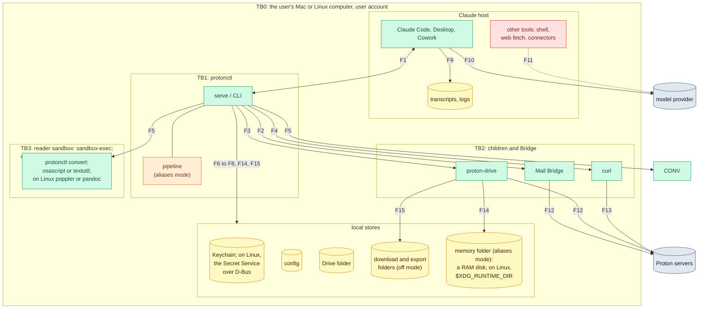

[RFC-0001](../rfc-0001.md) › Security and privacy review

# Security and privacy review

A standing threat model of protonctl: off mode as built at commit 7786b3e,
and aliases mode as [section 6](06-privacy.md), the
[low-level design](lld-privacy-layer.md) and the
[API specification](lld-api.md) describe it. The data flows and the
invariants' states were checked again against the code at commit cac0a1f
(2026-10-05), with Phase 2 and the Linux phases P2 to P4 built, and so
were the threats that signing (Q12), the panic hook (M2.9) and the Linux
readers' sandbox (Q34) changed. It records the properties the
design must keep, what can break them, and the tradeoffs behind each
choice. It is re-run at the end of each phase ([section 8](08-review-process.md)).
The security review of the Phase 2 changes that Q25 asks for ran on
2026-10-06; its findings are in this review's
[section 6](#6-phase-2-security-review-q25).

## Method

The template is the OWASP Threat Modeling Cheat Sheet, which builds on the
Threat Modeling Manifesto's four questions. Each section answers one:

| Question | Section | Technique |
|---|---|---|
| What are we working on? | [1. System model](#1-system-model) | a data-flow diagram with trust boundaries |
| What can go wrong? | [3. Threats](#3-threats) | STRIDE for security; LINDDUN for privacy |
| What are we going to do about it? | [2. Invariants](#2-invariants), [3. Threats](#3-threats), [4. Tradeoffs](#4-tradeoffs) | Shostack's four responses: mitigate, eliminate, transfer, accept |
| Did we do a good enough job? | [5. Validation](#5-validation), [6. Phase 2 security review](#6-phase-2-security-review-q25) | the cheat sheet's review questions; a review of the code |

Why these techniques: STRIDE fits a technical design with clear trust
boundaries, which protonctl has. Its purpose is privacy, which STRIDE's
security properties do not fully cover, and the cheat sheet names LINDDUN
(Linking, Identifying, Non-repudiation, Detecting, Data disclosure,
Unawareness and Unintervenability, Non-compliance) for that. Attack
trees, PASTA, OCTAVE and VAST were not used: protonctl has one user and
no business process or organization to model.

**Residual risk** after the response: **high** means an attacker or a
mistake can break an invariant or a goal of the RFC with no further step;
**medium** needs an unlikely step or a user error; **low** needs code
running as the user, or the harm is small.

The earlier review of the 2026-10-04 revision's text, and the fixes it
made, are in commit 7786b3e.

## 1. System model

### Scope

In scope: protonctl's process (server and CLI), its config and its items
in the Keychain or, on Linux, the Secret Service, its memory folder, its
children (the Drive CLI, curl, and `protonctl convert` with `osascript`
and `textutil`, or on Linux poppler and pandoc), and what crosses from them
to the Claude hosts. Out of scope, as non-goals
of [section 1](01-goals.md): code running as root, anyone with access to
the Proton account, Proton's own clients and servers, and the hosts'
internals beyond what they store.

### Assets

| ID | Asset | Why it matters |
|---|---|---|
| A1 | Mail, files and calendar content | the user's data, end-to-end encrypted at Proton |
| A2 | The identities of people in A1 | third parties who never chose to share with a model provider |
| A3 | Secrets: Bridge password, calendar links, privacy key | each opens A1 or reverses aliases |
| A4 | The Proton account's state | read-only is a promise (R1) |
| A5 | Transcripts at the provider and on the Mac | where A1 and A2 end up |

### Actors

| ID | Actor | Reach |
|---|---|---|
| T1 | Authors of third-party content: senders, file authors, invitation senders | text that Claude reads (prompt injection) |
| T2 | The model, acting on T1's text or its own mistake | every tool, and in Claude Code a shell |
| T3 | The model provider, and whoever obtains transcripts (a breach, a legal demand) | A5 |
| T4 | Other code running as the user | the Keychain after an approval, on Linux the Secret Service once unlocked, files, ports on 127.0.0.1 |
| T5 | The supply chain: crates, the Drive CLI binary, Bridge | code inside the trust boundary |
| T6 | The network between the Mac and Proton | the calendar GET; everything else is Proton's E2EE |

### Data flows and trust boundaries

| Flow | What crosses | Off mode | Aliases mode |
|---|---|---|---|
| F1 | tool calls and results | names, IDs, digests, images as Proton shows them | aliases, handles, keyed digests, refs; raw text only after Touch ID |
| F2 | IMAP commands and messages | EXAMINE and `BODY.PEEK` only | same |
| F3, F4, F5 | to the Drive CLI: paths in argv, a cleared environment; to curl: the link on stdin; to the converters: file bytes on stdin to `protonctl convert`, which confines and then runs the reader | as built; F5 sandboxed on both systems (Q13, Q34) | same |
| F6, F8 | reads of the Drive folder and the config | as built | same |
| F7 | secrets and the privacy setting, from the Keychain or, on Linux, the Secret Service over D-Bus | Bridge password, links, the setting | plus the privacy key |
| F14 | a cloud-only Drive file: the CLI writes it into the memory folder, and protonctl reads it, then deletes it | none: F15 instead | a per-process RAM disk on macOS; on Linux a 0700 folder under `$XDG_RUNTIME_DIR`, used only on tmpfs with every swap encrypted or zram; gone at exit (I15) |
| F15 | files the CLI downloads and attachments protonctl saves, in the download folder; exports and manifests, in the export folder | as built: downloads removed after an hour or at exit; exports kept | none (I15); the CLI writes a file only where `--out` names (R10) |
| F12 | Bridge's and the CLI's traffic | Proton's end-to-end encryption | same |
| F9, F10 | whatever F1 returned | everything | tokenized, and approved raw items |
| F11 | whatever the model sends on | not protonctl's | not protonctl's |
| F13 | the calendar link | Proton decrypts the calendar server-side | same |

## 2. Invariants

The properties the design must keep. Each names its requirement, the
modes it holds in, what enforces it, what checks it, and whether that
check exists. A property whose check is not built is a claim until the
check runs.

| ID | Invariant | Modes | Enforced by | Checked by | Status |
|---|---|---|---|---|---|
| I1 | protonctl never changes or sends from the account (R1) | both | no write paths; IMAP `EXAMINE` and `BODY.PEEK`; the Drive CLI called only for `list`, `info`, `download` and `--version` | forbidden-name test; each mode's exact tool set; IMAP command snapshots; the scripted Bridge refuses any command outside LOGIN, LIST, EXAMINE, STATUS, UID SEARCH, UID FETCH and LOGOUT, and the stand-in Drive CLI any call but the four protonctl makes | built and tested |
| I2 | protonctl never holds the Proton password or private keys (R2) | both | Bridge and the Drive CLI hold the session | by reading the code | built |
| I3 | Secrets live only in the Keychain, or on Linux the Secret Service, and never reach argv, the environment, logs or results (R2, R3, R20, R25) | both | `secrecy` types, and `Zeroizing` for the privacy key and its subkeys; curl reads the link on stdin; the CLI runs with a cleared environment | the redaction tests; the environment test on the stand-in CLI | built |
| I4 | protonctl's sockets go only to 127.0.0.1; one HTTPS GET goes to `proton.me` through `/usr/bin/curl` (R3) | both | no HTTP crate; host check | `cargo deny` bans; the host property test | built |
| I5 | Bridge is pinned and the Drive CLI is Proton's (R9) | both | certificate pin; Team ID on macOS, pinned SHA-256 on Linux, in the secret store; version check; each call runs the copy it checked | pin tests against a fake Bridge; the per-run pin test, the swap test and the config-pin test against a stand-in CLI | built and tested on Linux; the CLI check runs before every run (Q24, Q33), on the copy that then runs ([#72](https://github.com/matt-w-horn/protonctl/issues/72)); the macOS copy is built, not run |
| I6 | An excluded item cannot be told from a missing one, in every tool (R7) | both | `resolve` checks the requested and the resolved path | exclusion and symlink tests; the test of an excluded file reached through a handle | built |
| I7 | Third-party text is marked as data and has no hidden characters (R6) | both | `clean`, `escape_hidden`, `provenance` | content property tests; the M1.5 tests with U+202E in Drive errors | built |
| I8 | Every call ends within 150 s (R8) | both | `CALL_LIMIT` in `Server::call` | by reading the code | built |
| I9 | Every result and error leaves through one function, `Server::call` | both | one function for every tool of both modes; `reply()` in off mode, the pipeline in aliases mode | a test that calls each tool through the server | built and tested |
| I10 | In aliases mode nothing untokenized leaves because something failed (R13, R26) | aliases | the pipeline returns a fault on any error or panic; no fallback to off | fail-closed test; leak test | built and tested: the leak test covers every tool, and the fail-closed test plants a panic in a stage |
| I11 | A server serves only the mode it started in (R26) | both | `Privacy::check()` before every call | settings tests | built |
| I12 | In aliases mode no result holds a Proton ID, `Message-Id`, UID, raw digest or local path (R16, R17) | aliases | field policies; an unlisted string field is dropped and named in `dropped` | leak test with planted IDs; field coverage test | built |
| I13 | Identifiers are deterministic under one key, and nothing maps them back on disk (R14, principle 8) | aliases | HMAC and AES-SIV from HKDF subkeys | stability and round-trip tests | built and tested, across two processes and under another key |
| I14 | Raw content in aliases mode needs fresh user presence, for one item, with a prompt protonctl writes (R18, R19) | aliases | `Presence`, `Approvals`, the prompt's form | user-presence tests with an injectable checker | not built (Phase 3) |
| I15 | In aliases mode protonctl writes no content to disk (R10) | aliases | no download or export folder; a RAM disk for cloud-only Drive files (Q14), on Linux `$XDG_RUNTIME_DIR` when it is tmpfs, private, and every swap is encrypted | the no-disk test; the memory disk test | built and tested, every tool against a throwaway home, and the CLI's commands that could write; on macOS the readers' own writes are not watched until Phase 4 |
| I16 | Logs and panics carry no content (R25) | both | WARN-level logs; a panic hook | the stderr test; a planted panic | built |
| I18 | A feature on Linux meets the same requirement as on macOS, or is absent ([section 11](11-platforms.md)) | both | tools registered per platform; `get_status` names what is absent and why | a surface snapshot per platform and mode | P1 to P4 built: no tool is absent on Linux, and each mode's one snapshot passes on Linux; whether `reveal_*` is absent there is P5 (Phase 3) |
| I17 | Converters reach no network, Keychain or file writes (R21) | both | `protonctl convert`: on macOS a `sandbox-exec` profile (Q13), on Linux Landlock and seccomp (Q34) | the converter sandbox test | built: Linux 2026-10-05, macOS 2026-10-07 |

## 3. Threats

### Security (STRIDE)

| STRIDE | Threat | Where | Response | Control | Residual |
|---|---|---|---|---|---|
| Spoofing | A local process answers on Bridge's port and collects the password | F2 | mitigate | certificate pin; loopback only (I5) | low |
| Spoofing | A fake `proton-drive` earlier on PATH, or swapped in after the check | F3 | mitigate | absolute path; each call copies the CLI through one open of its path, checks the copy's Team ID or pinned SHA-256 and the version, and runs that copy (I5, Q24, Q33, [#72](https://github.com/matt-w-horn/protonctl/issues/72)) | low, since a swap needs code running as the user. On Linux the copy is a sealed memfd, which no process can change. On macOS it is a file in a new 0700 folder, which another process of the user could still change between `codesign` and the run, once it finds the folder's random name |
| Spoofing | A look-alike calendar host | F13 | mitigate | host check and its property test (I4) | low |
| Spoofing | A subject or file name written to make the Touch ID prompt look harmless | Phase 3 prompt | mitigate | protonctl writes the prompt; the name comes last, cleaned, cut and quoted (R18) | low |
| Spoofing | A replaced `protonctl` binary whose Keychain prompt looks like a rebuild's | F7 | mitigate | a self-signed signing identity, made and used by `scripts/install.sh` since 2026-10-04, so a prompt after a rebuild is no longer routine (Q12) | low on macOS; on Linux, the Secret Service row below applies |
| Tampering | The model edits the config: an exclusion removed, the mode set to off, the Drive CLI's path or pin changed | F8 | transfer | Claude Code's sandbox denies the write with the README's settings (Q17: `denyWrite` and an `Edit` deny rule, seen 2026-10-07); the mode lives in the Keychain from Phase 2 (Q28), so the file cannot turn the layer off; on Linux the Drive CLI's pin lives in the Secret Service item `drive-cli-pin`, a pin in the file is ignored, and every `setup drive` asks on a terminal before it pins, the first one too ([#72](https://github.com/matt-w-horn/protonctl/issues/72)) | low in Claude Code with the settings and medium without, for exclusions. For the Drive CLI: a changed path on Linux reaches only the pinned bytes; on macOS it reaches any executable Proton's team signed, an older CLI included, until the code requirement names the CLI's identifier. On Linux any program of the user can write the Secret Service once it is unlocked (section 11), so the model can still pin a file with `secret-tool store`, or answer the prompt through a terminal that `script` fakes; each is a Bash call the user sees and can refuse, and Phase 3's user presence (Q35) is where both close, as for the mode. None in Cowork |
| Tampering | `PROTON_DRIVE_BASE_URL` in the host's environment | F3 | eliminate | the CLI runs with `HOME` and the log level only | low |
| Tampering | A forged or altered handle, ref or page token | F1 | mitigate | AES-SIV authenticates every one; a failure is `invalid_*` (I13) | low |
| Repudiation | protonctl keeps no record of calls | all | accept | read-only (I1); a call log was declined on 2026-10-03; the hosts' transcripts are the record | low |
| Information disclosure | Injected text has Claude send what protonctl returned through another tool | F11 | transfer | session setup and Claude Code's sandbox with `strictAllowlist` (Q17), which covers Bash and not WebFetch or other connectors; in aliases mode a result holds aliases, and raw text needs Touch ID | high in off mode; medium in aliases mode |
| Information disclosure | Errors quote paths, labels or a client's output | F1 | mitigate | fixed fault codes in aliases mode; off mode quotes them by design | low |
| Information disclosure | A panic prints part of a string to stderr, which hosts keep | F9 | mitigate | panic hook, built in M2.9: a fixed line with the code location only (I16) | low |
| Information disclosure | Another program reads protonctl's Keychain items after an Always Allow | F7 | accept | user habit; inside Claude Code's sandbox `security` does not find the items (Q17, the sandbox's default, not a setting); the data-protection keychain needs an entitlement that a self-signed identity cannot carry (Q12) | medium |
| Information disclosure | Hosts keep results in transcripts and logs on disk, and Time Machine copies them | F9 | transfer | the hosts' retention settings; outside protonctl | medium |
| Denial of service | Throttling or a CAPTCHA from Proton | F12 | mitigate | official clients; serialized CLI calls; no remote tree walks; a 15-minute calendar cache | low |
| Denial of service | A result too large for the host | F1 | mitigate | page sizes; in aliases mode a size cap with one smaller retry | low |
| Denial of service | A crafted file stalls a converter | F5 | mitigate | 60 s limit, 32 MiB output cap, `kill_on_drop`; on Linux, 2 GiB of address space per reader and a 1 GiB pandoc heap, and no reader starts a process that would outlive the limit ([#71](https://github.com/matt-w-horn/protonctl/issues/71), built 2026-10-07) | low on Linux: a file built to fill memory stops in about a second, and a read still takes up to 2 GiB for up to 60 s; medium on macOS, whose readers have no memory limit until Phase 4 |
| Denial of service | Injected text runs `rotate-key`, `setup privacy --off` or `logout` through the CLI | CLI | mitigate | Phase 2: they refuse when stdin is not a terminal, which a faked terminal (`script`) defeats; Phase 3: user presence ([API specification](lld-api.md#command-line)) | medium in Claude Code until Phase 3 |
| Elevation of privilege | The model uses the shell to run `proton-drive`, read the Drive folder or speak IMAP, around protonctl | TB0 | transfer | Claude Code's sandbox with the README's settings (Q17, seen 2026-10-07): the folder and Bridge's port are closed, `proton-drive` runs but cannot reach Proton; R19 covers protonctl's own CLI only | high in Claude Code without the settings, low with them; none in Cowork |
| Elevation of privilege | A crafted PDF or image exploits a converter | F5 | mitigate | on Linux, Landlock and seccomp in `protonctl convert`, built 2026-10-05 (I17, Q34); on macOS, `sandbox-exec` with a deny-default profile in `protonctl convert`, built 2026-10-07 (Q13); a VM helper for the riskiest formats (Phase 7) | low on Linux: seccomp refuses signals to other processes on every kernel, not only from 6.12, where Landlock scopes them, and a core size of 1 keeps a crashed reader's core from a file or a `\|` handler, though not from an `@` socket handler, which Linux 6.17 added ([#71](https://github.com/matt-w-horn/protonctl/issues/71)); low on macOS, where no Mach service, so no Keychain, Apple Event or shell, is reachable, though the readers have no memory limit there and a crash still reaches the system's crash reporter |
| Information disclosure | On Linux, any process in the user's session reads protonctl's Secret Service items over D-Bus once the collection is unlocked, with no per-program prompt like the Keychain's | TB0 | accept | a collection unlocked only while needed; Q31 chose the Secret Service, which Bridge and the Drive CLI need on Linux anyway | medium on Linux |
| Elevation of privilege | On Linux the model usually has a shell, in Claude Code or Claude Desktop's Code tab | TB0 | transfer | Claude Code's sandbox (Q17; its settings were checked on macOS only) | high on Linux without a sandbox |
| Elevation of privilege | A dependency is compromised | TB1 | mitigate | a small set; `Cargo.lock`; `cargo deny` | low |
| Tampering | A swapped or altered model file finds fewer names, from Phase 5 | TB1 | mitigate | the model and tokenizer ship with the install, pinned by SHA-256 and checked on load; a fixed sentence must give its names at start, or the detector refuses to serve (M5.2, R13) | low |

### Privacy (LINDDUN)

| LINDDUN | Threat | Response | Control | Residual |
|---|---|---|---|---|
| Linking | One alias links a person's appearances across transcripts | accept | intended, so long chats and agents keep context (Q8); no key epochs (Q21); `rotate-key` bounds it when the user runs it | medium |
| Linking | One pairing of a name with its alias (a typed query, a reveal) reads that alias as the name in every transcript under the key | mitigate | a query pairs only names that match an entity in its result (Q21); a reveal keeps its pairing, which Claude needs, so that part is accepted; `rotate-key` | medium: each pairing follows an action the user took |
| Linking | An item seen in off mode and in aliases mode pairs names with aliases across transcripts | mitigate | `rotate-key` when aliases mode comes back ([section 4, Settings](04-design.md#settings)) | medium |
| Identifying | Context identifies a person whom no alias names: a job, an event, a writing style | accept | a non-goal; hints stay coarse; local summaries reduce context (Phase 6) | medium |
| Identifying | A name only free text carries passes raw when the name model misses it | mitigate | the dictionary; one model, Otter (Phase 5, Q23), built 2026-10-08 (M5.2), which aliases mode cannot run without (R13); `detectors` says what ran (R24); a page cut can also leave a name raw that the pipeline would find ([#69](https://github.com/matt-w-horn/protonctl/issues/69)) | medium: the model found 0.930 of the mentions on the synthetic corpus of [section 7](07-testing.md) (people 0.935, organizations 0.954, projects 0.949, products 0.857, places 0.818; 0.5 in Hebrew, 0.667 in Czech), and the proof of concept measured 0.924 on OCR text; street addresses have no detector |
| Identifying | Two people share an alias and Claude merges them | mitigate | a fourth word inside one result (Q19); URLs get no alias, so tracking links do not add entities; the name canon removes no honorific that is also a name or an initial (`M.`, `Pan`, `Pani`, `Sri`, `Dame`, `Sig`; [#74](https://github.com/matt-w-horn/protonctl/issues/74), fixed 2026-10-07) | low under 20,000 entities (0.06%); medium above, where it reaches 5% at 200,000 |
| Non-repudiation | With the privacy key, transcripts reverse fully: refs and handles decrypt, and keyed digests match files | accept | the key stays in this Mac's Keychain and never syncs (R20); `rotate-key` and `logout` end it | medium |
| Non-repudiation | In off mode, Proton IDs and raw digests in transcripts match Proton's records and the files themselves | accept | the user's choice of off mode; aliases mode removes them (I12) | medium in off mode |
| Detecting | A search by name shows whether that person is in the mailbox | accept | searches are not limited (Q7); `guidance` steers toward topics | medium |
| Detecting | Equal handles across sessions show that the same item was read again | accept | intended (stability) | low |
| Detecting | "Excluded" can be told from "missing" | eliminate | identical results (I6) | low |
| Data disclosure | Content reaches the provider | mitigate in aliases mode; accept in off mode | tokenization; raw items one at a time after Touch ID (I14); a link with any scheme or none becomes `link N`, and an address in any script is found (fixed in [#70](https://github.com/matt-w-horn/protonctl/issues/70)); names in free text found by the model (M5.2) | aliases: medium; off: by choice |
| Data disclosure | Proton's server decrypts the calendar on each fetch of the link | accept | a dedicated link, Limited view where details are not needed (Q9) | medium |
| Data disclosure | Content on disk: downloads, exports, a RAM disk | mitigate | none in aliases mode (I15), but where the CLI's `--out` names; off mode keeps the 2026-10-03 rules | low |
| Unawareness, unintervenability | People in the user's mail never chose to reach a model provider | mitigate | aliases mode exists for them; the Touch ID prompt says where the text goes | medium |
| Unawareness, unintervenability | The user cannot tell which mode served a result | mitigate | `status`, `doctor`, `get_status` and the instructions name the mode (R26) | low |
| Unawareness, unintervenability | protonctl cannot delete what the provider keeps | transfer | the Claude account's data controls | medium |
| Non-compliance | Processing third parties' personal data; Proton's terms on automation (§2.10) and on the Drive SDK's personal use | transfer | a question for a lawyer, outside this review; listed so it is not silent | not rated |

## 4. Tradeoffs

Each choice with its benefit, its cost, and the condition that would
reopen it.

| Choice | Benefit | Cost | Revisit when |
|---|---|---|---|
| The privacy layer is optional (Q26) | a stand-in for Google's connectors with no friction | a user who skips the choice may never turn it on; what off mode sent cannot be recalled | a new install has no mode until the user chooses (Q27) |
| Stable aliases under one key (Q8) | long chats, agents and memory keep working | linkability, and one pairing unmasks everywhere (Q21) | if pairings prove common in use, epochs (Q21) |
| Deterministic AES-SIV for refs and handles | stable handles; search by ref; no state on disk | two equal values are visibly equal | a need to hide equality, which would need state |
| One mode for every service and host | no pairing between a plain and an aliased view | no plain Drive beside aliased mail | a use that needs mixed modes and accepts the pairing |
| Words for aliases, base64url for refs and handles | aliases read like names; refs stay out of prose | tokens per alias; 38 bits for three words | the token measurement shows words cost much more (Q16), or collisions show up in use (Q19) |
| Fail closed | no partial leak when a stage breaks | a call can fail where off mode would have answered | if failures are frequent, fix the cause, not the rule |
| Touch ID per item, no Always Allow | an agent cannot approve; one item per prompt | interruptions; habit can still form | Q15 shows whether every host can show the prompt |
| Tokenize every entity, public ones included (Q7) | no list of who is public to maintain or leak | "a minister" becomes an alias too | the optional allowlist (Phase 7) |
| No content on disk in aliases mode | nothing to clean up or back up | no exports, no `download_file` in that mode | a use for files that off mode cannot serve |
| Calendar through a share link (Q1, Q9) | calendar at all, with no Proton API | Proton decrypts it server-side | Proton ships a calendar API |
| Login keychain items | works without an Apple Developer ID, with the self-signed identity of Q12 | any program the user approves can read them | a built binary is distributed: an Apple Developer ID and the data-protection keychain; the directory listing distributes source, which each user builds and signs (Q12, Q36) |
| Fixed fault codes in aliases mode | errors cannot carry names or paths | less detail for the model | `doctor` and `--raw` give the user detail; revisit if the model is often stuck |
| Linux through a platform module, with traits when needed (Q30) | builds and tests in containers; Linux users; fakes where tests need them | two implementations of each service to keep in step; some Linux mechanisms are weaker (the Secret Service, presence without Touch ID) | a feature that cannot meet its requirement on Linux is absent there, not weaker (I18) |
| One model for names in free text, as configuration (Q23) | names in no header found, in more than 100 languages; a model swapped without code changes | 1.2 GB of weights in float32 in the install; a change of model changes some aliases (Q19) | the evaluation shows a smaller or better model, or int8 or float16 weights that keep recall |
| A local model for summaries (Phase 6) | less context leaves | a second model and its runtime, still open (Q38) | Q38 |

## 5. Validation

The cheat sheet's review questions, answered for this model:

| Question | Answer |
|---|---|
| Does the data-flow diagram reflect the system? | Yes: drawn from the code at 7786b3e, and checked again at cac0a1f (2026-10-05). That check added the memory folder, the Secret Service and `protonctl convert`, and the off-mode download and export folders, which the first drawing left out. It is checked again when each phase closes. |
| Have all threats been identified? | No: the Cowork cloud path and where each host stores results (M1.1), how LocalAuthentication is reached (Q15), and how Claude Desktop's Linux beta and Cowork's virtual machine reach a local server are not measured ([#18](https://github.com/matt-w-horn/protonctl/issues/18), [#22](https://github.com/matt-w-horn/protonctl/issues/22) and [#29](https://github.com/matt-w-horn/protonctl/issues/29)). |
| Does each threat have a response? | Yes: every row in section 3 names one. The accepted risks are the linking, identifying and non-repudiation rows the design takes on for stability, the calendar link, Keychain readability, and repudiation. |
| Do the mitigations reduce risk to an acceptable level? | Off mode: as the user chose it. Aliases mode: for names that appear only in free text, since Phase 5 (M5.2, 2026-10-08) to the model's recall, 0.930 on the synthetic corpus, with the process-wide dictionary (Q22) covering the names that appear in a header or invitation; the identifying row above says what still passes. |
| Is the model documented and accessible? | This file, with the RFC; it is versioned in the repository. |
| Can the mitigations be tested? | Every invariant names its check. Built checks: I1, I3 to I7, I10 to I13, I15, I16, I17 on Linux and I18 for P1 to P4, some of them in part, as the table says; I2 and I8 are checked by reading the code. Not built: I9's test, I14 (Phase 3) and I17 on macOS (Phase 4). [Section 7](07-testing.md) says which planned tests exist, and [the issues labeled tests](https://github.com/matt-w-horn/protonctl/issues?q=label%3Atests) list the missing ones. |

## 6. Phase 2 security review (Q25)

Run on 2026-10-06 over the Phase 2 and Linux changes, commits
`7e9e2e5..7f2cecd`: about 14,000 lines of Rust added, and the workflows. The
`/security-review` command reviews only a branch's pending changes, so
its method was applied to that range by five reviewers, one per area:
the keys and identifiers; the pipeline, detectors and server; the Linux
sandbox, memory folder and readers; Drive, Mail, Calendar, config and
setup; the workflows and scripts. Each read its files whole and reported
only findings it held 80% likely to be real; most were confirmed with a
test on a scratch copy, and each finding below was checked against the
code before it was recorded. The ratings below are the reviewers',
weighing harm and likelihood; none rated a finding high. Where a finding
changes a residual on this review's scale, the row in section 3 now says
so; #75 changes none. Open work is in the issues.

| Finding | Reviewer's rating | Issue |
|---|---|---|
| A page cut can split a name, and both halves pass raw: the cut uses a smaller dictionary than the pipeline (R13) | medium | [#69](https://github.com/matt-w-horn/protonctl/issues/69) |
| A link without `http`, `https` or `ftp` keeps its path and query, a `webcal://` share link included (Q19); a non-ASCII address in free text is not found | medium; low to medium | [#70](https://github.com/matt-w-horn/protonctl/issues/70) |
| The readers have no memory limit; signals are not confined on Linux before 6.12 (R21) | medium; low | [#71](https://github.com/matt-w-horn/protonctl/issues/71), fixed 2026-10-07 |
| The Drive CLI is checked, then run again by path (Q24, I5); on Linux its path and pin live in the config, which the model can edit | medium; medium | [#72](https://github.com/matt-w-horn/protonctl/issues/72) |
| The CLI writes to disk in aliases mode: `drive manifest`, `--export`, a cloud-only `drive cat` (R10, M2.7) | low to medium | [#73](https://github.com/matt-w-horn/protonctl/issues/73), fixed 2026-10-07 |
| The name canon removes `Pan`, `Sri` and `M.` as honorifics, so two people can share an alias | low | [#74](https://github.com/matt-w-horn/protonctl/issues/74), fixed 2026-10-07 |
| `live-check.py` prints a failed call's error text; Dependabot's auto-merge is not bound to the reviewed commit | low; low | [#75](https://github.com/matt-w-horn/protonctl/issues/75) |

Found sound: HKDF labels and output lengths, domain separation between
refs, handles and page tokens, AES-SIV authentication of every input,
fixed fault text, the fail-closed paths, the mode latch, the field
policies, IMAP quoting, the Bridge pin, the config's atomic writes, the
readers' Landlock rules and seccomp filter beyond signals, the memory
folder's checks, and who can start the Claude workflows.

---

[← API specification](lld-api.md) · [Contents](../rfc-0001.md#contents)
